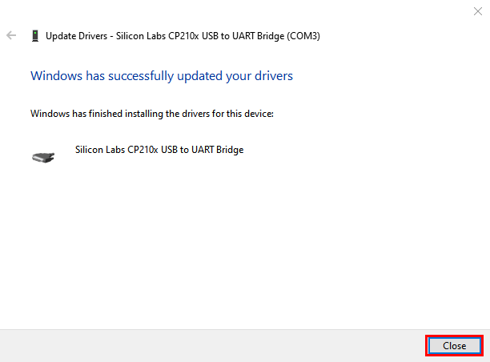
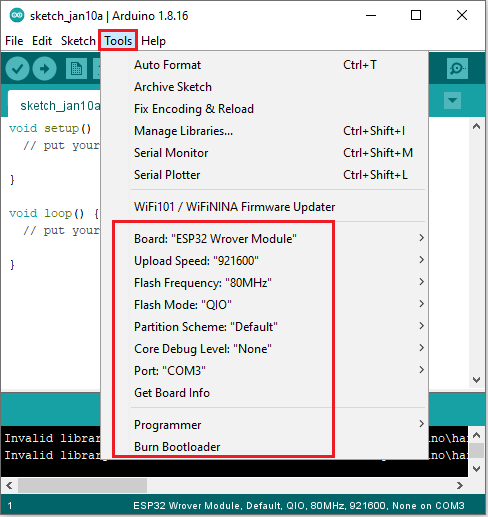
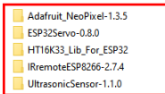
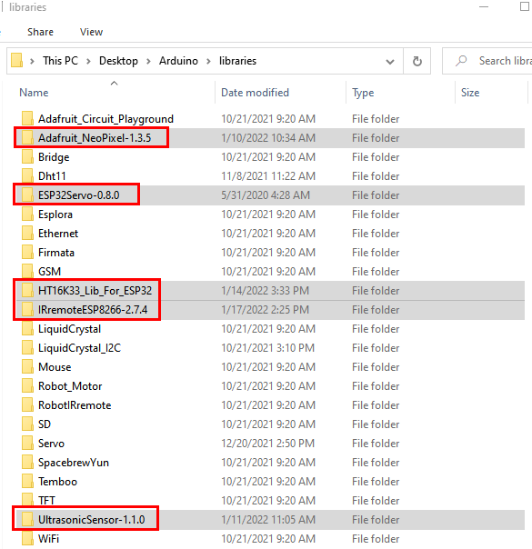
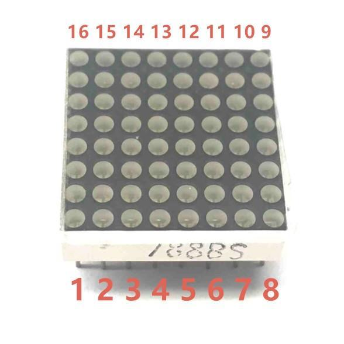
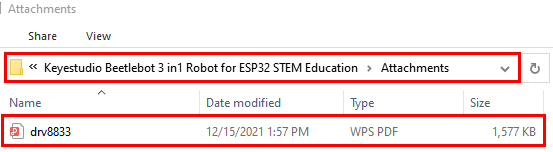
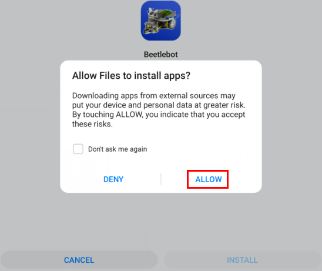

# Arduino tutorial


## 1. Get started with Arduino

### **1. Windows System：**


#### **1.1 Installing Arduino IDE**

When you get control board, you need to download Arduino IDE and driver firstly.

You could download Arduino IDE from the official website: <https://www.arduino.cc/>, click the **SOFTWARE** on the browse bar, click“DOWNLOADS” to enter download page, as shown below:


There are various versions of IDE for Arduino. Just download a version compatible with your system. Here we will show you how to download and install the windows version of Arduino IDE.


There are two versions of IDE for WINDOWS system. You can choose between the installer (.exe) and the Zip file. For installer, it can be directly downloaded, without the need of installing it manually while for Zip package, you will need to install the driver manually.


You just need to click JUST DOWNLOAD.

After the Arduino is downloaded, click“I Agree”to continue installing


Click **Next**


Then click **Install.**


If the following page appears, click **Install.**


#### 1.2 Install a driver on Windows：

If you have installed the driver, just skip it.

Before using the ESP32 board, you must install a driver, otherwise it will not communicate with computer.

Unlike the USB series chip (ATMEGA8U2) of the Arduino UNO R3, the ESP32 board is used the CP2102 chip USB series chip and USB type C interface. 

The driver of the CP2102 chip is included in 1.8.0 version and newer version of Arduino IDE. Usually, you connect the board to the computer and wait for Windows to begin its driver installation process. After a few moments, the process will succeed. 

If the driver installation process fail, you need to install the driver manually.

Note: 

1. Please make sure that your IDE is updated to 1.8.0 or newer version

2. If the version of Arduino IDE you download is below 1.8, you should download the driver of CP2102 and install it manually.

Link to download the driver of CP2102:

<https://fs.keyestudio.com/CP2102-WIN>

To install the drive manually, open the device manager of computer.

Right click Computer----- Click Properties-----Click Device Manager.

Look under Ports (COM & LPT) or other device.

A yellow exclamation mark means that the CP2102 driver installation failed.


Double-click  and click **Update drive...**”


Click“Browse my computer for updated driver software”.


There is a DRIVERS folder in Arduino software installed package（), open driver folder and you can see the driver of CP210X series chips.

Click“Browse”, then find the driver folder, or you could enter“driver”to search in rectangular box, then click“Next”,




Open device manager, you will find the yellow exclamation mark disappear. The driver of CP2102 is installed successfully.


#### 1.3. Install the ESP32 on Arduino IDE：

Note：you need to download Arduino IDE 1.8.5 or advanced version to install the ESP32

1)  Clickto open Arduino IDE
    
    

2)  **Click File**” →**“Preferences”**，copy the website address <https://dl.espressif.com/dl/package_esp32_index.json> in the“**Additional Boards Manager URLs:**”and click“**OK**”
    
    


Click“**Tools**”→“**Board:**”then click “**Boards Manager...**”to enter“**Boards Manager**”.

Enter **ESP32**”as follows, then click **Install**


After installing, click“**Close**”

#### 1.4. **Arduino IDE Setting**

Clickicon to pen Arduino IDE.


When downloading the sketch to the board, you must select the correct name of Arduino board that matches the board connected to your computer. As shown below;

(Note: we use the ESP32 board in this tutorial; therefore, we select ESP32**)**


Set the board type as follows;



Then select the correct COM port (you can see the corresponding COM port after the driver is successfully installed).


A- Used to verify whether there is any compiling mistakes or not.

B- Used to upload the sketch to your Arduino board.

C- Used to create shortcut window of a new sketch.

D- Used to directly open an example sketch.

E- Used to save the sketch.

F- Used to send the serial data received from board to the serial
monitor.

### **2. Mac System**


#### 2.1 Download Arduino IDE:


#### **2.2 How to install the CP2102 driver：**

If you have installed the driver, just skip it

Connect the ESP32 board to your computer, and open Arduino IDE


Click **Tools→Board:ESP32 Dev Module and /dev/cu.usbserial-0001.**


Click  to upload code.

Note: If code is uploaded unsuccessfully, you need to install driver of CP2102, please continue to follow the instructions as below:

Download the driver of CP2102:

<https://www.silabs.com/products/development-tools/software/usb-to-uart-bridge-vcp-drivers>

Select Mac OSX edition, as shown below;


Unzip the downloaded package.


Open folder and double-click **SiLabsUSBDriverDisk.dmg** file.


You will view the following files as follows:


Double-click Install CP210x VCP Driver, tick **on’t warn me when opening application on this** **disk image** and tap **Open.**


Tap **Continue**


Tap **Agree,** and **Continue**


Click **Continue** and input your password.


**Select Open Security Preferences**


Click the lock to unlock security & privacy preference.


Tap **Unlock and** enter **your Username and password**


Then click **Allow**


Back to installation page, and wait to install.


Successfully installed


Then enter ArduinoIDE, click **Tools** and select Board **ESP32 Dev Module** and **/dev/cu.usbserial-0001**


Click to upload code and show“Done uploading”.

### **3. How to Add Libraries?**

#### **(1) What are Libraries ?**

Libraries are a collection of code that make it easy for you to connect a sensor,display, module, etc. 

For example, the built-in LiquidCrystal library helps talk to LCD displays. There are hundreds of additional libraries available on the Internet for download. 

The built-in libraries and some of these additional libraries are listed in the reference.

(<https://www.arduino.cc/en/Reference/Libraries>)

#### **(2) How to Install a Library ?**

Here we will introduce the most simple way to add libraries .

**Step 1:** After downloading well the Arduino IDE, you can right-click the icon of Arduino IDE.

Find the option "Open file location"


**Step 2:** Click **Open file location** \>libraries


**Step 3:** Next, find out the“libraries”folder

(seen in the link: <https://fs.keyestudio.com/KS5002>)


Copy in the libraries folder of Arduino.

Then click“Replace the files in the destination”





## 2. Keyestudio ESP32 Core Board


### Description:

This keyestudio ESP32 core board is a Mini development board based on the ESP-WROOM-32 module. 

The board has brought out most I/O ports to pin headers of 2.54mm pitch. These provide an easy way of connecting peripherals according to your own needs.

When it comes to developing and debugging with the development board, the both side standard pin headers can make your operation more simple and handy.

The ESP-WROOM-32 module is the industry's leading integrated WiFi + Bluetooth solution with less than 10 external components. 

It integrates antenna switch, RF balun, power amplifiers, low noise amplifiers, filters and power management modules. 

At the same time, it also integrates with TSMC's low-power 40nm technology, so that power performance and RF performance are safe and reliable, easy to expand to a variety of applications.

### Technical Details:

  - Microcontroller: ESP-WROOM-32 module

  - USB to Serial Port Chip: CP2102-GMR

  - Operating Voltage: DC 5V

  - Operating Current: 80mA (average)

  - Current Supply: 500mA (Minimum)

  - Operating Temperature Range: -40℃ \~ +85℃

  - WiFi mode: Station/SoftAP/SoftAP+Station/P2P

  - WiFi protocol: 802.11 b/g/n/e/i (802.11n, speed up to 150 Mbps

  - WiFi frequency range: 2.4 GHz \~ 2.5 GHz

  - Bluetooth protocol: conform to Bluetooth v4.2 BR/EDR and BLE standards
    
  - Dimensions: 55mm\*26mm\*13mm

  - Weight: 9.3g
    
    

### **Pin out**

Warning: The voltage level of the ESP32 pins is 3.3V. If you want to connect the ESP32 to other devices that operate at 5V, you should use a level shifter to convert the voltage levels.


● **Power pins**: The module has two power pins: +5V and 3.3V. You can use these two pins to power other devices and modules.


● **GND pin**: There are 3 pins for grounding of this module.

● **Enable Pin (EN)**: This pin is used to enable and disable the module. The module is enabled when the pin is high, and disabled when the pin is low.

● **Input/Output Pins (GPIO)**: You can use 32 GPIO pins to communicate with LEDs, switches and other input/output devices.

You can pull up or pull down these pins

Note: GPIO6 to GPIO11 pins (SCK/CLK, SDO/SD0, SDI/SD1, SHD/SD2, SWP/SD3 and SCS/CMD pins) are used for SPI communication of the module's internal flash memory, we do not recommend using them.

● **ADC**: You can use the 16 ADC pins on this module to convert analog voltages (the output of some sensors) into digital voltages. Some of these converters are connected to internal amplifiers and are capable of measuring small voltages with high accuracy.

● **DAC**: The ESP32 module has two A/D converters with 8-bit precision.

● **Touch pads**: There are 10 pins on the ESP32 module, which are sensitive to changes in capacitance. You can connect these pins to some pads (pads on the PCB) and use them as a touch switch.

● **SPI**: There are two SPI interfaces on this module which can be used to connect the display screen, the SD / microSD memory card module and external flash memory, etc.

● **I2C**: SDA and SCL pins are used for I2C communication.

● **Serial communication (UART)**: There are two UART serial interfaces on this module. You can transfer information up to 5Mbps between two devices with these pins. UART0 also has CTS and RTS controls.

● **PWM**: Almost all ESP32 input/output pins can be used for PWM (Pulse Width Modulation), which can control motors, LED lights, colors, and more.


## 3. Arduino Libraries and the CP2102 Driver：

Refer to the **Get started with Arduino** folder to gain access to more details about adding libraries and the CP2102 driver

If Arduino libraries and the CP2102 driver are added, just skip this step.


## 4. Projects： 
--------------

### Project 1: 6812 RGB 

 **Description：**

There are 4 RGB LEDs can be widely used in the decoration of buildings, bridges, roads, gardens, courtyards and so on by colors adjustment.

In this experiment, we will demonstrate different lighting effects with them.

 **Knowledge：**

**Working Principle**

From the schematic diagram, we can see that these four pixel lighting beads are all connected in series. In fact, no matter how many they are, we can use a pin to control a light and let it display any color. The pixel point contains a data latch signal shaping amplifier drive circuit, a high-precision internal oscillator and a 12V high-voltage programmable constant current control part, which effectively ensures the color of the pixel point light is highly consistent.

The data protocol adopts a single-wire zero-code communication method. After the pixel is powered up and reset, the S terminal receives the data transmitted from the controller. The first 24bit data sent is extracted by the first pixel and sent to the data latch of the pixel.


 **Test Code：**

The SK6812RGB on the PCB board is controlled by the GPIO 14 of the ESP32 board

```c
/*
  Project 01 SK6812 RGB
  4 RGBs for various lighting effects.
*/
#include <Adafruit_NeoPixel.h>

#define PIN  14

// Parameter 1 = number of pixels in strip
// Parameter 2 = Arduino pin number (most are valid)
// Parameter 3 = pixel type flags, add together as needed:
//   NEO_KHZ800  800 KHz bitstream (most NeoPixel products w/WS2812 LEDs)
//   NEO_KHZ400  400 KHz (classic 'v1' (not v2) FLORA pixels, WS2811 drivers)
//   NEO_GRB     Pixels are wired for GRB bitstream (most NeoPixel products)
//   NEO_RGB     Pixels are wired for RGB bitstream (v1 FLORA pixels, not v2)
Adafruit_NeoPixel strip = Adafruit_NeoPixel(60, PIN, NEO_GRB + NEO_KHZ800);

// IMPORTANT: To reduce NeoPixel burnout risk, add 1000 uF capacitor across pixel power leads, add 300 - 500 Ohm resistor on first pixel's data input and minimize distance between Arduino and first pixel. Avoid connecting on a live circuit...if you must, connect GND first.

void setup() {
  strip.begin();
  strip.show(); // Initialize all pixels to 'off'
}

void loop() {
  // Some example procedures showing how to display to the pixels:
  colorWipe(strip.Color(255, 0, 0), 50); // Red
  colorWipe(strip.Color(0, 255, 0), 50); // Green
  colorWipe(strip.Color(0, 0, 255), 50); // Blue
  // Send a theater pixel chase in...
  theaterChase(strip.Color(127, 127, 127), 50); // White
  theaterChase(strip.Color(127,   0,   0), 50); // Red
  theaterChase(strip.Color(  0,   0, 127), 50); // Blue

  rainbow(20);
  rainbowCycle(20);
  theaterChaseRainbow(50);
}

// Fill the dots one after the other with a color
void colorWipe(uint32_t c, uint8_t wait) {
  for(uint16_t i=0; i<strip.numPixels(); i++) {
      strip.setPixelColor(i, c);
      strip.show();
      delay(wait);
  }
}

void rainbow(uint8_t wait) {
  uint16_t i, j;

  for(j=0; j<256; j++) {
    for(i=0; i<strip.numPixels(); i++) {
      strip.setPixelColor(i, Wheel((i+j) & 255));
    }
    strip.show();
    delay(wait);
  }
}

// Slightly different, this makes the rainbow equally distributed throughout
void rainbowCycle(uint8_t wait) {
  uint16_t i, j;

  for(j=0; j<256*5; j++) { // 5 cycles of all colors on wheel
    for(i=0; i< strip.numPixels(); i++) {
      strip.setPixelColor(i, Wheel(((i * 256 / strip.numPixels()) + j) & 255));
    }
    strip.show();
    delay(wait);
  }
}

//Theatre-style crawling lights.
void theaterChase(uint32_t c, uint8_t wait) {
  for (int j=0; j<10; j++) {  //do 10 cycles of chasing
    for (int q=0; q < 3; q++) {
      for (int i=0; i < strip.numPixels(); i=i+3) {
        strip.setPixelColor(i+q, c);    //turn every third pixel on
      }
      strip.show();
     
      delay(wait);
     
      for (int i=0; i < strip.numPixels(); i=i+3) {
        strip.setPixelColor(i+q, 0);        //turn every third pixel off
      }
    }
  }
}

//Theatre-style crawling lights with rainbow effect
void theaterChaseRainbow(uint8_t wait) {
  for (int j=0; j < 256; j++) {     // cycle all 256 colors in the wheel
    for (int q=0; q < 3; q++) {
        for (int i=0; i < strip.numPixels(); i=i+3) {
          strip.setPixelColor(i+q, Wheel( (i+j) % 255));    //turn every third pixel on
        }
        strip.show();
       
        delay(wait);
       
        for (int i=0; i < strip.numPixels(); i=i+3) {
          strip.setPixelColor(i+q, 0);        //turn every third pixel off
        }
    }
  }
}

// Input a value 0 to 255 to get a color value.
// The colours are a transition r - g - b - back to r.
uint32_t Wheel(byte WheelPos) {
  if(WheelPos < 85) {
   return strip.Color(WheelPos * 3, 255 - WheelPos * 3, 0);
  } else if(WheelPos < 170) {
   WheelPos -= 85;
   return strip.Color(255 - WheelPos * 3, 0, WheelPos * 3);
  } else {
   WheelPos -= 170;
   return strip.Color(0, WheelPos * 3, 255 - WheelPos * 3);
  }
}
```

 **Test Result**

Upload the code to the ESP32 board (if the code can’t be uploaded, you can click and press Boot , as shown below


Power up with a USB cable, then 4 RGB LEDs will show different colors


### Project 2: Play Music 

 **Description：**

There is a power amplifier component on the expansion board, which is often used to play music and serve as an external amplifying device for music playback devices.

In this experiment, we use the speaker amplifier component to play music.

 **Knowledge：**

Power amplifier modules(equivalent to a passive buzzer) don’t have internal oscillation circuits.

The power amplifier module can chime sounds with different frequency when power it up.

 **Test Code：**

The speaker component on the PCB board is controlled by the GPIO 2 of the ESP32 board.
```c
/*
    Project 02 Buzzer
    Buzzer plays music
*/

#define LEDC_CHANNEL_0 0//LEDC timer uses 13-bit precision 
#define LEDC_TIMER_13_BIT  13

// define the IO port

#define BUZZER_PIN  2

//Create a list of music melodies, Super Mario
int melody[] = {330, 330, 330, 262, 330, 392, 196, 262, 196, 165, 220, 247, 233, 220, 196, 330, 392, 440, 349, 392, 330, 262, 294, 247, 262, 196, 165, 220, 247, 233, 220, 196, 330, 392,440, 349, 392, 330, 262, 294, 247, 392, 370, 330, 311, 330, 208, 220, 262, 220, 262, 294, 392, 370, 330, 311, 330, 523, 523, 523, 392, 370, 330, 311, 330, 208, 220, 262,220, 262, 294, 311, 294, 262, 262, 262, 262, 262, 294, 330, 262, 220, 196, 262, 262,262, 262, 294, 330, 262, 262, 262, 262, 294, 330, 262, 220, 196};

//Create a list of tone durations
int noteDurations[] = {8,4,4,8,4,2,2,3,3,3,4,4,8,4,8,8,8,4,8,4,3,8,8,3,3,3,3,4,4,8,4,8,8,8,4,8,4,3,8,8,2,8,8,8,4,4,8,8,4,8,8,3,8,8,8,4,4,4,8,2,8,8,8,4,4,8,8,4,8,8,3,3,3,1,8,4,4,8,4,8,4,8,2,8,4,4,8,4,1,8,4,4,8,4,8,4,8,2};
void setup() {
    pinMode(BUZZER_PIN, OUTPUT); // set the buzzer to OUTPUT
}

void loop() {
  int noteDuration; //create the variable noteDuration
  for (int i = 0; i < sizeof(noteDurations); ++i){
      noteDuration = 800/noteDurations[i];
      ledcSetup(LEDC_CHANNEL_0, melody[i]*2, LEDC_TIMER_13_BIT);
      ledcAttachPin(BUZZER_PIN, LEDC_CHANNEL_0);
      ledcWrite(LEDC_CHANNEL_0, 50);
      delay(noteDuration * 1.30); //delay
  }
}
```

 **Test Result**

Upload the code to the ESP32 board(if the code can’t be uploaded, you can click and press Boot, as shown below


Power up with a USB cable, then the speaker module on the PCB board will play a song.


### Project 3: 8*8 Dot Matrix Display 

 **Description：**

Composed of LED emitting tube diodes, the 8\*8 LED dot matrix are applied widely to public information display like advertisement screen and bulletin board, by controlling LED to show words, pictures and videos, etc.

 **Knowledge：**

There are different types of matrices, including 4×4, 8×8 and 16×16 and etc. It contains 64 LEDs.

The inner structure of 8×8 dot matrix is shown below.


Every LED is installed on the cross point of row line and column line. When the voltage on a row line increases, and the voltage on the column line reduces, the LED on the cross point will light up. 8×8 dot matrix has 16 pins. Put the silk-screened side down and the numbers are 1, 8, 9 and 16 in anticlockwise order as marked below.




The definition inner pins are shown below:


For instance, to light up the LED on row 1 and column 1, you should increase the voltage of pin 9 and reduce the voltage of pin 13.

**HT16K33 8X8 Dot Matrix**

The HT16K33 is a memory mapping and multi-purpose LED controller driver. The max. Display segment numbers in the device is 128 patterns (16 segments and 8 commons) with a 13*3 (MAX.) matrix key scan circuit. The software configuration features of the HT16K33 makes it suitable for multiple LED applications including LED modules and display subsystems. The HT16K33 is compatible with most microcontrollers and communicates via a two-line bidirectional I2C-bus.

The picture below is the working schematic of HT16K33 chip


We design the drive module of 8\*8 dot matrix based on the above principle. We could control the dot matrix by I2C communication and two pins of microcontroller, according to the above diagram.

**Specification:**

-   Input voltage: 5V    

-   Rated input frequency: 400KHZ 

-   Input power: 2.5W  

-   Input current: 500mA  


 **Introduction for Modulus Tool**

The online version of dot matrix modulus tool:

<http://dotmatrixtool.com/>

①Open the link to enter the following page.


②The dot matrix is 8\*8 in this project. So set the height to 8, width to 8; as shown below.


③Click **Endian** to select **Big Endian**(MSB)


③ Generate hexadecimal data from the pattern

As shown below, the left button of the mouse is for selection while the right is for canceling. Thus you could use them to draw the pattern you want, then click **Generate**, to yield the hexadecimal data needed.


The generated hexadecimal code（0x00, 0x66, 0x00, 0x00, 0x18, 0x42, 0x3c, 0x00) is what will be displayed, so you need to save it for next procedure.

 **Wiring up：**

| 8\*8 Dot matrix display | PCB Board |
| :---------------------: | :-------: |
|            G            |     G     |
|           5V            |    5V     |
|           SDA           |    SDA    |
|           SCL           |    SCL    |

 **Test Code：**

The 8\*8 dot matrix is controlled by GPIO21（SDA）and GPIO22（SCL）of the ESP32 board.

```c
/*
 Project 03 8*8 Dot Matrix
 8*8 dot matrix screen to display patterns
*/
#include "HT16K33_Lib_For_ESP32.h"

#define SDA 21
#define SCL 22

ESP32_HT16K33 matrix = ESP32_HT16K33();

//The brightness values can be set from 1 to 15, with 1 darkest and 15 brightest
#define  A  15

byte result[8][8];
byte test1[8] = {0x70, 0x88, 0x84, 0x42, 0x42, 0x84, 0x88, 0x70};

void setup()
{
  matrix.init(0x70, SDA, SCL);//Initialize matrix
  matrix.showLedMatrix(test1,0,0);
  matrix.show();
}

void loop()
{
  for (int i = 0; i <= 7; i++)
  {
    matrix.setBrightness(i);
    delay(100);
  }
  for (int i = 7; i > 0; i--)
  {
    matrix.setBrightness(i);
    delay(100);
  }
}
```

 **Test Result**

Upload the code to the ESP32 board(if the code can’t be uploaded, you can click and press Boot, as shown below


Power up by a USB cable, the 8\*8 dot matrix display will show show “❤”pattern.

### Project 4: Servo Rotation 

 **Description：**

There are two servos on the car. We take the servo connected to pin D9 as an example. 

The servo is a motor that can rotate very accurately. It has been widely applied to toy cars, remote control helicopters, airplanes, robots and other fields. In this project, we will use the Nano motherboard to control the servo to spin.

 **Knowledge：**


Servo motor is a position control rotary actuator. It mainly consists of a housing, a circuit board, a core-less motor, a gear and a position sensor. Its working principle is that the servo receives the signal sent by MCU or receiver and produces a reference signal with a period of 20ms and width of 1.5ms, then compares the acquired DC bias voltage to the voltage of the potentiometer and obtain the voltage difference output.

When the motor speed is constant, the potentiometer is driven to rotate through the cascade reduction gear, which leads that the voltage difference is 0, and the motor stops rotating. Generally, the angle range of servo rotation is 0° --180 °.

The rotation angle of servo motor is controlled by regulating the duty cycle of PWM (Pulse-Width Modulation) signal. The standard cycle of PWM signal is 20ms (50Hz). Theoretically, the width is distributed between 1ms-2ms, but in fact, it's between 0.5ms-2.5ms. The width corresponds the rotation angle from 0° to 180°. But note that for different brand motors, the same signal may have different rotation angles.  


In general, servo has three lines in brown, red and orange. The brown wire is grounded, the red one is a positive pole line and the orange one is a signal line.


 **Wire up：**

| Servo  |  PCB Board  |
| :----: | :---------: |
| Brown  |      G      |
|  Red   |     5V      |
| Orange | S1（GPIO4） |

 **Test Code 1：**

The servo for controlling the ultrasonic sensor is controlled by the GPIO4 of the ESP32 board.

```c
/*
Project 04.1 Servo Rotation
the plastic arm of the servo will rotate at an angle of 0°,45°,90°,135°,and180°,repeatly.
*/

#include <Arduino.h>

// Servo channel 
int channel_PWM = 3;  
// Servo frequency, then the period is 1/50, which is 20ms, PWM has a total of 16 channels, 0-7 high-speed channels are driven by 80Mhz clock, and the last 8 low-speed channels are driven by 1Mhz clock.
int freq_PWM = 50;   
// PWM resolution, the value is between 0-20, here is 10, then the pwm value filled in the following ledcWrite is between 0-2 to the 10th power, that is, 0-1024.
int resolution_PWM = 10;   
//
const int PWM_Pin = 4;  

void setup() {
  Serial.begin(115200); //Set the baud rate to 115200.
  ledcSetup(channel_PWM, freq_PWM, resolution_PWM); // Set servo channel, servo frequency, PWM resolution.
  ledcAttachPin(PWM_Pin, channel_PWM); 
}

void get_pwm_info()
{
  Serial.println("*******************************************************************");
  Serial.print("Reads the value of the specified channel duty cycle：");
  Serial.println(ledcRead(channel_PWM));  //Read the value of the specified channel duty cycle
  Serial.print("Reads the value of the specified channel frequency as：");
  Serial.println(ledcReadFreq(channel_PWM));  //Returns the current frequency of the specified channel (if the current duty cycle is 0, the method returns 0).
}

void loop() {
  ledcWrite(channel_PWM, 25);  //The 20ms high level is about 2.5ms, which is 2.5/20*1024, and the angle of the steering gear is 90°.
  get_pwm_info();  
  delay(1000);
  ledcWrite(channel_PWM, 52);  //The 20ms high level is about 2.5ms, which is 2.5/20*1024, and the angle of the steering gear is 45°. .
  get_pwm_info();  //Print information, click the serial port viewer in the upper right corner of the IDE to see the printed content
  delay(1000);
  ledcWrite(channel_PWM, 77);  //The 20ms high level is about 2.5ms, which is 2.5/20*1024, and the angle of the steering gear is 90°.
  get_pwm_info();
  delay(1000);
  ledcWrite(channel_PWM, 102);  //The 20ms high level is about 2.5ms, which is 2.5/20*1024, and the angle of the steering gear is 135°. .
  get_pwm_info();
  delay(1000);
  ledcWrite(channel_PWM, 128);  //The 20ms high level is about 2.5ms, which is 2.5/20*1024, and the angle of the steering gear is 180°. .
  get_pwm_info();
  delay(1000);
  //ledcDetachPin(PWM_Pin);
}
```

 **Test Result 1：**

Upload the test code to the ESP32 board, and power up with a USB cable, open the monitor and set baud rate to 115200. Then the arm of the servo will rotate to 0°, 45°, 90°, 135° and 180°


In fact, we can also have a simpler way to control the servo, that is to use the servo library file of Arduino ESP32, you can refer to the official Arduino instructions for use：<https://www.arduino.cc/en/Reference/Servo> .

 **Test Code 2：**

```c
/*
Project 04.2 Servo Rotation
the servo will rotate from 0 degrees to 180 degrees and then reverse the direction to make it rotate from 180 degrees to 0 degrees and repeat these actions in an endless loop.
*/
#include <ESP32Servo.h>

Servo myservo;  // create servo object to control a servo

int posVal = 0;    // variable to store the servo position
int servoPin = 4; // Servo motor pin

void setup() {
  myservo.setPeriodHertz(50);           // standard 50 hz servo
  myservo.attach(servoPin, 500, 2500);  // attaches the servo on servoPin to the servo object
}
void loop() {

  for (posVal = 0; posVal <= 180; posVal += 1) { // goes from 0 degrees to 180 degrees
    // in steps of 1 degree
    myservo.write(posVal);       // tell servo to go to position in variable 'pos'
    delay(15);                   // waits 15ms for the servo to reach the position
  }
  for (posVal = 180; posVal >= 0; posVal -= 1) { // goes from 180 degrees to 0 degrees
    myservo.write(posVal);       // tell servo to go to position in variable 'pos'
    delay(15);                   // waits 15ms for the servo to reach the position
  }
}
```

 **Test Result** 2

Upload the code to the ESP32 board(if the code can’t be uploaded, you can click and press Boot, as shown below


Power up with a USB cable, the arm will rotate from 0° to 180°, then from 180° to 0°

### Project 5: Motor Driving and Speed Control  

 **Description：**

There are many ways to drive motors. This car uses the most commonly used DRV8833 motor driver chip, which provides a dual-channel bridge electric driver for toys, printers and other motor integration applications.

In this experiment, we use the DRV8833 motor driver chip on the expansion board to drive the two DC motors, and demonstrate the effect of forward, backward, left-turning, and right-turning.

 **Knowledge：**

DRV8833 motor driver chip: Dual H-bridge motor driver with current control function, can drive two DC motors, one bipolar stepper motor, solenoid valve or other inductive loads. Each H-bridge includes circuitry to regulate or limit winding current.

An internal shutdown function with a fault output pin is used for over-current and short circuit protection, under-voltage lockout and over-temperature. A low-power sleep mode is also added. Let's take a look at the schematic diagram of the DRV8833 motor driver chip driving two DC motors: 


If you want to get insight to it, you can check the specification of this chip. Just browse it in the“Attachments”folder.



**Specification：**

- Input voltage of logic part: DC 5V

- Input voltage of driving part : DC 5V

- Working current of logic part: &lt;30mA

- Operating current of driving part: &lt;2A

- Maximum power dissipation: 10W (T=80℃)

- Motor speed: 5V 200 rpm / min

- Motor drive form: dual H-bridge drive

- Control signal input level: high level 2.3V&lt;Vin&lt;5V, low level -0.3V&lt;Vin&lt;1.5V

- Working temperature: -25~130℃


 **Drive the car to move**

From the above diagram, the direction pin of the left motor is GPIO33; the speed pin is GPIO26; GPIO32 is the direction pin of the right motor; and GPIO25 is speed pin.

PWM drives the robot car. The PWM value is in the range of 0-255. The more the PWM value is set, the faster the rotation of the motor.

| Function   | GPIO33 | GPIO26（PWM) | Left motor    | GPIO32 | GPIO25（PW） | Right motor   |
| ---------- | ------ | ------------ | ------------- | ------ | ------------ | ------------- |
| forward    | LOW    | 200          | clockwise     | LOW    | 200          | clockwise     |
| Go back    | HIGH   | 50           | anticlockwise | HIGH   | 50           | anticlockwise |
| Turn left  | HIGH   | 200          | anticlockwise | LOW    | 200          | clockwise     |
| Turn right | LOW    | 200          | clockwise     | HIGH   | 200          | anticlockwise |
| Stop       | LOW    | 0            | stop          | LOW    | 0            | stop          |

 **Test Code：**

```c
/*
 Project 05 Motor drive and speed regulation
 Motor moves forward, backward, left and right
*/ 
#define left_ctrl  33  //define the direction control pin(rgpio33) of the left motor
#define left_pwm  26   //define the speed control pin(D6) of the left motor
#define right_ctrl  32 //Define the direction control pin of the  right motor as gpio32
#define right_pwm  25  //define PWM control pins of the right motor as gpio25

void setup()
{
  pinMode(left_ctrl,OUTPUT);//set control pins of the left motor to OUTPUT
  ledcSetup(0, 1200, 8);//Set LEDC channel 1 frequency to 1200, PWM resolution to 8 that duty cycle is 256.
  ledcAttachPin(26, 0);  //LEDC channel 1 is connected to 1 the pin gpio26 of the left motor
  pinMode(right_ctrl,OUTPUT);//set direction control pins of the right motor to OUTPUT..
  ledcSetup(1, 1200, 8);//Set the LEDC channel to 2, the frequency to 1200, and the PWM resolution to 8, that is, the duty cycle is 256.
  ledcAttachPin(25, 1);  //LEDC channel 2 is connected to 1 the pin gpio25 of the right motor.
}

void loop()
{ 
  //front
  digitalWrite(left_ctrl,LOW); //set direction control pins of the left motor to LOW.
  ledcWrite(0, 255); //LEDC channel 1 is connected to the left motor and outputs PWM 255
  digitalWrite(right_ctrl,LOW); //set control pins of the right motor to LOW.
  ledcWrite(1, 255); //LEDC channel 2 is connected to the right motor and outputs PWM 255
  delay(2000);//delay in 2s
  
  //back
  digitalWrite(left_ctrl,HIGH); //set direction control pins of the left motor to HIGH..
  ledcWrite(0, 50); //LEDC channel 1 is connected to the left motor and outputs PWM 50
  digitalWrite(right_ctrl,HIGH); //set control pins of the right motor to HIGH..
  ledcWrite(1, 50); //LEDC channel 2 is connected to the right motor and outputs PWM 50
  delay(2000);//delay in 2s
  
  //left
  digitalWrite(left_ctrl,HIGH); //set direction control pins of the left motor to HIGH..
  ledcWrite(0, 55); //LEDC channel 1 is connected to the left motor and outputs PWM 55.
  digitalWrite(right_ctrl,LOW); //set control pins of the right motor to LOW.
  ledcWrite(1, 200); //LEDC channel 2 is connected to the right motor and outputs PWM 200.
  delay(2000);//delay in 2s
  
  //right
  digitalWrite(left_ctrl,LOW); //set direction control pins of the left motor to LOW.
  ledcWrite(0, 200); //LEDC channel 1 is connected to the left motor and outputs PWM 200.
  digitalWrite(right_ctrl,HIGH); //set control pins of the right motor to HIGH..
  ledcWrite(1, 55); //LEDC channel 2 is connected to the right motor and outputs PWM 55
  delay(2000);//delay in 2s
  
  //stop
  digitalWrite(left_ctrl,LOW);//set direction control pins of the left motor to LOW.
  ledcWrite(0, 0); //LEDC channel 1 is connected to the left motor and outputs PWM 0.
  digitalWrite(right_ctrl,LOW);//set control pins of the right motor to LOW.
  ledcWrite(1, 0); //LEDC channel 2 is connected to the right motor and outputs PWM 0
  delay(2000);//delay in 2s
}
```

 **Test Result**

Upload the code to the ESP32 board(if the code can’t be uploaded, you can click and press Boot, as shown below


Place batteries in the car, and turn the power switch to ON end and power up. Then the car moves forward for 2s, backward for 2s, turns left for 2s and right for 2s, stops for 2s.

**Speed regulation**

HIGH is equivalent to a PWM value of 255, and 50 is a PWM value that can be adjusted. The difference in this code is 200. The larger the upper and lower difference is, the faster the motor rotates. We can adjust the motor speed by adjusting the PWM value. If 50 is set to 0, the upper and lower difference becomes 255, and the motor speed reaches the maximum; if 50 is set to 255, the upper and lower difference becomes 0, the motor speed is 0, and the motor does not rotate. When the upper and lower difference values are positive, the motor reverses.


LOW is equivalent to a PWM value of 0, and 255 is a PWM value that can be adjusted. The difference in this code is 255. The larger the upper and lower difference is, the faster the motor rotates. We can adjust the motor speed by adjusting the PWM value. If 255 is set to 100, the upper and lower difference becomes 100, and the motor speed slows down; if the upper and lower difference is 255, the motor speed reaches the maximum; if 255 is set to 0, the upper and lower difference becomes 0, and the motor does not work. turned. When the upper and lower difference values are negative, the motor rotates forward.

### Project 6: Ultrasonic Sensor 

There is an ultrasonic sensor on the car. It is a very affordable distance-measuring sensor. 

The ultrasonic sensor sends a high-frequency ultrasonic signal that human hearing can’t hear. When encountering obstacles, these signals will be reflected back immediately. After receiving the returned information, the distance between the sensor and the obstacle will be calculated by judging the time difference between the transmitted signal and the received signal. It is mainly used for object avoidance and ranging in various robotics projects.

#### Project 6.1: Ultrasonic Ranging 

 **Description：**

In this experiment, we use an ultrasonic sensor to measure distance and print the data on a serial monitor.

 **Knowledge：**

The HC-SR04 ultrasonic sensor uses sonar to determine distance to an object like what bats do. It offers excellent non-contact range detection with high accuracy and stable readings in an easy-to-use package. It comes complete with ultrasonic transmitter and receiver modules.

The HC-SR04 or the ultrasonic sensor is being used in a wide range of electronics projects for creating obstacle detection and distance measuring application as well as various other applications. Here we have brought the simple method to measure the distance with Arduino and ultrasonic sensor and how to use ultrasonic sensor with Arduino.


**Use method and timing chart of ultrasonic module:**

1.  Setting the delay time of Trig pin of SR04 to 10μs at least, which can trigger it to detect distance.

2.  After triggering, the module will automatically send eight 40KHz ultrasonic pulses and detect whether there is a signal return. This step will be completed automatically by the module.

3.  If the signal returns, the Echo pin will output a high level, and the duration of the high level is the time from the transmission of the ultrasonic wave to the return.


Time=Echo pulse width, unit: us

$$
Distance(cm) =time / 58
$$

$$
Distance(inch) =time / 148
$$

The HC-SR04 ultrasonic sensor has four pins: Vcc, Trig, Echo and GND.

The Vcc pin provides power generating ultrasonic pulses and is connected to Vcc/+5V. The GND pin is grounded/GND.

The Trig pin is where the Arduino sends a signal to start the ultrasonic pulse. The Echo pin is where the ultrasonic sensor sends information about the duration of the ultrasonic pulse stroke to the Arduino control board.

 **Wiring Up**

| Ultrasonic Sensor |  PCB Board   |
| :---------------: | :----------: |
|        Vcc        |      5V      |
|       Trig        | S2（GPIO5）  |
|       Echo        | S1（GPIO18） |
|        Gnd        |      G       |

 **Test Code：**

The pin Trig and Echo of the ultrasonic sensor are controlled by the GPIO5 and GPIO18 of the ESP32 board.

```c
/*
Project 06.1 Ultrasonic Ranging
Ultrasonic detection of distance from objects
*/
#define trigPin 5 // define trigPin gpio5.
#define echoPin 18 // define echoPin gpio18.
#define MAX_DISTANCE 700 // Maximum sensor distance is rated at 400-500cm.
//timeOut= 2*MAX_DISTANCE /100 /340 *1000000 = MAX_DISTANCE*58.8
float timeOut = MAX_DISTANCE * 60; 
int soundVelocity = 340; // define sound speed=340m/s
void setup() {
 pinMode(trigPin,OUTPUT);// set trigPin to output mode
 pinMode(echoPin,INPUT); // set echoPin to input mode
 Serial.begin(115200); // Open serial monitor at 115200 baud to see ping results.
}
void loop() {
 delay(100); // Wait 100ms between pings (about 20 pings/sec). 
 Serial.printf("Distance: ");
 Serial.print(getSonar()); // Send ping, get distance in cm and print result 
 Serial.println("cm");
}
float getSonar() {
 unsigned long pingTime;
 float distance;
 // make trigPin output high level lasting for 10us to trigger HC_SR04
  digitalWrite(trigPin, HIGH); 
 delayMicroseconds(10);
 digitalWrite(trigPin, LOW);
 // Wait HC-SR04 returning to the high level and measure out this waiting time
 pingTime = pulseIn(echoPin, HIGH, timeOut); 
 // calculate the distance according to the time
 distance = (float)pingTime * soundVelocity / 2 / 10000; 
 return distance; // return the distance value
}
```


 **Test Result**

Upload the code to the ESP32 board(if the code can’t be uploaded, you can click and press Boot, as shown below.


Power up with a USB cable, open the monitor and set baud to 115200. When you move an object in front of the ultrasonic sensor, it will detect the distance and the serial monitor will show the distance value.


#### Project 6.2: Light Following 

 **Description：**

In the above experiments, we have learned about the 8\*8 dot matrix, motor drivers and speed regulation, ultrasonic sensors, servos and other hardware. In this experiment, we will combine them to create a follow car with the ultrasonic sensor. The can can follow an object to move through measuring distance.

 **Working Principle：**


 **Flow Chart：**


 **Test Code：**


```c
/*
Project 06.2: follow me
Car follows the object
*/ 
//motor
#define left_ctrl  33  //define direction control pins of the left motor as gpio33
#define left_pwm  26   //define PWM control pins of the left motor as gpio26.
#define right_ctrl  32 //define direction control pins of the right motor as gpio32.
#define right_pwm  25  //define PWM control pins of the right motor as gpio25

//ultrasonic sensor
#define TRIG_PIN 5 // set signals input of the ultrasonic sensor to gpio5.
#define ECHO_PIN 18 //set signals output of the ultrasonic sensor to gpio18.
long distance; //define distance variables

//servo
int channel_PWM = 3; // servo channels
// Servo frequency, then the period is 1/50, which is 20ms, PWM has a total of 16 channels, 0-7 high-speed channels are driven by 80Mhz clock, and the last 8 low-speed channels are driven by 1Mhz clock.
int freq_PWM = 50;
// PWM resolution, in the range of 0-20, fill in 10. Then the pwm value of ledcWrite is in the range of 0-1024.
int resolution_PWM = 10;
// 
const int servopin = 4;//set the pin of the servo to gpio4.

void setup() {
  Serial.begin(115200); //set baud rate to 115200.
  pinMode(left_ctrl,OUTPUT);//set control pins of the left motor to OUTPUT
  ledcSetup(0, 1200, 8);//Set the frequency of LEDC channel 0 to 1200 and the PWM resolution to 8, that is, the duty cycle is 256
  ledcAttachPin(26, 0);  //connect the LEDC channel 0to the pin gpio26 of the left motor
  pinMode(right_ctrl,OUTPUT);//set direction control pins of the right motor to OUTPUT..
  ledcSetup(1, 1200, 8);//Set the frequency of LEDC channel 1 to 1200 and the PWM resolution to 8, that is, the duty cycle is 256.
  ledcAttachPin(25, 1);  //connect the LEDC channel 1 to the pin gpio25 of the right motor
  
  pinMode(TRIG_PIN,OUTPUT);//set TRIG_PIN to OUTPUT.
  pinMode(ECHO_PIN,INPUT);//set ECHO_PIN to INPUT.
  
  ledcSetup(3, 50, 10); // Set the frequency of servo channels3 to 50 and the PWM resolution to 10.
  ledcAttachPin(4, 3);  //connect LEDC channels to IO ports you set
  ledcWrite(channel_PWM, 77);  //The 20ms high level is about 1.5ms, which is 1.5/20*1024, and the initial angle of the servo is set to 90° .
  delay(300);
}

void loop() {
  distance = checkdistance();//Get the distance measured by the ultrasonic sensor
  Serial.print(distance);//Send a pulse, calculate the distance in centimeters and print the result.
  Serial.println("cm");
  if(distance<8)//if distance is less than 8
  {
    back();//back
  }
  else if((distance>=8)&&(distance<13))//if 8≤distance<13
  {
    Stop();//stop
  }
  else if((distance>=13)&&(distance<35))//if 13≤distance<35.
  {
    front();//follow
  }
  else//
  {
    Stop();//stop
  }
}

float checkdistance() {
  digitalWrite(TRIG_PIN, LOW);
  delayMicroseconds(2);
  digitalWrite(TRIG_PIN, HIGH);
  delayMicroseconds(10);
  digitalWrite(TRIG_PIN, LOW);
  float distance = pulseIn(ECHO_PIN, HIGH) / 58.00;
  delay(10);
  return distance;
}
   
void front()//define the state of going forward
{
  digitalWrite(left_ctrl,LOW); //set direction control pins of the left motor to LOW.
  ledcWrite(0, 200); //Connect the LEDC channel 0 to the left motor and outputs PWM 200
  digitalWrite(right_ctrl,LOW); //set control pins of the right motor to LOW.
  ledcWrite(1, 200); //Connect the LEDC channel 1 to the right motor and outputs PWM 200
}
void back()//define the state of going back
{
  digitalWrite(left_ctrl,HIGH); //set direction control pins of the left motor to HIGH..
  ledcWrite(0, 100); //Connect the LEDC channel 0 to the left motor and outputs PWM 100.
  digitalWrite(right_ctrl,HIGH); //set control pins of the right motor to HIGH..
  ledcWrite(1, 100); //Connect the LEDC channel 1 to the right motor and outputs PWM 100
}
void Stop()//define state of stopping
{
  digitalWrite(left_ctrl,LOW);//set direction control pins of the left motor to LOW.
  ledcWrite(0, 0); //Connect the LEDC channel 0 to the left motor and outputs PWM 0
  digitalWrite(right_ctrl,LOW);//set control pins of the right motor to LOW.
  ledcWrite(1, 0); //connect the LEDC channel 1 to the right motor and outputs PWM 0
}
```

 **Test Result**

Upload the code to the ESP32 board(if the code can’t be uploaded, you can click and press Boot, as shown below.


Place batteries in the car and turn the power switch to ON end and power up. Then the car will follow the obstacle to move.

#### Project 6.3: Dodge obstacles 

 **Description：**

In this project, we will take advantage of the ultrasonic sensor to detect the distance away from the obstacle so as to avoid them

 **Working Principle：**


 **Flow Chart：**


 **Test Code：**

```c
/*
Project 06.3: avoid obstacles
*/  
#include "HT16K33_Lib_For_ESP32.h"  //define 8*8 dot matrix display

//8*8 dot matrix display
//define pins as GPIO21 and GPIO22
#define SDA 21
#define SCL 22
ESP32_HT16K33 matrix = ESP32_HT16K33();
//Array, used to store pattern data, which can be calculated by yourself or obtained from the touch tool
byte front[8]={0x12,0x24,0x48,0x90,0x90,0x48,0x24,0x12};
byte back[8]={0x48,0x24,0x12,0x09,0x09,0x12,0x24,0x48};
byte left[8]={0x18,0x24,0x42,0x99,0x24,0x42,0x81,0x00};
byte right[8]={0x00,0x81,0x42,0x24,0x99,0x42,0x24,0x18};
byte stop1[8]={0x00,0x00,0x00,0xfd,0xfd,0x00,0x00,0x00};
byte result[8][8];

//motor
#define left_ctrl  33  //define direction control pins of the left motor as gpio33
#define left_pwm  26   //define PWM control pins of the left motor as gpio26.
#define right_ctrl  32 //define direction control pins of the right motor as gpio32.
#define right_pwm  25  //define PWM control pins of the right motor as gpio25

//ultrasonic sensor
#define TRIG_PIN 5 // Define the signal input of the ultrasonic sensor as gpio5.
#define ECHO_PIN 18 // Define the signal output of the ultrasonic sensor as gpio18.
long distance,a1,a2;//define three distance variables

//servo
int channel_PWM = 3; // servo channels
// Servo frequency, then the period is 1/50, which is 20ms, PWM has a total of 16 channels, 0-7 high-speed channels are driven by 80Mhz clock, and the last 8 low-speed channels are driven by 1Mhz clock.
int freq_PWM = 50;
// PWM resolution, in the range of 0-20, fill in 10. Then the pwm value of ledcWrite is in the range of 0-1024.
int resolution_PWM = 10;
// 
const int servopin = 4;//set the IO pin of the servo to gpio4.

void setup() {
  Serial.begin(9600);
  pinMode(left_ctrl,OUTPUT);//set control pins of the left motor to OUTPUT
  ledcSetup(0, 1200, 8);//Set the frequency of LEDC channel 0 to 1200 and the PWM resolution to 8, that is, the duty cycle is 256
  ledcAttachPin(26, 0);  //Connect the LEDC channel 0 to the pin gpio26 of the left motor 
  pinMode(right_ctrl,OUTPUT);//set direction control pins of the right motor to OUTPUT..
  ledcSetup(1, 1200, 8);//Set the frequency of LEDC channel 0 to 1200 and the PWM resolution to 8, that is, the duty cycle is 256
  ledcAttachPin(25, 1);  //Connect the LEDC channel 1 to the pin gpio25 of the right motor .
  
  pinMode(TRIG_PIN,OUTPUT);//set TRIG_PIN to OUTPUT.
  pinMode(ECHO_PIN,INPUT);//set ECHO_PIN to INPUT.
  
  ledcSetup(3, 50, 10); // Set servo channels3 frequency to 50 and PWM resolution to 10
  ledcAttachPin(4, 3);  //Connect the LEDC channel to the IO port   
ledcWrite(channel_PWM, 77);  //The 20ms high level is about 1.5ms, which is 1.5/20*1024, and the initial angle of the servo is set to 90° .
  delay(300);
  
  matrix.init(0x70, SDA, SCL);//Initialize dot matrix display
  matrix.clear(); //clear up screens
}
 
void loop()
 {
  avoid();//obstacle avoidance
}

float checkdistance() {
  digitalWrite(TRIG_PIN, LOW);
  delayMicroseconds(2);
  digitalWrite(TRIG_PIN, HIGH);
  delayMicroseconds(10);
  digitalWrite(TRIG_PIN, LOW);
  float distance = pulseIn(ECHO_PIN, HIGH) / 58.00;
  delay(10);
  return distance;
}

void avoid()
{
  distance = checkdistance(); //Get the value of ultrasonic distance
  Serial.println(distance);
  if((distance < 10)&&(distance != 0))//if 0<distance<10
  {
    car_Stop();//stop
    matrix.clear();
    matrix.showLedMatrix(stop1,0,0);
    matrix.show();//show stop pattern
    delay(200);
    ledcWrite(channel_PWM, 128);  //The 20ms high level is about 2.5ms, which is 2.5/20*1024, at this time the servo turns to 180°. 
    delay(300);
    a1=checkdistance();//Measuring distance
    delay(200);
    ledcWrite(channel_PWM, 25);  //The 20ms high level is about 0.5ms, that is, 0.5/20*1024, at this time the servo turns to 0°.     delay(300);
    a2=checkdistance();//Measuring distance
    delay(200);
    if(a1 > a2)//
    {
      car_left();//turn left
      matrix.clear();
      matrix.showLedMatrix(left,0,0);
      matrix.show();//show left turning patter
      ledcWrite(channel_PWM, 77);  //The 20ms high level is about 1.5ms, which is 1.5/20*1024, and the initial angle of the servo is set to 90° .
      delay(300);
      matrix.clear();
      matrix.showLedMatrix(front,0,0);
      matrix.show();//show forward pattern
    }
    else//if left distance <right distance
    {
      car_right();//turn right
      matrix.clear();
      matrix.showLedMatrix(right,0,0);/
      matrix.show();//show right turning
      ledcWrite(channel_PWM, 77);  //The 20ms high level is about 1.5ms, which is 1.5/20*1024, and the initial angle of the servo is set to 90° .
      delay(300);
      matrix.clear();
      matrix.showLedMatrix(front,0,0);/
      matrix.show();//show forward pattern
    }
  }
  else//
  {
    car_front();//go forward
    matrix.clear();
    matrix.showLedMatrix(front,0,0);//
    matrix.show();//show forward pattern
  }
}

void car_front()//define the state of going forward
{
  digitalWrite(left_ctrl,LOW); //set direction control pins of the left motor to LOW.
  ledcWrite(0, 200); //Connect the LEDC channel 0 to the left motor and outputs PWM 200
  digitalWrite(right_ctrl,LOW); //set control pins of the right motor to LOW.
  ledcWrite(1, 200); //Connect the LEDC channel 1 to the right motor and outputs PWM 200
}
void car_back()//define the state of going back
{
  digitalWrite(left_ctrl,HIGH); //set direction control pins of the left motor to HIGH..
  ledcWrite(0, 50); //Connect the LEDC channel 0 to the left motor and outputs PWM 50.
  digitalWrite(right_ctrl,HIGH); //set control pins of the right motor to HIGH..
  ledcWrite(1, 50); //Connect the LEDC channel 1 to the right motor and outputs PWM 50.
}
void car_left()//define the state of turning left
{
  digitalWrite(left_ctrl,HIGH); //set direction control pins of the left motor to HIGH..
  ledcWrite(0, 200); //Connect the LEDC channel 0 to the left motor and outputs PWM 200
  digitalWrite(right_ctrl,LOW); //set control pins of the right motor to LOW.
  ledcWrite(1, 200); //Connect the LEDC channel 1 to the right motor and outputs PWM 200
}
void car_right()//define the state of turning right
{
  digitalWrite(left_ctrl,LOW); //set direction control pins of the left motor to LOW.
  ledcWrite(0, 200); //Connect the LEDC channel 0 to the left motor and outputs PWM 200
  digitalWrite(right_ctrl,HIGH); //set control pins of the right motor to HIGH..
  ledcWrite(1, 200); //Connect the LEDC channel 1 to the right motor and outputs PWM 200
}
void car_Stop()//define the state of stopping
{
  digitalWrite(left_ctrl,LOW);//set direction control pins of the left motor to LOW.
  ledcWrite(0, 0); //Connect the LEDC channel 0 to the left motor and outputs PWM 0  digitalWrite(right_ctrl,LOW); set control pins of the right motor to LOW.
  ledcWrite(1, 0); //Connect the LEDC channel 1 to the right motor and outputs PWM0
}
```


 **Test Result**

Upload the code to the ESP32 board(if the code can’t be uploaded, you can click and press Boot, as shown below


Place batteries in the car and power up. Then the car can automatically dodge obstacles

### Project 7: Line Tracking Sensor 

There are two IR line tracking sensors on the car. They are actually two pairs of ST188L3 infrared tubes and used to detect black and white lines. In this project, we will make a line tracking car

#### **Project7.1: Reading Values** 

 **Description：**

In this experiment, we use ST188L3 infrared tubes to detect black and white lines, then print the data on the serial monitor.

 **Knowledge：**

**Infrared line tracking:**

The IR line tracking sensor boasts a pair of ST188L3 infrared tubes. ST188L3 tubes has an infrared emitting diode and a receiver tube. When the emitting diode emits an infrared signal then received by the receiving tube after being reflected by the white object. Once the receiving tube receives the signal, the output terminal will output a low level (0); when the infrared emitting diode emits an infrared signal, and the infrared signal is absorbed by the black object, a high level (1) will be output, thus realizing the function of detecting signals through infrared rays. 

Warning: Reflective optical sensors (including IR line tracking sensors) shouldn’t be applied under sunlight as there is a lot of invisible light such as infrared and ultraviolet. 

Values detected by the line tracking sensor are shown in the table.

The value will be 1 if detecting black or no objects and the value 0 will appear if detecting white objects.

he detected black object or no object represents 1, and the detected white object represents 0. 

| Left | Right | Value（Binary ） |
| :--: | :---: | :--------------: |
|  0   |   0   |        00        |
|  0   |   1   |        01        |
|  1   |   0   |        10        |
|  1   |   1   |        11        |

 **Test Code：**

The line tracking sensors of the PCB board are controlled by GPIO17 and GPIO16 of the ESP32 board.

```c
/*
Project 07.1: Tracking sensor read value
*/ 
#define tracking_left  17  //define the pin of the left sensor as gpio17
#define tracking_right  16  //define the pin of the right sensor as gpio16
int L_val,R_val; //define two variables of two sensors

void setup() {
 Serial.begin(115200); //set baud rate to 115200
 pinMode(tracking_left, INPUT); //set pins of the left sensor to INPUT
 pinMode(tracking_right, INPUT); //set pins of the right sensor to INPUT
}

void loop() {
 L_val = digitalRead(tracking_left); //read the value of the left sensor
 R_val = digitalRead(tracking_right); //read the value of the right sensor
 Serial.print("L_val: "); //serial print L_val
 Serial.print(L_val); //serial prints L_val
 Serial.print("    "); //serial prints space key
 Serial.print("R_val: "); //serial prints R_val
 Serial.println(R_val); //serial prints the R_val
 delay(300); //delay in 0.3s
}
```


**Test Result**

Upload the code to the ESP32 board(if the code can’t be uploaded, you can click and press Boot, as shown below


Power on with a USB cable, open the serial monitor and set the baud rate to 115200.

Put a black thing under the line tracking sensor of the car and move it, you will see different indicators light up, and at the same time you will see the value on the serial monitor. 

The sensitivity can be adjusted by rotating the potentiometer. When the indicator light is adjusted to the critical point of on and off state, the sensitivity is the highest. 


#### Project 7.2: Line Tracking 

 **Description：**

We’ve introduced the knowledge of motor drivers, speed regulation, and infrared line tracking. In this experiment, the car will perform different actions according to the values transmitted by the infrared tracking.

 **Working Principle：**

| Left | Right | Value（Binary ） |    State     |
| :--: | :---: | :--------------: | :----------: |
|  0   |   0   |        00        |     Stop     |
|  0   |   1   |        01        |  Turn right  |
|  1   |   0   |        10        |  Turn left   |
|  1   |   1   |        11        | Move forward |

 **Flow Chart：**


 **Test Code：**

```c
/*
Project 07.2: Follow line to walk
*/

//motor
#define left_ctrl  33  //define direction control pins of the left motor as gpio33
#define left_pwm  26   //define PWM control pins of the left motor as gpio26
#define right_ctrl  32 //define direction control pins of the right motor as gpio32
#define right_pwm  25  //define the PWM control pin of the right motor as gpio25

//IR line tracking 
#define tracking_left  17  //set the pin of the left line tracking sensor to gpio17
#define tracking_right  16  //set the pin of the right line tracking sensor to gpio16
int L_val,R_val;//Define two variables

//servo
int channel_PWM = 3; // servo channels
// Servo frequency, then the period is 1/50, which is 20ms, PWM has a total of 16 channels, 0-7 high-speed channels are driven by 80Mhz clock, and the last 8 low-speed channels are driven by 1Mhz clock.
int freq_PWM = 50;
// PWM resolution, in the range of 0-20, fill in 10. Then the pwm value of ledcWrite is in the range of 0-1024.
int resolution_PWM = 10;
//
const int servopin = 4;//set the IO port of the servo to gpio4.

void setup() {
  pinMode(left_ctrl,OUTPUT);//set control pins of the left motor to OUTPUT
  ledcSetup(0, 1200, 8);//Set the frequency of LEDC channel 1 to 20 and the PWM resolution to 8, that is, the duty cycle is 256.   ledcAttachPin(26, 0);  //Connect the LEDC channel 1 to the gpio26 of the left motor
  pinMode(right_ctrl,OUTPUT);//set direction control pins of the right motor to OUTPUT..
  ledcSetup(1, 1200, 8);//Set the LEDC channel to 2, the frequency to 20, and the PWM resolution to 8, that is, the duty cycle is 256.
  ledcAttachPin(25, 1);  //LEDC channel 2 is connected to 1 the pin gpio25 of the right motor.
  
  pinMode(tracking_left, INPUT); //Set right pins of the left sensor to input
  pinMode(tracking_right, INPUT); //Set right pins of the right sensor to input
 
  ledcSetup(3, 50, 10); // set servo channels3 frequency to 50,PWM resolution to 10.
  ledcAttachPin(4, 3);  //Connect the LEDC channel  to the IO port you set
  ledcWrite(channel_PWM, 77);  //The 20ms high level is about 1.5ms, which is 1.5/20*1024, at this time the servo rotates 90°.
  delay(300);
}

void loop() 
{
  tracking(); //run main programs
}

void tracking()
{
  L_val = digitalRead(tracking_left);//read the value of the left line tracking sensor
  R_val = digitalRead(tracking_right);//read the value of the right line tracking sensor
  if((L_val == 1)&&(R_val == 1))//if both of sensors detect black lines
  {
    front();//go forward
  }
  else if((L_val == 1)&&(R_val == 0))//if only the left sensor detects black lines
  {
    left();//turn left
  }
  else if((L_val == 0)&&(R_val == 1))//if only the right sensor detects black lines
  {
    right();//turn right
  }
  else//if none of sensors detects black lines
  {
    Stop();//stop
   }
}

void front()//define the state of going forward
{
  digitalWrite(left_ctrl,LOW); //set direction control pins of the left motor to LOW.
  ledcWrite(0, 130); //Connect the LEDC channel 1 to the left motor and outputs PWM 200
  digitalWrite(right_ctrl,LOW); //set control pins of the right motor to LOW.
  ledcWrite(1, 130); //Connect the LEDC channel 2 to the right motor and outputs PWM 200
}
void left()//define the state of turning left
{
  digitalWrite(left_ctrl,HIGH); //set direction control pins of the left motor to HIGH..
  ledcWrite(0, 135); //Connect the LEDC channel 1 to the left motor and outputs PWM 200
  digitalWrite(right_ctrl,LOW); //set control pins of the right motor to LOW.
  ledcWrite(1, 80); //Connect the LEDC channel 2 to the right motor and outputs PWM 200
}
void right()//define the state of turning right
{
  digitalWrite(left_ctrl,LOW); //set direction control pins of the left motor to LOW.
  ledcWrite(0, 80); //Connect the LEDC channel 1 to the left motor and outputs PWM 200
  digitalWrite(right_ctrl,HIGH); //set control pins of the right motor to HIGH..
  ledcWrite(1, 135); //Connect the LEDC channel 2 to the right motor and outputs PWM 200
}
void Stop()//define the state of stopping
{
  digitalWrite(left_ctrl,LOW);//set direction control pins of the left motor to LOW.
  ledcWrite(0, 0); //Connect the LEDC channel 1 to the left motor and outputs PWM 0
  digitalWrite(right_ctrl,LOW);//set control pins of the right motor to LOW.
  ledcWrite(1, 0); //Connect the LEDC channel 2 to the right motor and outputs PWM 0
}
```


**Test Result**

Upload the code to the ESP32 board(if the code can’t be uploaded, you can click and press Boot, as shown below


Place batteries in the car, turn the power switch to ON end and power up.

Then the car will perform different functions via values sent by line tracking sensors

### Project 8: Light Following 

There are two photoresistors on the car. They can vary with the light intensity and send information to the Nano board to control the car.

Photoresistors can determine and conduct the car to move by detecting light.

#### Project 8.1 Read Values 

 **Description：**

In this experiment, we will learn the working principle of the photoresistor

 **Knowledge：**

**Photoresistor:**

It mainly uses a photosensitive resistance element whose resistance varies from the light intensity. The signal terminal of the sensor is connected to the analog port of the microcontroller. When the light is stronger, the analog value at the analog port will increase; on the contrary, when the light intensity is weaker, the analog value of the microcontroller will reduce. In this way, the corresponding analog value can reflect the ambient light intensity.

 **Wire up：**

Through the wiring-up diagram, signal pins of two photoresistors are connected to GPIO34 and GPIO35 of the ESP32 board.

For the following experiment, we use the photoresistor connected to GPIO34 to finish experiments. First, let’s read analog values.

| Left photoresistor |  PCB board  |
| :----------------: | :---------: |
|         G          |      G      |
|         V          |      V      |
|         S          | S（GPIO34） |

 **Test Code：**

The left photoresistor is controlled by the GPIO34 of the ESP32 board.


```c
/*
Project 08.1:Read Photosensor Value
*/
#define PHOTOSENSITIVE_PIN 34 //Define the pins that ESP32 reads photosensitive
int photosensitiveADC;        //Defines a variable to store ADC values

void setup()
{
  pinMode(PHOTOSENSITIVE_PIN, INPUT);//Configure the pins for input mode
  Serial.begin(115200);          //Initialize the serial port and set the baud rate to 115200
}

void loop()
{
  photosensitiveADC = analogRead(PHOTOSENSITIVE_PIN);//Read the photosensitive resistance value
  Serial.print("photosensitiveADC: ");
  Serial.println(photosensitiveADC);         //Print photosensitive resistance value
  delay(500);
}
```


**Test Result**

Upload the code to the ESP32 board ,if the code can’t be uploaded, you can click and press Boot, as shown below.


Power up with a USB cable, open the serial monitor and set baud rate to 115200.

When the light intensifies, the analog value will get increased; on the contrary, the analog value will get reduced.


#### Project 8.2: Light Following Car 

 **Description：**

We have learned the working principle of photoresistor, motor and speed regulation. In this experiment, we will use a photoresistor to detect the intensity of light as as to achieve the light following effect.

 **Working Principle：**

| Analog value of the left sensor | Analog value of the right sensor |   Function    |
| :-----------------------------: | :------------------------------: | :-----------: |
|            &gt;3000             |             &gt;3000             | Move forward  |
|            &gt;3000             |              ≤3000               | Move to left  |
|              ≤3000              |             &gt;3000             | Move to right |
|            &lt;3000             |             &lt;3000             |     Stop      |

 **Wiring up：**

| Left Photoresistor |  PCB Board  |      | Right photoresistor |  PCB Board  |
| :----------------: | :---------: | ---- | :-----------------: | :---------: |
|         G          |      G      |      |          G          |      G      |
|         V          |      V      |      |          V          |      V      |
|         S          | S（GPIO34） |      |          S          | S（GPIO35） |

 **Flow Chart：**


 **Test Code：**

The left and right photoresistors are controlled by GPIO34 and GPIO35 of the ESP32 board.

```c
/*
Project 08.2:Light Following Car
*/ 

//motor
#define left_ctrl  33  //define direction control pins of the left motor as gpio33
#define left_pwm  26   //define PWM control pins of the left motor as gpio26.
#define right_ctrl  32 //define direction control pins of the right motor as gpio32.
#define right_pwm  25  //define PWM control pins of the right motor as gpio25

//photoresistors
#define light_L_Pin  34   //define the pins of the left photoresistor as gpio34
#define light_R_Pin  35   //define the pins of the right photoresistor as gpio35
int left_light; 
int right_light;

//servo
int channel_PWM = 3; // servo channels
// Servo frequency, then the period is 1/50, which is 20ms, PWM has a total of 16 channels, 0-7 high-speed channels are driven by 80Mhz clock, and the last 8 low-speed channels are driven by 1Mhz clock.
int freq_PWM = 50;
// PWM resolution, in the range of 0-20, fill in 10. Then the pwm value of ledcWrite is in the range of 0-1024.
int resolution_PWM = 10;
// 
const int servopin = 4;//define the IO port of the servo as gpio4.

void setup(){
  Serial.begin(115200); //set baud rate to 115200.
  pinMode(light_L_Pin, INPUT); //set pins of the left sensor to INPUT
  pinMode(light_R_Pin, INPUT); //set pins of the right sensor to INPUT
  
  pinMode(left_ctrl,OUTPUT);//set control pins of the left motor to OUTPUT
  ledcSetup(0, 1200, 8);//Set the frequency of LEDC channel 1 to 1200 and the PWM resolution to 8, that is, the duty cycle is 256. 
  ledcAttachPin(26, 0);  //Connect the LEDC channel 1 to the gpio26 of the left motor
  pinMode(right_ctrl,OUTPUT);//set direction control pins of the right motor to OUTPUT..
  ledcSetup(1, 1200, 8);//Set the frequency of LEDC channel 2 to 1200 and the PWM resolution to 8, that is, the duty cycle is 256.
  ledcAttachPin(25, 1);  //LEDC channel 2 is connected to 1 the pin gpio25 of the right motor.
  
  ledcSetup(3, 50, 10); // Set servo channels3 frequency to 50 and PWM resolution to 10
  ledcAttachPin(4, 3);  //Connect the LEDC channel  to the IO port you set
  ledcWrite(channel_PWM, 77);  //The 20ms high level is about 1.5ms, which is 1.5/20*1024, and the initial angle of the servo is set to 90°.
  delay(300);
}

void loop(){
  left_light = analogRead(light_L_Pin);//Read the value of the left photoresistor
  right_light = analogRead(light_R_Pin);//Read the value of the right photoresistor
  Serial.print("left_light_value = ");
  Serial.println(left_light);
  Serial.print("right_light_value = ");
  Serial.println(right_light);
  if (left_light > 3000 && right_light > 3000) //detect ranges of left and right photoresistors
  {  
    Car_front(); //go forward
  } 
  else if (left_light > 3000 && right_light <= 3000)  //detect ranges of left and right photoresistors
  {
    Car_left(); //turn left
  } 
  else if (left_light <= 3000 && right_light > 3000) //detect ranges of left and right photoresistors
  {
    Car_right(); //turn right
  } 
  else  //
  {
    Car_Stop(); //stop
  }
}

void Car_front()
{
  digitalWrite(left_ctrl,LOW); //set direction control pins of the left motor to LOW.
  ledcWrite(0, 200); //Connect the LEDC channel 1 to the left motor and outputs PWM 200
  digitalWrite(right_ctrl,LOW); //set control pins of the right motor to LOW.
  ledcWrite(1, 200); //Connect the LEDC channel 2 to the right motor and outputs PWM 200
}
void Car_left()
{
  digitalWrite(left_ctrl,HIGH); //set direction control pins of the left motor to HIGH..
  ledcWrite(0, 200); //Connect the LEDC channel 1 to the left motor and outputs PWM 200
  digitalWrite(right_ctrl,LOW); //set control pins of the right motor to LOW.
  ledcWrite(1, 200); //Connect the LEDC channel 2 to the right motor and outputs PWM 200
}
void Car_right()
{
  digitalWrite(left_ctrl,LOW); //set direction control pins of the left motor to LOW.
  ledcWrite(0, 200); //Connect the LEDC channel 1 to the left motor and outputs PWM 200
  digitalWrite(right_ctrl,HIGH); //set control pins of the right motor to HIGH..
  ledcWrite(1, 200); //Connect the LEDC channel 2 to the right motor and outputs PWM 200
}
void Car_Stop()
{
  digitalWrite(left_ctrl,LOW);//set direction control pins of the left motor to LOW.
  ledcWrite(0, 0); //Connect the LEDC channel 1 to the left motor and outputs PWM 0
  digitalWrite(right_ctrl,LOW);//set control pins of the right motor to LOW.
  ledcWrite(1, 0); //Connect the LEDC channel 2 to the right motor and outputs PWM 0
}
```


**6. Test Result**

Upload the code to the ESP32 board(if the code can’t be uploaded, you can click and press Boot, as shown below.


Place batteries in the battery holder, turn the power switch to the ON end and power up. Then the car will follow the light to move.

### Project 9: IR Remote Control 

Infrared remote controls are everywhere in daily life. It is used to control various home appliances, such as TV, speakers, video recorders and satellite signal receivers.

The remote control is composed of an IR emitter, an IR receiver and a decoding MCU. In this project, we will make a IR remote control car.

#### Project 9.1: IR Remote and Reception 

 **Description：**

In this experiment, we will combine the IR receiver and the IR remote control to read key values and show them on the serial monitor.

 **Knowledge：**

**IR Remote Control：**

It is a device with buttons. When the key is pressed, IR signals will be sent.

Infrared remote control technology is widely used, such as TVs, air conditioners and so on. And it can control air conditioners and TVs

The infrared remote control adopts NEC coding, and the signal period is 110ms.

The remote control is shown below:


Infrared (IR) receiver:

It can receive infrared light and be used to detect the infrared signal emitted by the infrared remote control.

It can demodulate the received infrared light signal and convert it back to binary, and then transmit the information to the microcontroller.


**NEC Infrared communication protocol：**

**NEC Protocol**

To my knowledge the protocol I describe here was developed by NEC (Now Renesas). I've seen very similar protocol descriptions on the internet, and there the protocol is called Japanese Format.

I do admit that I don't know exactly who developed it. What I do know is that it was used in my late VCR produced by Sanyo and was marketed under the name of Fisher. NEC manufactured the remote control IC.

This description was taken from my VCR's service manual. Those were the days, when service manuals were filled with useful information!

**Features**

-   8 bit address and 8 bit command length.

-   Extended mode available, doubling the address size.

-   Address and command are transmitted twice for reliability.

-   Pulse distance modulation.

-   Carrier frequency of 38kHz.

-   Bit time of 1.125ms or 2.25ms.

**Modulation**


The NEC protocol uses pulse distance encoding of the bits. Each pulse is a 560µs long 38kHz carrier burst (about 21 cycles). A logical "1" takes 2.25ms to transmit, while a logical "0" is only half of that, being 1.125ms. The recommended carrier duty-cycle is 1/4 or 1/3

**Protocol**


The picture above shows a typical pulse train of the NEC protocol. With this protocol the LSB is transmitted first. In this case Address $59 and Command $16 is transmitted. A message is started by a 9ms AGC burst, which was used to set the gain of the earlier IR receivers. This AGC burst is then followed by a 4.5ms space, which is then followed by the Address and Command. Address and Command are transmitted twice. The second time all bits are inverted and can be used for verification of the received message. The total transmission time is constant because every bit is repeated with its inverted length. If you're not interested in this reliability you can ignore the inverted values, or you can expand the Address and Command to 16 bits each! 

Keep in mind that one extra 560µs burst has to follow at the end of the message in order to be able to determine the value of the last bit. 


A command is transmitted only once, even when the key on the remote control remains pressed. Every 110ms a repeat code is transmitted for as long as the key remains down. This repeat code is simply a 9ms AGC pulse followed by a 2.25ms space and a 560µs burst.


**Extended NEC protocol**

The NEC protocol is so widely used that soon all possible addresses were used up. By sacrificing the address redundancy the address range was extended from 256 possible values to approximately 65000 different values. This way the address range was extended from 8 bits to 16 bits without changing any other property of the protocol. 

By extending the address range this way the total message time is no longer constant. It now depends on the total number of 1's and 0's in the message. If you want to keep the total message time constant you'll have to make sure the number 1's in the address field is 8 (it automatically means that the number of 0's is also 8). This will reduce the maximum number of different addresses to just about 13000. 

The command redundancy is still preserved. Therefore each address can still handle 256 different commands. 


Keep in mind that 256 address values of the extended protocol are invalid because they are in fact normal NEC protocol addresses. Whenever the low byte is the exact inverse of the high byte it is not a valid extended address.

 **Test Code：**

The IR receiver on the PCB board is controlled by GPIO19 of the ESP32 board.


```c
/*
Project 9.1:Infrared remote and receiver
*/
#include <Arduino.h>
#include <IRremoteESP8266.h>
#include <IRrecv.h>
#include <IRutils.h>

const uint16_t recvPin = 19;  // Infrared receiving pin
IRrecv irrecv(recvPin);  // Create a class object used to receive class
decode_results results;   // Create a decoding results class object

void setup()
{
  Serial.begin(115200); // Initialize the serial port and set the baud rate to 115200
  irrecv.enableIRIn(); // start receiving signals
}

void loop() {
  if (irrecv.decode(&results)) {
    serialPrintUint64(results.value, HEX);
    Serial.println("");
    irrecv.resume(); //Release the IRremote and receive the next value.
  }
  delay(100);
} 
```

 **Test Result：**

Upload the code to the ESP32 board(if the code can’t be uploaded, you can clickand press Boot, as shown below


Power up with a USB cable, open the serial monitor and set baud rate to 115200，


Press a key on the IR remote control, you will view a code on the serial monitor. If FFFFFFFF shows up, just ignore it.


 **Code of each key**


#### Project 9.2: IR Remote Control Car 

 **Description：**

In the above experiment, we have learned about the knowledge of the 8*8 dot matrix display, the motor driver and speed regulation, the infrared receiver and the infrared remote control. In this experiment, we will use the infrared remote control and the infrared receiver to control the car.

 **Working Principle：**

| Keys                                            | Keys Code | Functions                                  |
| ----------------------------------------------- | --------- | ------------------------------------------ |
|  | FF629D    | Go forward<br />Display “forward”pattern   |
|  | FFA857    | Go back<br />Display “back”pattern         |
|  | FF22DD    | Turn left<br />Show“left” pattern          |
|  | FFC23D    | Turn right<br />Show“right turning”pattern |
|  | FF02FD    | stop<br />show“stop”pattern                |

**Flow Chart：**


 **Test Code：**

```c
/*
Project 09.2:Infrared remote control car
*/ 
#include <Arduino.h>
#include <IRremoteESP8266.h>
#include <IRrecv.h>
#include <IRutils.h>
#include <HT16K33_Lib_For_ESP32.h>

//IR reception
const uint16_t RECV_PIN = 19;  //IR reception pins
IRrecv irrecv(RECV_PIN); //initialize pins of IR receiver
unsigned long irr_val;
decode_results results; 

//dot matrix display
//define pins of the dot matrix display as GPIO21 and GPIO22
#define SDA 21
#define SCL 22
ESP32_HT16K33 matrix = ESP32_HT16K33();
//Array, used to store pattern data, which can be calculated by yourself or obtained from the touch tool
byte front[8]={0x12,0x24,0x48,0x90,0x90,0x48,0x24,0x12};
byte back[8]={0x48,0x24,0x12,0x09,0x09,0x12,0x24,0x48};
byte left[8]={0x18,0x24,0x42,0x99,0x24,0x42,0x81,0x00};
byte right[8]={0x00,0x81,0x42,0x24,0x99,0x42,0x24,0x18};
byte stop1[8]={0x00,0x00,0x00,0xfd,0xfd,0x00,0x00,0x00};

//motor
#define left_ctrl  33  //define direction control pins of the left motor as gpio33
#define left_pwm  26   //define PWM control pins of the left motor as gpio26.
#define right_ctrl  32 //define direction control pins of the right motor as gpio32.
#define right_pwm  25  //define PWM control pins of the right motor as gpio25

//servo
int channel_PWM = 3; // servo channels
// Servo frequency, then the period is 1/50, which is 20ms, PWM has a total of 16 channels, 0-7 high-speed channels are driven by 80Mhz clock, and the last 8 low-speed channels are driven by 1Mhz clock.
int freq_PWM = 50;
// PWM resolution, in the range of 0-20, fill in 10. Then the pwm value of ledcWrite is in the range of 0-1024.
int resolution_PWM = 10;
//
const int servopin = 4;//define the IO pin of the servo as gpio4.

void setup() {
  Serial.begin(115200);//open the serial port and set baud rate to 115200
  pinMode(left_ctrl,OUTPUT);//set control pins of the left motor to OUTPUT
  ledcSetup(0, 1200, 8);//Set the frequency of LEDC channel 1 to 1200 and the PWM resolution to 8, that is, the duty cycle is 256. 
  ledcAttachPin(26, 0);  //Connect the LEDC channel 1 to the gpio26 of the left motor
  pinMode(right_ctrl,OUTPUT);//set direction control pins of the right motor to OUTPUT..
  ledcSetup(1, 1200, 8);//Set the LEDC channel to 2, the frequency to 1200, and the PWM resolution to 8, that is, the duty cycle is 256. 
  ledcAttachPin(25, 1);  //LEDC channel 2 is connected to 1 the pin gpio25 of the right motor.
  
  // In case the interrupt driver crashes on setup, give a clue
  // to the user what's going on.
  irrecv.enableIRIn(); //start receiving signals
  Serial.print("Enabling IRin");
  Serial.println(RECV_PIN);   //print the infrared receiving pin
  
  ledcSetup(3, 50, 10); // set the frequency of servo channels3 to 50,PWM resolution to 10.
  ledcAttachPin(4, 3);  //Connect the LEDC channel  to the IO port you set
  ledcWrite(channel_PWM, 77);  //The 20ms high level is about 1.5ms, which is 1.5/20*1024, and the initial angle of the servo is set to 90° .
  delay(300);
  matrix.init(0x70, SDA, SCL);//initialize the dot matrix display
  matrix.clear(); //clear up screens
}

void loop() {
  if (irrecv.decode(&results)) {
    // print() & println() can't handle printing long longs. (uint64_t)
    irr_val = results.value;
    serialPrintUint64(irr_val, HEX);
    Serial.println("");
    switch(irr_val)
    {
      case 0xFF629D : 
        car_front(); 
        matrix.clear();
        matrix.showLedMatrix(front,0,0);
        matrix.show();//go forward 
        break;
      case 0xFFA857 : 
        car_back(); 
        matrix.clear();
        matrix.showLedMatrix(back,0,0);
        matrix.show();//go back
        break;
      case 0xFF22DD : 
        car_left(); 
        matrix.clear();
        matrix.showLedMatrix(left,0,0);
        matrix.show();//turn left
        break; 
      case 0xFFC23D : 
        car_right();
        matrix.clear();
        matrix.showLedMatrix(right,0,0);
        matrix.show();//turn right
        break;
      case 0xFF02FD : 
        car_Stop();
        matrix.clear();
        matrix.showLedMatrix(stop1,0,0);
        matrix.show();//stop
        break;
    }
    irrecv.resume();  // Receive the next value
  }
  delay(100);
}
void car_front()//define the state of going forward
{
  digitalWrite(left_ctrl,LOW); //set direction control pins of the left motor to LOW.
  ledcWrite(0, 200); //Connect the LEDC channel 1 to the left motor and outputs PWM 200
  digitalWrite(right_ctrl,LOW); //set control pins of the right motor to LOW.
  ledcWrite(1, 200); //Connect the LEDC channel 2 to the right motor and outputs PWM 200
}
void car_back()//define the state of going back
{
  digitalWrite(left_ctrl,HIGH); //set direction control pins of the left motor to HIGH..
  ledcWrite(0, 50); //Connect the LEDC channel 1 to the left motor and outputs PWM 50
  digitalWrite(right_ctrl,HIGH); //set control pins of the right motor to HIGH..
  ledcWrite(1, 50); //Connect the LEDC channel 2 to the right motor and outputs PWM 50
}
void car_left()//define the state of turning left
{
  digitalWrite(left_ctrl,HIGH); //set direction control pins of the left motor to HIGH..
  ledcWrite(0, 200); //Connect the LEDC channel 1 to the left motor and outputs PWM 200
  digitalWrite(right_ctrl,LOW); //set control pins of the right motor to LOW.
  ledcWrite(1, 200); //Connect the LEDC channel 2 to the right motor and outputs PWM 200
}
void car_right()//define the state of turning right
{
  digitalWrite(left_ctrl,LOW); //set direction control pins of the left motor to LOW.
  ledcWrite(0, 200); //Connect the LEDC channel 1 to the left motor and outputs PWM 200
  digitalWrite(right_ctrl,HIGH); //set control pins of the right motor to HIGH..
  ledcWrite(1, 200); //Connect the LEDC channel 2 to the right motor and outputs PWM 200
}
void car_Stop()//define the state of stopping
{
  digitalWrite(left_ctrl,LOW);//set direction control pins of the left motor to LOW.
  ledcWrite(0, 0); //Connect the LEDC channel 1 to the left motor and outputs PWM 0
  digitalWrite(right_ctrl,LOW);//set control pins of the right motor to LOW.
  ledcWrite(1, 0); //Connect the LEDC channel 2 to the right motor and outputs PWM 0
}
```

 **Test Result：**

Upload the code to the ESP32 board(if the code can’t be uploaded, you can click and press Boot, as shown below


Place batteries in the car, turn the power switch to ON end and power up. Turn the power switch to the ON end, power up and press a key of the IR remote control. Then the car will make the corresponding movement.

### Project 10: WIFI Working Mode 

In this chapter, we will focus on the WiFi infrastructure of the ESP32. ESP32 has 3 different WiFi working modes: Station mode, AP mode and AP+Station mode. All WiFi programming projects must configure WiFi operating mode before using WiFi, otherwise WiFi cannot be used.

#### Project 10.1：WIFI Station Mode 

 **Components**

|  |  |
| ----------------------------------------------- | ------------------------------------------------------------ |
| USB Cable x1                                    | ESP32\*1                                                     |

Plug the ESP32 to the USB port of your PC.


 **Component Knowledge：**

**Station mode：**

When setting Station mode, the ESP32 is taken as a WiFi client. It can connect to the router network and communicate with other devices on the router via a WiFi connection. As shown in the figure below, the PC and the router have been connected. If the ESP32 wants to communicate with the PC, the PC and the router need to be connected.


 **Test Code：**

Since the WiFi name and password are different in different places, before programming code, users need to enter the correct WiFi name and password in the box shown in the figure below.


```c
/*
  Project 10.1: WiFi Station Mode
  Description : Connect to your router using ESP32
*/
#include <WiFi.h>
  
const char *ssid_Router     = "********"; //Enter the router name
const char *password_Router = "********"; //Enter the router password 

void setup(){
  Serial.begin(115200);
  delay(2000);
  Serial.println("Setup start");
  WiFi.begin(ssid_Router, password_Router);
  Serial.println(String("Connecting to ")+ssid_Router);
  while (WiFi.status() != WL_CONNECTED){
    delay(500);
    Serial.print(".");
  }
  Serial.println("\nConnected, IP address: ");
  Serial.println(WiFi.localIP());
  Serial.println("Setup End");
}
 
void loop() {
}
```

 **Test Result**

Upload the code to the ESP32 board(if the code can’t be uploaded, you can click and press Boot, as shown below


Open the serial monitor and set baud rate to 115200, turn the power switch to ON end and power up.

When the ESP32 successfully connects to ssid\_WiFi, the serial monitor will print out the IP address that the WiFi assigned to the ESP32. Then the serial monitor window will appear as follows:


#### Project 10.2：WIFI AP Mode 

 **Component Knowledge：**

**AP Mode:**

When setting AP mode, a hotspot network will be created, waiting for other WiFi devices to connect. As shown below;

take the ESP32 as the hotspot. If a phone or PC needs to communicate with the ESP32, it must be connected to the ESP32's hotspot. Communication is only possible after a connection is established via the ESP32.


 **Test Code:**

Before programming , you can make alter the AP name and password of the ESP32 or remain them unchanged.


```c
/*
  Project 10.2: WiFi AP Mode
  Description : Set ESP32 to open an access point
*/
#include <WiFi.h>

const char *ssid_AP     = "ESP32_Wifi"; //Enter the AP name
const char *password_AP = "12345678"; //Enter the AP password

IPAddress local_IP(192,168,1,126);//Set the IP address of ESP32 itself
IPAddress gateway(192,168,1,10);   //Set the gateway of ESP32 itself
IPAddress subnet(255,255,255,0);  //Set the subnet mask for ESP32 itself

void setup(){
  Serial.begin(115200);
  delay(2000);
  Serial.println("Setting soft-AP configuration ... ");
  WiFi.disconnect();
  WiFi.mode(WIFI_AP);
  Serial.println(WiFi.softAPConfig(local_IP, gateway, subnet) ? "Ready" : "Failed!");
  Serial.println("Setting soft-AP ... ");
  boolean result = WiFi.softAP(ssid_AP, password_AP);
  if(result){
    Serial.println("Ready");
    Serial.println(String("Soft-AP IP address = ") + WiFi.softAPIP().toString());
    Serial.println(String("MAC address = ") + WiFi.softAPmacAddress().c_str());
  }else{
    Serial.println("Failed!");
  }
  Serial.println("Setup End");
}
 
void loop() {
}
```

 **Test Result**

Upload the code to the ESP32 board(if the code can’t be uploaded, you can click and press Boot, as shown below


Open the serial monitor and set baud rate to 115200 and power up. The serial monitor will display as follows;


When observing the printed information of the serial monitor, turn on the WiFi scanning function of the mobile phone, and you can see the ssid_AP which is called "ESP32_Wifi" in the code. You can enter the password "12345678" to connect it, or you can modify its AP name and password by modifying the program code.


#### Project 10.3：WIFI AP+Station Mode 

 **Component Knowledge：**

**AP+Station mode**

In addition to the AP mode and the Station mode, **AP+Station** can be used at the same time. Turn on the Station mode of the ESP32, connect it to the router network, and it can communicate with the Internet through the router. Then turn on the AP mode to create a hotspot network. Other WiFi devices can be connected to the router network or the hotspot network to communicate with the ESP32.

 **Test Code：**

Before running the code, you need to modify ssid\_Router, password\_Router, ssid\_AP and password\_AP


```c
/*
  Project 10.3:  WiFi AP+Station Mode
  Description : ESP32 connects to the user's router, turning on an access point
*/
#include <WiFi.h>
 
const char *ssid_Router     =  "********";  //Enter the router name
const char *password_Router =  "********";  //Enter the router password
const char *ssid_AP         =  "ESP32_Wifi"; //Enter the AP name
const char *password_AP     =  "12345678";  //Enter the AP password

void setup(){
  Serial.begin(115200);
  Serial.println("Setting soft-AP configuration ... ");
  WiFi.disconnect();
  WiFi.mode(WIFI_AP);
  Serial.println("Setting soft-AP ... ");
  boolean result = WiFi.softAP(ssid_AP, password_AP);
  if(result){
    Serial.println("Ready");
    Serial.println(String("Soft-AP IP address = ") + WiFi.softAPIP().toString());
    Serial.println(String("MAC address = ") + WiFi.softAPmacAddress().c_str());
  }else{
    Serial.println("Failed!");
  }
  
  Serial.println("\nSetting Station configuration ... ");
  WiFi.begin(ssid_Router, password_Router);
  Serial.println(String("Connecting to ")+ ssid_Router);
  while (WiFi.status() != WL_CONNECTED){
    delay(500);
    Serial.print(".");
  }
  Serial.println("\nConnected, IP address: ");
  Serial.println(WiFi.localIP());
  Serial.println("Setup End");
}

void loop() {
}
```

 **Test Result**

Upload the code to the ESP32 board(if the code can’t be uploaded, you can click and press Boot, as shown below


Open the serial monitor and set baud rate to 115200. Then the monitor will show as follows;

If the serial monitor does not display the following information, you can press the reset button on the ESP32 board.


Observe the information printed on the serial display, turn on your cellphone and search WiFi, then you can see the ssid\_AP on the ESP32.


### Project 11: Control Multi-purpose Car via Wifi 

In the previous experiments, we have learned about the three modes of ESP32: WIFI Station mode, WIFI AP mode and WIFI AP+Station mode. Then in this chapter, we will use the WIFI Station mode of ESP32 to control a multi-function car via app

#### Project 11.1: Read Character String 

 **Description：**

In this experiment, we first use the WIFI Station mode of ESP32 to read the characters via app.

 **Components**

|                                                 |                                                              |                                                              |
| ----------------------------------------------- | ------------------------------------------------------------ | ------------------------------------------------------------ |
|  |  |  |
| USB cable x1                                    | ESP32\*1                                                     | Cellphone/iPad\*1                                            |

 **Install APP**

**Android system：**


Transfer the file Beetlebot.apk to your cellphone or IPAD, click it to install, and click“**ALLOW**”→“**INSTALL**”→“**OPEN**”.





**IOS system**

Open App Store


Search Beetlebot，click“ ”to download Beetlebot.

The installation instructions are similar with Android system.

 **Test Code：**

```c
// generated by KidsBlock
#include <Arduino.h>
#include <WiFi.h>
#include <ESPmDNS.h>
#include <WiFiClient.h>

String item = "0";
const char* ssid = "ChinaNet-2.4G-0DF0";
const char* password = "ChinaNet@233";
WiFiServer server(80);

void setup() {
  Serial.begin(115200);
  WiFi.begin(ssid, password);
  while (WiFi.status() != WL_CONNECTED) {
    delay(500);
    Serial.print(".");
  }
  Serial.println("");
  Serial.print("Connected to ");
  Serial.println(ssid);
  Serial.print("IP address: ");
  Serial.println(WiFi.localIP());
  server.begin();
  Serial.println("TCP server started");
  MDNS.addService("http", "tcp", 80);
}

void loop() {
  WiFiClient client = server.available();
  if (!client) {
      return;
  }
  while(client.connected() && !client.available()){
      delay(1);
  }
  String req = client.readStringUntil('\r');
  int addr_start = req.indexOf(' ');
  int addr_end = req.indexOf(' ', addr_start + 1);
  if (addr_start == -1 || addr_end == -1) {
      Serial.print("Invalid request: ");
      Serial.println(req);
      return;
  }
  req = req.substring(addr_start + 1, addr_end);
  item=req;
  Serial.println(item);
  String s;
  if (req == "/")
  {
      IPAddress ip = WiFi.localIP();
      String ipStr = String(ip[0]) + '.' + String(ip[1]) + '.' + String(ip[2]) + '.' + String(ip[3]);
      s = "HTTP/1.1 200 OK\r\nContent-Type: text/html\r\n\r\n<!DOCTYPE HTML>\r\n<html>Hello from ESP32 at ";
      s += ipStr;
      s += "</html>\r\n\r\n";
      Serial.println("Sending 200");
      client.println(s);
  }
  //client.print(s);
  client.stop();
}
```

Note：


Change the Wifi name and password into yours

 **Test Result**

Upload the code to the ESP32 board(if the code can’t be uploaded, you can click and press Boot, as shown below


Place batteries in the car, turn the power switch to ON end and power up.

Open the serial monitor and set baud rate to 115200; then the monitor will print detected WiFi IP address, open app to enter the detected Wifi IP address in the text box, as shown below;

For example, the following IP address is 192.168.1.137. Then click button  to connect wifi.

If the IP address 192.168.1.137 is shown in the test box, which means wifi is connected with app.


Click each key on app, then the monitor will receive corresponding characters

If the monitor doesn’t display anything, press reset button to reboot


#### Project 11.2: Control 8*8 Dot Matrix Display Via WIFI  

 **Description：**

In this experiment, we will use the WIFI Station mode to control the 8\*8 dot matrix display on the car through APP and WIFI.

 **Test Code**

```c
// generated by KidsBlock
#include <Arduino.h>
#include <WiFi.h>
#include <ESPmDNS.h>
#include <WiFiClient.h>
#include <HT16K33_Lib_For_ESP32.h>

String item = "0";
const char* ssid = "ChinaNet-2.4G-0DF0";
const char* password = "ChinaNet@233";
WiFiServer server(80);

//dot matrix
//set pins of the dot matrix display to GPIO21 and GPIO22
#define SDA 21
#define SCL 22
ESP32_HT16K33 matrix = ESP32_HT16K33();
//Array, used to store the data of the pattern, can be calculated yourself
byte front[8]={0x12,0x24,0x48,0x90,0x90,0x48,0x24,0x12};
byte back[8]={0x48,0x24,0x12,0x09,0x09,0x12,0x24,0x48};
byte left[8]={0x18,0x24,0x42,0x99,0x24,0x42,0x81,0x00};
byte right[8]={0x00,0x81,0x42,0x24,0x99,0x42,0x24,0x18};
byte stop1[8]={0x00,0x00,0x00,0xfd,0xfd,0x00,0x00,0x00};

void setup() {
  Serial.begin(115200);
  WiFi.begin(ssid, password);
  while (WiFi.status() != WL_CONNECTED) {
    delay(500);
    Serial.print(".");
  }
  Serial.println("");
  Serial.print("Connected to ");
  Serial.println(ssid);
  Serial.print("IP address: ");
  Serial.println(WiFi.localIP());
  server.begin();
  Serial.println("TCP server started");
  MDNS.addService("http", "tcp", 80);

  matrix.init(0x70, SDA, SCL);// matrix init
  matrix.clear(); //clear
  matrix.setBrightness(10);
}

void loop() {
  WiFiClient client = server.available();
  if (!client) {
      return;
  }
  while(client.connected() && !client.available()){
      delay(1);
  }
  String req = client.readStringUntil('\r');
  int addr_start = req.indexOf(' ');
  int addr_end = req.indexOf(' ', addr_start + 1);
  if (addr_start == -1 || addr_end == -1) {
      Serial.print("Invalid request: ");
      Serial.println(req);
      return;
  }
  req = req.substring(addr_start + 1, addr_end);
  item=req;
  Serial.println(item);
  String s;
  if (req == "/")
  {
      IPAddress ip = WiFi.localIP();
      String ipStr = String(ip[0]) + '.' + String(ip[1]) + '.' + String(ip[2]) + '.' + String(ip[3]);
      s = "HTTP/1.1 200 OK\r\nContent-Type: text/html\r\n\r\n<!DOCTYPE HTML>\r\n<html>Hello from ESP32 at ";
      s += ipStr;
      s += "</html>\r\n\r\n";
      Serial.println("Sending 200");
      client.println(s);
  }
  else if(req == "/btn/i")
  {
    Serial.write('i');
    client.println(F("i"));
    matrix.showLedMatrix(front,0,0);
    matrix.show();//go forward
  }
  else if(req == "/btn/j")
  {
    Serial.write('j');
    client.println(F("j"));
    matrix.showLedMatrix(stop1,0,0);
    matrix.show();//stop
  }
  else if(req == "/btn/k")
  {
    Serial.write('k');
    client.println(F("k"));
    matrix.showLedMatrix(back,0,0);//
    matrix.show();/go back 
  }
  //client.print(s);
  client.stop();
}
```

 **Test Result：**

Click , the 8\*8 display will show the forward pattern, click  , the stop pattern will be shown and click , the display module will show the backward pattern.

#### Project 11.3: Multi-purpose Car 

In this project we will demonstrate how to control the car with app


## 5. Resources

Download code, libraries and more details, please refer to the following link:

<https://fs.keyestudio.com/KS5002>

 
