# **Catapult**

##  **Description：**

A catapult is a ballistic device used to launch a projectile a great
distance without the aid of gunpowder or other propellants –
particularly various types of ancient and medieval siege engines.
... We will make a catapult with LEGO building blocks. Equipped with
servos and gears, the car has LEGO tower used to carry projectiles.

As the servo rotates to a proper angle then push the long arm
backward a projectile will be launched.

##  **How to build up a catapult**

 Step 1
 Required components

------

------

------

 Step 2
 Required components
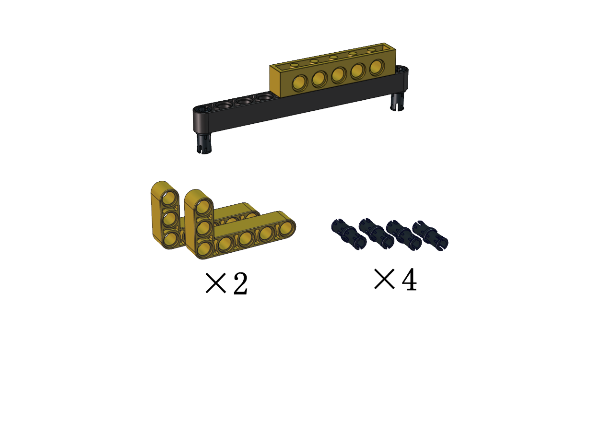

------

------

------

 Step 3
 Required components

------

------

------

 Step 4
 Required components

------

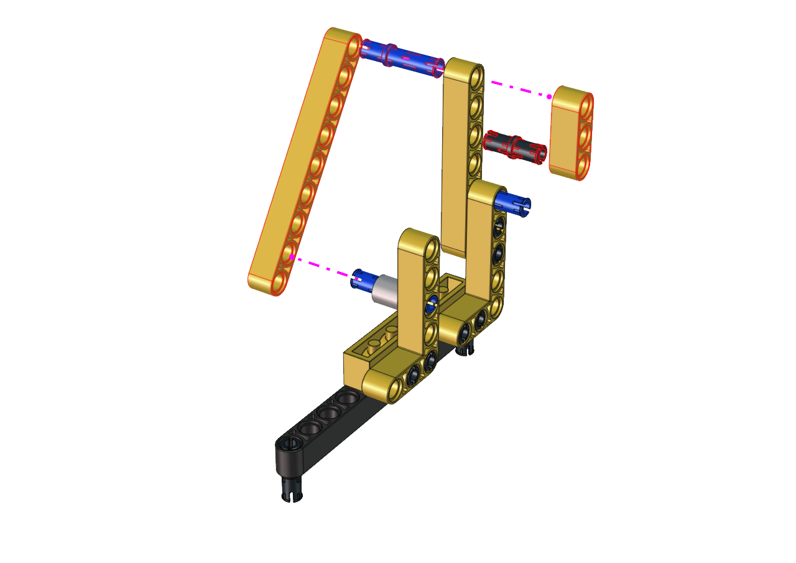

------

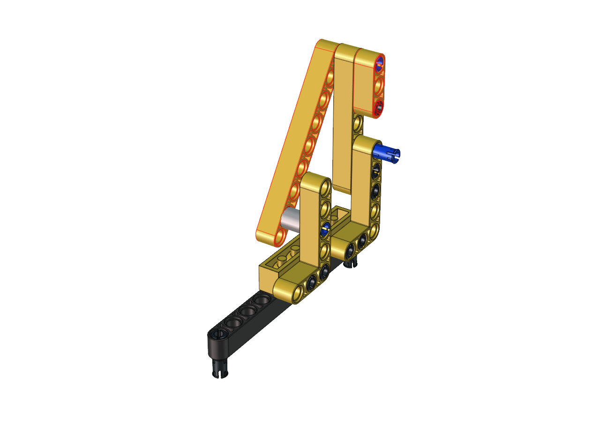

------

 Step 5
 Required components

------

------

------

 Step 6
 Required components
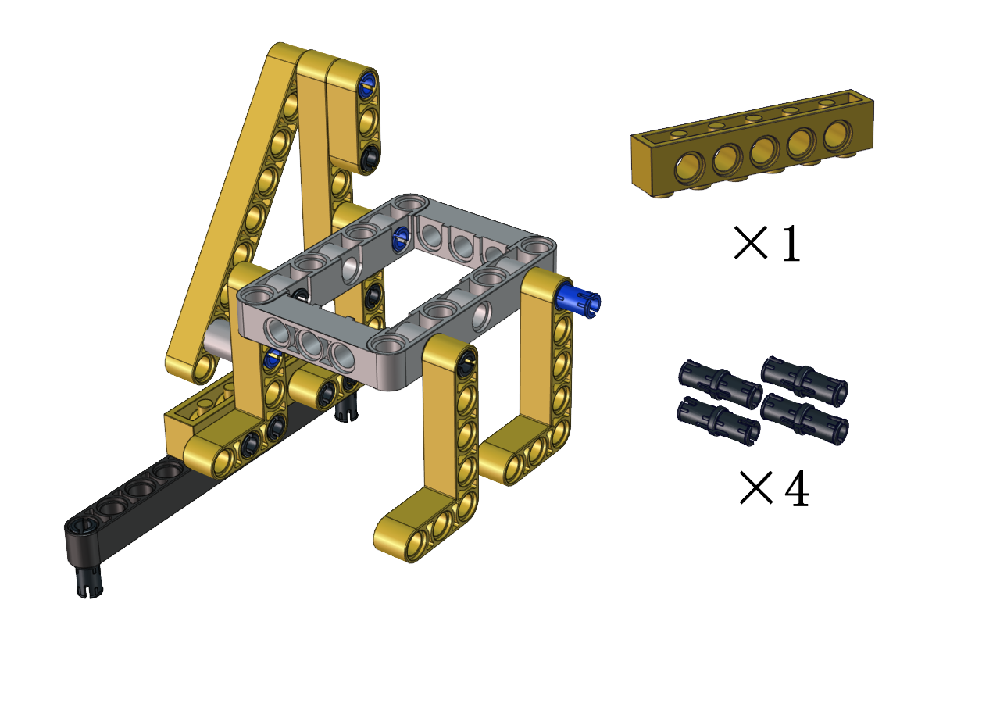

------

------

------

 Step 7
 Required components
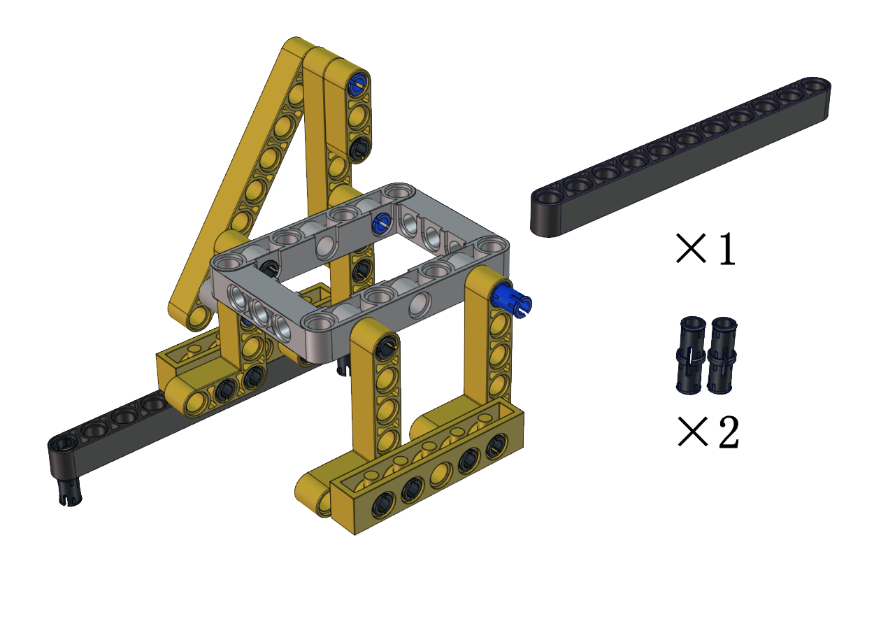

------

------

------

 Step 8
 Required components

------

------

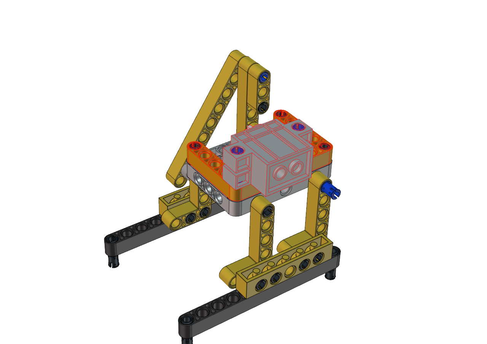

------

 Step 9
 Required components

------

------

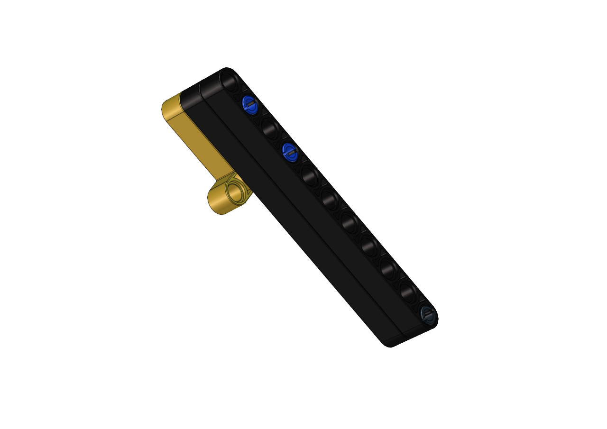

------

 Step 10
 Required components

------

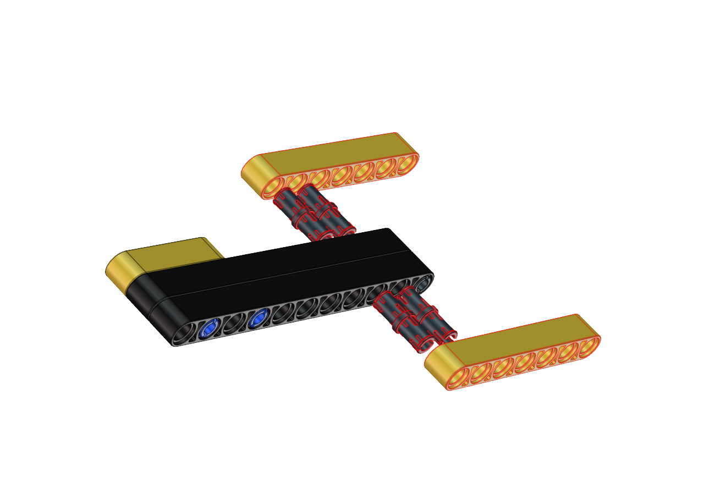

------

------

 Step 11
 Required components

------

------

------

 Step 12
 Required components

------

------

------

 Step 13
 Required components

------

------

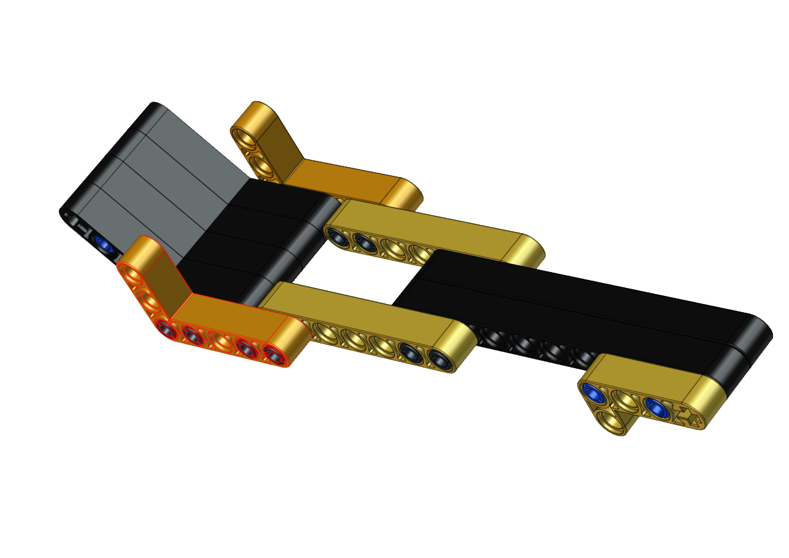

------

 Step 14
 Required components
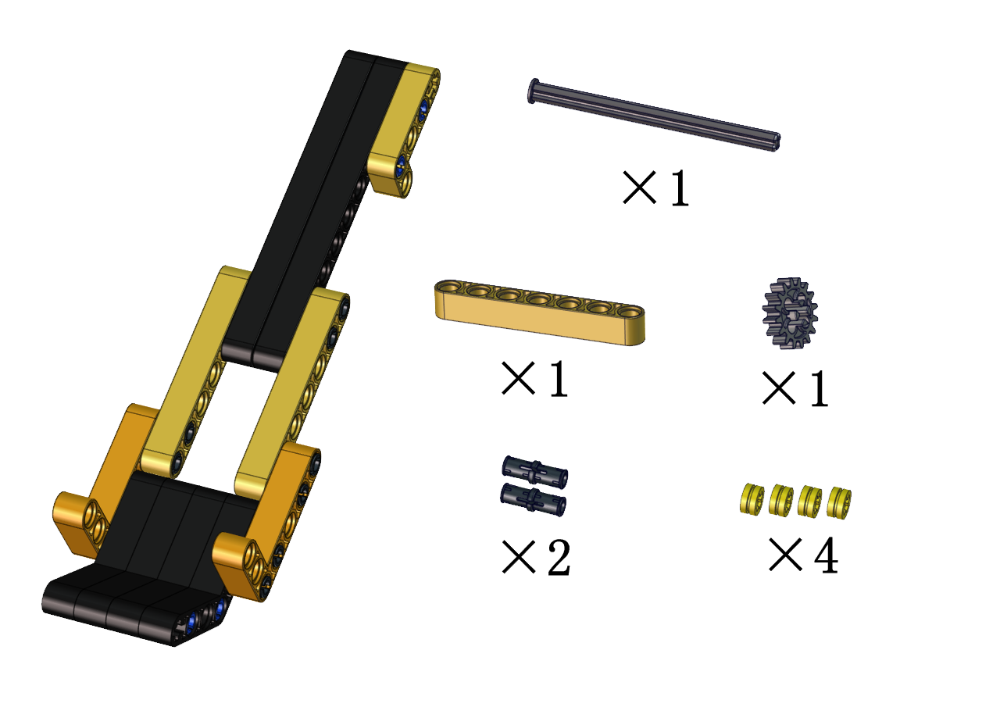

------

------

------

 Step 15
 Required components

------

------

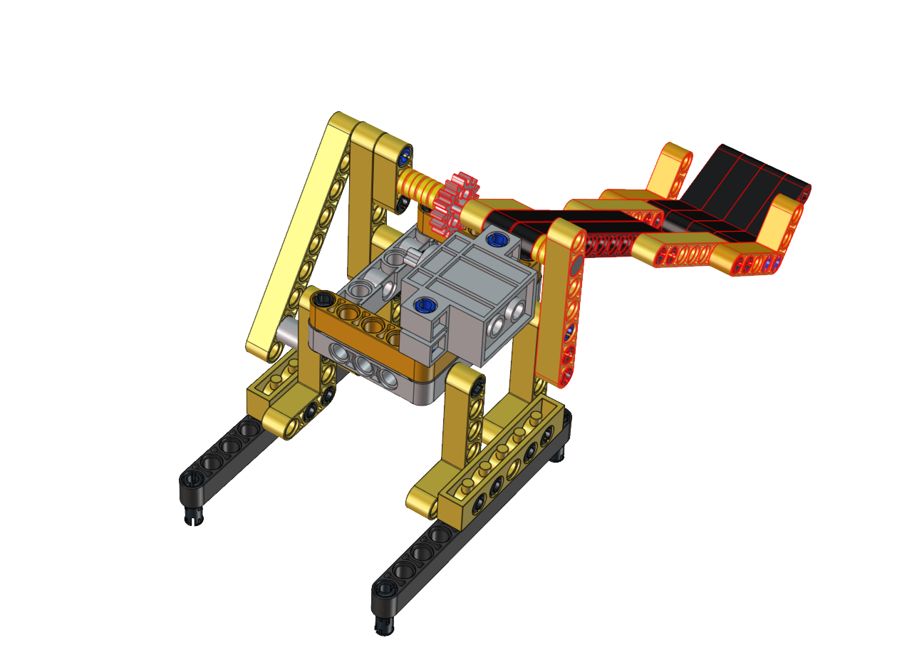

------

 Step 16
 Required components

------

------

------

 Step 17
 Required components
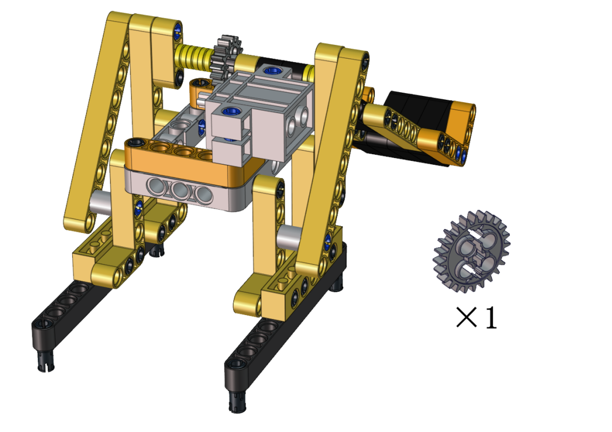

------

 Set the angle of the servo to 180 degree

| Wire servo up Servo | PCB Board |
| :--: | :--: |
|  Brown | G                 |
| Red | 5V  |
| Orange| S2（GPIO23）|

 Upload the code of the servo to the main board of the Beetlebot car, as shown below

    //*************************************************************************************
    #include <Arduino.h>

    int channel_PWM = 4;  
    int freq_PWM = 50;   
    int resolution_PWM = 10;   
    const int PWM_Pin = 23;  

    void setup() {
    ledcSetup(channel_PWM, freq_PWM, resolution_PWM); 
    ledcAttachPin(PWM_Pin, channel_PWM);  
    }

    void loop() {
    ledcWrite(channel_PWM, 128);  
    }
    //*************************************************************************************

 You can also initialize the angle of the servo through the following code

------

------

------

 Step 18

 Required components

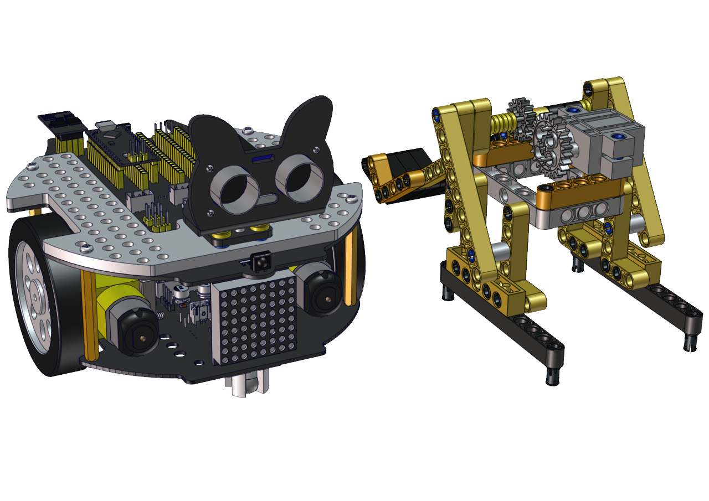

------

------

------

 Wire up

 Interface the servo

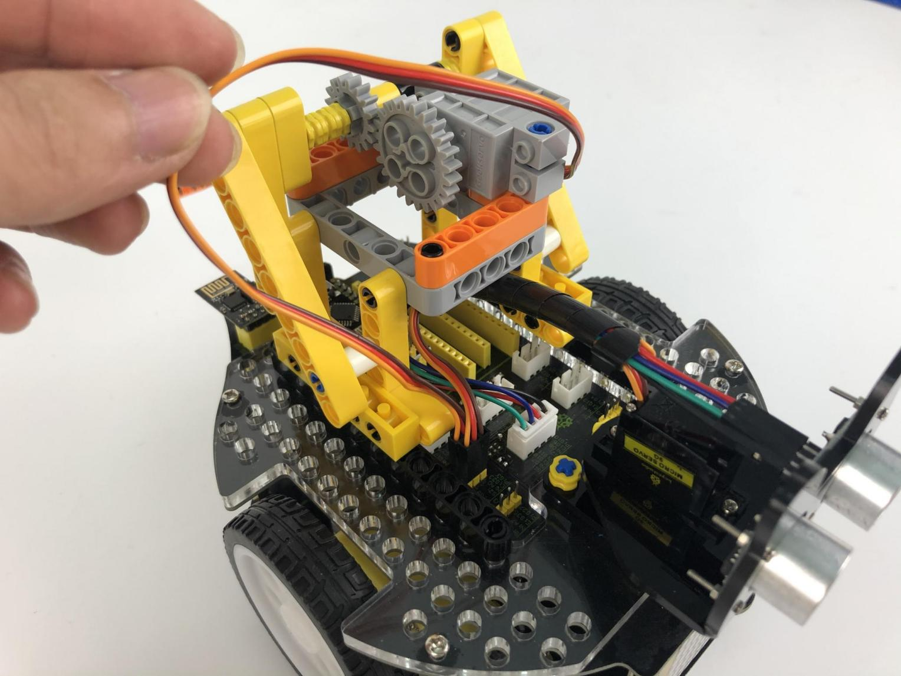

## **Test Code for Arduino：**

    #include <WiFi.h>
    #include <ESPmDNS.h>
    #include <WiFiClient.h>

    #define INA 32
    #define PWMA 25
    #define INB 33
    #define PWMB 26

    const char* ssid = "ChinaNet-2.4G-0DF0";
    const char* password = "ChinaNet@233";
    // TCP server at port 80 will respond to HTTP requests
    WiFiServer server(80);

    int channel_PWM = 3; 
    int freq_PWM = 50;
    int resolution_PWM = 10;
    const int servopin = 4;//

    void setup(void)
    {
        Serial.begin(115200);
        pinMode(INA, OUTPUT);
        ledcAttachPin(PWMA, 0);
        ledcSetup(0, 50, 8);
        pinMode(INB, OUTPUT);
        ledcAttachPin(PWMB,1);
        ledcSetup(1, 50, 8);//
        
        ledcSetup(3, 50, 10); 
        ledcAttachPin(23, 3); 
        ledcWrite(channel_PWM, set_angle(0));
        delay(300);

        // Connect to WiFi network
        WiFi.begin(ssid, password);
        Serial.println("");

        // Wait for connection
        while (WiFi.status() != WL_CONNECTED) {
            delay(500);
            Serial.print(".");
        }
        Serial.println("");
        Serial.print("Connected to ");
        Serial.println(ssid);
        Serial.print("IP address: ");
        Serial.println(WiFi.localIP());

        // Set up mDNS responder:
        // - first argument is the domain name, in this example
        //   the fully-qualified domain name is "esp32.local"
        // - second argument is the IP address to advertise
        //   we send our IP address on the WiFi network
        if (!MDNS.begin("esp32")) {
            Serial.println("Error setting up MDNS responder!");
            while(1) {
                delay(1000);
            }
        }
        Serial.println("mDNS responder started");

        // Start TCP (HTTP) server
        server.begin();
        Serial.println("TCP server started");

        // Add service to MDNS-SD
        MDNS.addService("http", "tcp", 80);
    }

    void loop(void)
    {
        // Check if a client has connected
        WiFiClient client = server.available();
        if (!client) {
            return;
        }
        //Serial.println("");
        //Serial.println("New client");

        // Wait for data from client to become available
        while(client.connected() && !client.available()){
            delay(1);
        }

        // Read the first line of HTTP request
        String req = client.readStringUntil('\r');
        //Serial.println(req);
        // First line of HTTP request looks like "GET /path HTTP/1.1"
        // Retrieve the "/path" part by finding the spaces
        int addr_start = req.indexOf(' ');
        int addr_end = req.indexOf(' ', addr_start + 1);
        if (addr_start == -1 || addr_end == -1) {
            //Serial.print("Invalid request: ");
            //Serial.println(req);
            return;
        }
        req = req.substring(addr_start + 1, addr_end);
        //Serial.print("Request: ");
        Serial.println(req);
        String s;
        if (req == "/")
        {
            IPAddress ip = WiFi.localIP();
            String ipStr = String(ip[0]) + '.' + String(ip[1]) + '.' + String(ip[2]) + '.' + String(ip[3]);
            s = "HTTP/1.1 200 OK\r\nContent-Type: text/html\r\n\r\n<!DOCTYPE HTML>\r\n<html>Hello from ESP32 at ";
            s += ipStr;
            s += "</html>\r\n\r\n";
            Serial.println("Sending 200");
            client.println(WiFi.localIP());
        }
        else if(req == "/btn/F")
        {
        digitalWrite(INA, LOW);
        ledcWrite(0, 100);
        digitalWrite(INB, LOW);
        ledcWrite(1, 100);
        }
        else if(req == "/btn/B")
        {
        digitalWrite(INA, HIGH);
        ledcWrite(0, 155);
        digitalWrite(INB, HIGH);
        ledcWrite(1, 155);
        }
        else if(req == "/btn/L")
        {
        digitalWrite(INA, LOW);
        ledcWrite(0, 100);
        digitalWrite(INB, HIGH);
        ledcWrite(1, 155);
        }
        else if(req == "/btn/R")
        {
        digitalWrite(INA, HIGH);
        ledcWrite(0, 155);
        digitalWrite(INB, LOW);
        ledcWrite(1, 100);
        }
        else if(req == "/btn/S")
        {
        digitalWrite(INA, LOW);
        ledcWrite(0, 0);
        digitalWrite(INB, LOW);
        ledcWrite(1, 0);
        }
        else if(req == "/btn/p")
        {
        Serial.write('p');
        ledcWrite(channel_PWM, set_angle(55));
        }
        else if(req == "/btn/q")
        {
        Serial.write('q');
        client.println("q");
        }
        else if(req == "/btn/x")
        {
        ledcWrite(channel_PWM, set_angle(0));
        }

    }

    int set_angle(int angle)
    {
    int servo_angle = map(angle, 0, 180, 25, 128);
    return servo_angle;
    }

## **Test Code for Kidsblock：**

Build up a few target objects with building blocks(object A, B, C,
D, E) and keep them in a certain distance away the catapult and
connect Wifi.

Click 
to make the car to face the object A,
hold down the button

to drive the catapult to launch a
building block.

Then release the button

to make the long arm return to the
original state. Next, let’s check if the object A is hit by the
launched block

You can repeat above steps to hit the object B, C and D
