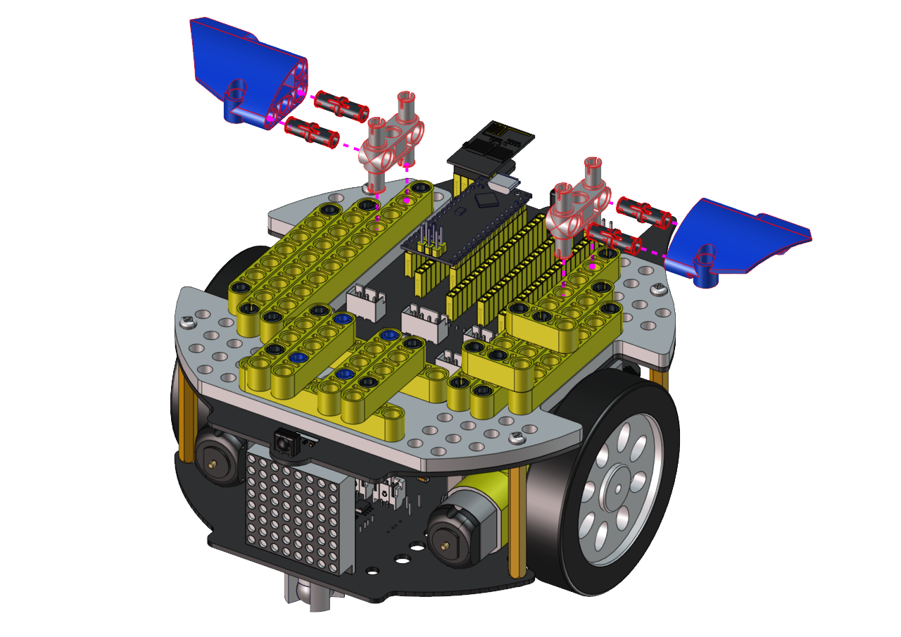
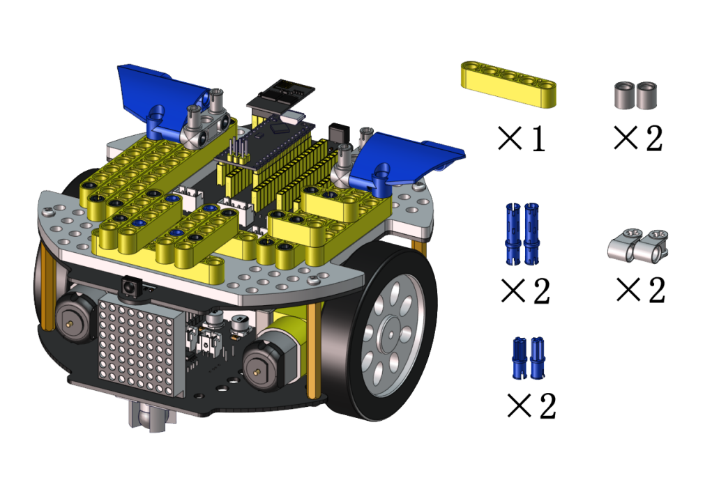
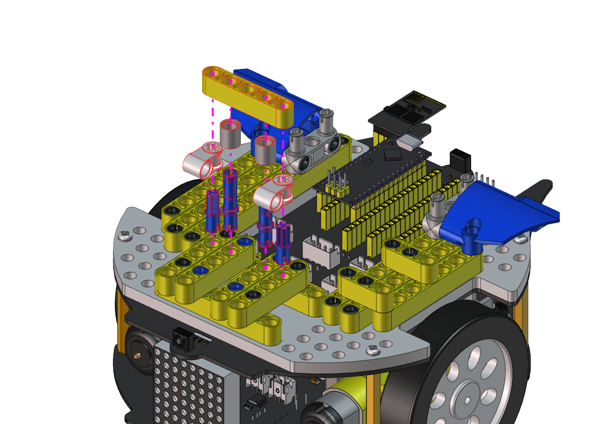
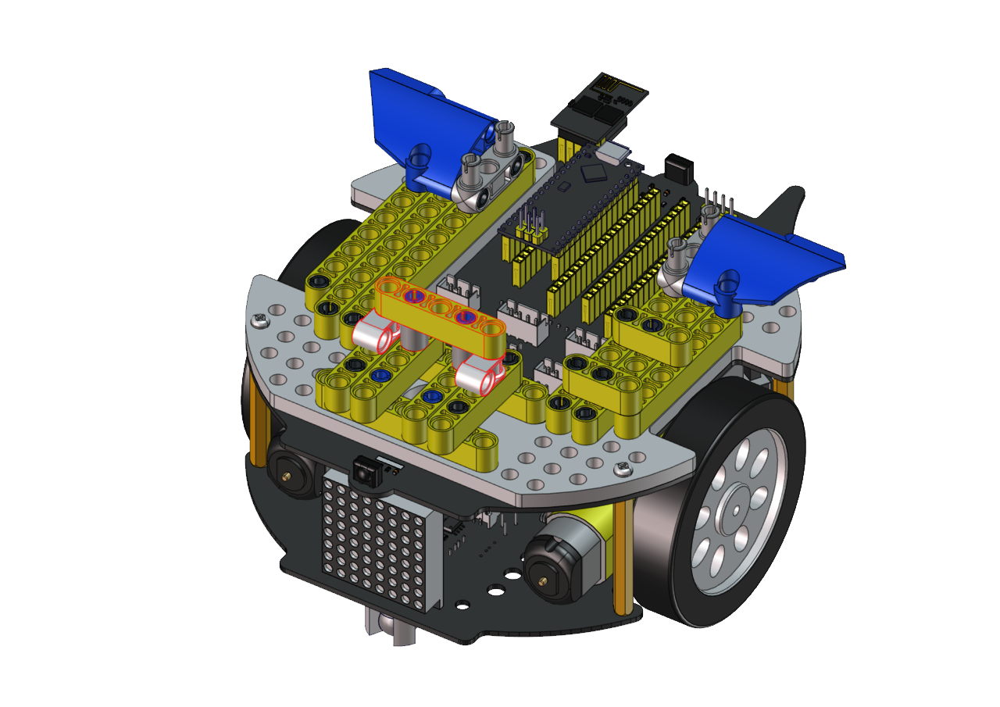
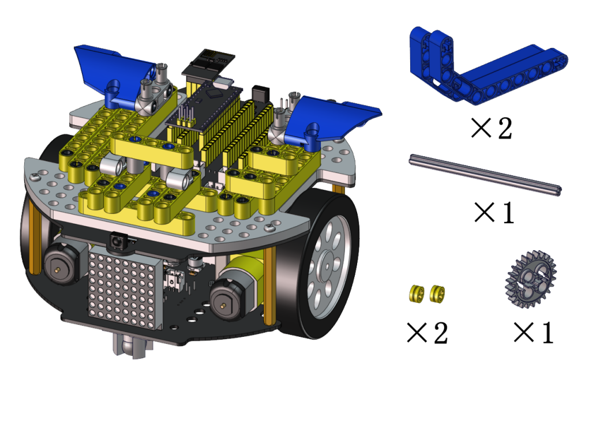
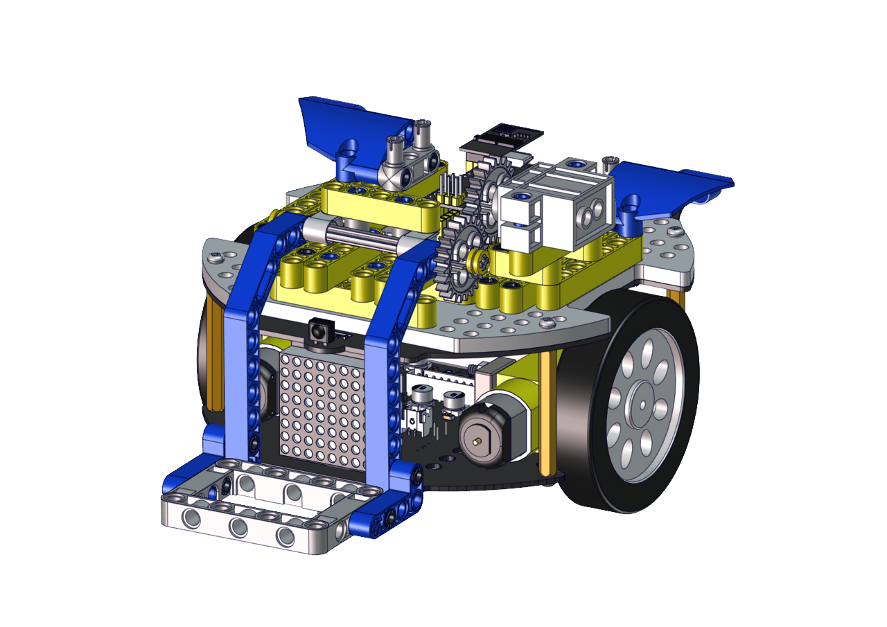
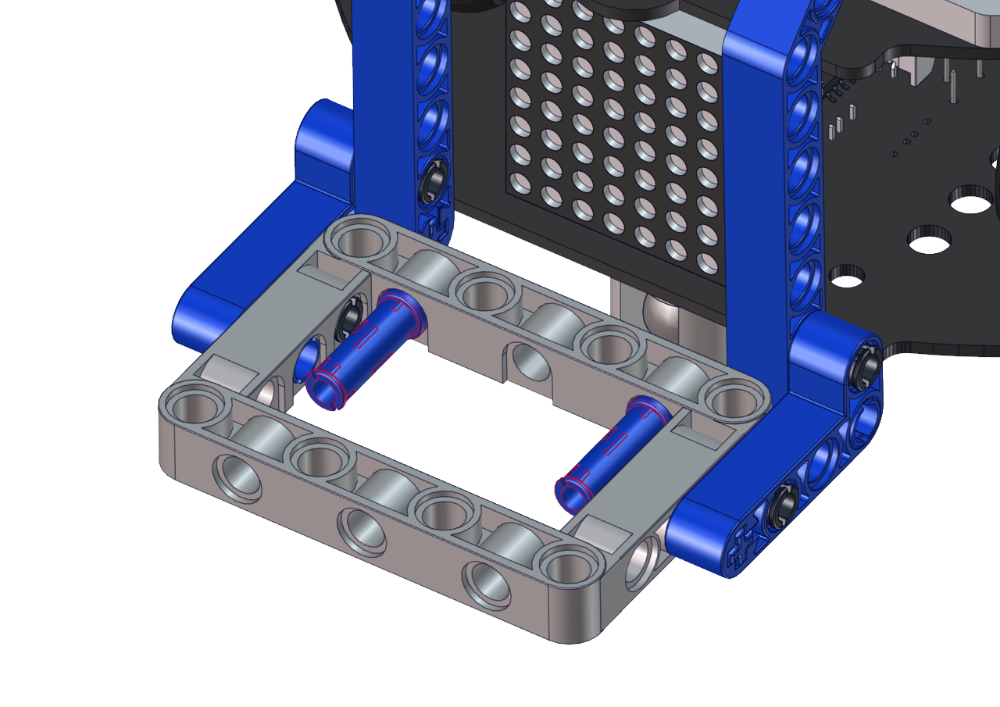

# **Handling Robot**

## **Description：**

Among many industrial robots, handling robots are undoubtedly
effective, applied in industrial manufacturing, warehousing and
logistics, tobacco, medicine, food, chemical and other industries,
or in post offices, libraries, ports and parking lots. In this
experiment, we will use LEGO blocks to build a handling robot to
carry things.

## **How to build up a handling robot**

 Step 1
 Dismantle the ultrasonic sensor

------

 Required components

------

------

------

 Step 2
 Required components

------

------

------

 Step 3
 Required components

------

------

------

 Step 4
 Required components

------

------

------

 Step 5
 Required components

------

------

------

 Step 6
 Required components

------

------

------

 Step 7
 Required components

------

------

------

 Step 8
 Required components

------

------

------

 Step 9
 Required components

------

 Set the angle of the servo to 180 degree

|    Wire servo up Servo  |  PCB Board    |
| ---- | ---- |
|   Brown   |  G    |
|   Red   |   5V   |
|   Orange   |   S2（A0）   |

 Upload the code of the servo to the main board of the Beetlebot car, as shown below

    //*************************************************************************************
    #include <Arduino.h>

    int channel_PWM = 4;  
    int freq_PWM = 50;   
    int resolution_PWM = 10;   
    const int PWM_Pin = 23;  

    void setup() {
    ledcSetup(channel_PWM, freq_PWM, resolution_PWM); 
    ledcAttachPin(PWM_Pin, channel_PWM);  
    }

    void loop() {
    ledcWrite(channel_PWM, 128);  
    }
    //*************************************************************************************

 You can also initialize the angle of the servo through the following code

------

------

------

 Step 10

 Required components

------

------

------

------

------

------

 Wire up servo

<!-- -->

## **Test Code for Arduino：**

    #include <WiFi.h>
    #include <ESPmDNS.h>
    #include <WiFiClient.h>

    #define INA 32
    #define PWMA 25
    #define INB 33
    #define PWMB 26

    const char* ssid = "ChinaNet-2.4G-0DF0";
    const char* password = "ChinaNet@233";
    // TCP server at port 80 will respond to HTTP requests
    WiFiServer server(80);
 
    int channel_PWM = 3; 
    int freq_PWM = 50;
    int resolution_PWM = 10;
    const int servopin = 4;//定义舵机的IO脚位在gpio4.

    void setup(void)
    {
        Serial.begin(115200);
        pinMode(INA, OUTPUT);
        ledcAttachPin(PWMA, 0);
        ledcSetup(0, 50, 8);
        pinMode(INB, OUTPUT);
        ledcAttachPin(PWMB,1);
        ledcSetup(1, 50, 8);
        
        ledcSetup(3, 50, 10); 
        ledcAttachPin(23, 3);
        ledcWrite(channel_PWM, set_angle(180));
        delay(300);

        // Connect to WiFi network
        WiFi.begin(ssid, password);
        Serial.println("");

        // Wait for connection
        while (WiFi.status() != WL_CONNECTED) {
            delay(500);
            Serial.print(".");
        }
        Serial.println("");
        Serial.print("Connected to ");
        Serial.println(ssid);
        Serial.print("IP address: ");
        Serial.println(WiFi.localIP());

        // Set up mDNS responder:
        // - first argument is the domain name, in this example
        //   the fully-qualified domain name is "esp32.local"
        // - second argument is the IP address to advertise
        //   we send our IP address on the WiFi network
        if (!MDNS.begin("esp32")) {
            Serial.println("Error setting up MDNS responder!");
            while(1) {
                delay(1000);
            }
        }
        Serial.println("mDNS responder started");

        // Start TCP (HTTP) server
        server.begin();
        Serial.println("TCP server started");

        // Add service to MDNS-SD
        MDNS.addService("http", "tcp", 80);
    }

    void loop(void)
    {
        // Check if a client has connected
        WiFiClient client = server.available();
        if (!client) {
            return;
        }
        //Serial.println("");
        //Serial.println("New client");

        // Wait for data from client to become available
        while(client.connected() && !client.available()){
            delay(1);
        }

        // Read the first line of HTTP request
        String req = client.readStringUntil('\r');
        //Serial.println(req);
        // First line of HTTP request looks like "GET /path HTTP/1.1"
        // Retrieve the "/path" part by finding the spaces
        int addr_start = req.indexOf(' ');
        int addr_end = req.indexOf(' ', addr_start + 1);
        if (addr_start == -1 || addr_end == -1) {
            //Serial.print("Invalid request: ");
            //Serial.println(req);
            return;
        }
        req = req.substring(addr_start + 1, addr_end);
        //Serial.print("Request: ");
        Serial.println(req);
        String s;
        if (req == "/")
        {
            IPAddress ip = WiFi.localIP();
            String ipStr = String(ip[0]) + '.' + String(ip[1]) + '.' + String(ip[2]) + '.' + String(ip[3]);
            s = "HTTP/1.1 200 OK\r\nContent-Type: text/html\r\n\r\n<!DOCTYPE HTML>\r\n<html>Hello from ESP32 at ";
            s += ipStr;
            s += "</html>\r\n\r\n";
            Serial.println("Sending 200");
            client.println(WiFi.localIP());
        }
        else if(req == "/btn/F")
        {
        digitalWrite(INA, LOW);
        ledcWrite(0, 100);
        digitalWrite(INB, LOW);
        ledcWrite(1, 100);
        }
        else if(req == "/btn/B")
        {
        digitalWrite(INA, HIGH);
        ledcWrite(0, 155);
        digitalWrite(INB, HIGH);
        ledcWrite(1, 155);
        }
        else if(req == "/btn/L")
        {
        digitalWrite(INA, LOW);
        ledcWrite(0, 100);
        digitalWrite(INB, HIGH);
        ledcWrite(1, 155);
        }
        else if(req == "/btn/R")
        {
        digitalWrite(INA, HIGH);
        ledcWrite(0, 155);
        digitalWrite(INB, LOW);
        ledcWrite(1, 100);
        }
        else if(req == "/btn/S")
        {
        digitalWrite(INA, LOW);
        ledcWrite(0, 0);
        digitalWrite(INB, LOW);
        ledcWrite(1, 0);
        }
        else if(req == "/btn/p")
        {
        Serial.write('p');
        ledcWrite(channel_PWM, set_angle(130));
        }
        else if(req == "/btn/q")
        {
        Serial.write('q');
        client.println("q");
        }
        else if(req == "/btn/x")
        {
        ledcWrite(channel_PWM, set_angle(180));
        }

    }

    int set_angle(int angle)
    {
    int servo_angle = map(angle, 0, 180, 25, 128);
    return servo_angle;
    }

## **Test Code for Kidsblock：**

Connect Wifi, click
buttons
to make the car to move toward
building blocks and put some building blocks on the robot.

Then press 
to drive the robot to move.

Hold down the button

to drive the robot to drop building
blocks, then building blocks can be conveyed
