# Python Tutorials


## Preparation for Python (Windows)

### Install Thonny

Thonny is a free and open source software platform with small size, simple interface, simple operation and rich functions. It is a Python IDE suitable for beginners. In this tutorial, we use this IDE to develop a ESP32. Thonny supports multiple operating systems including Windows, Mac OS, Linux. 

### Download Thonny

1\. Enter the website：[<span
class="underline">https://thonny.org</span>](https://thonny.org) to download the latest version of Thonny.

2\. Thonny open-source code library：[<span
class="underline">https://github.com/thonny/thonny</span>](https://github.com/thonny/thonny)

|  System   | Download link                                                |
| :-------: | ------------------------------------------------------------ |
| MAC OS：  | https://github.com/thonny/thonny/releases/download/v3.2.7/thonny-3.2.7.pkg |
| Windows： | [https://github.com/thonny/thonny/releases/download/v3.2.7/thonny-3.2.7.exe]( https:/github.com/thonny/thonny/releases/download/v3.2.7/thonny-3.2.7.exe) |
|  Linux：  | Latest version:<br /><br />**Binary bundle for PC (Thonny+Python):**<br />bash <(wget -O - https://thonny.org/installer-for-linux)<br />**With pip:** <br />pip3 install thonny<br />**Distro packages (may not be the latest version):**	<br />**Debian, Rasbian, Ubuntu, Mint and others:**<br />sudo apt install thonny<br />**Fedora:**<br />sudo dnf install thonny |


 **Windows System**


1.  Click 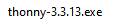 and select install mode. You can choose  or 

    
    
    
2.  You can also keep selecting  to finish install

    
    

    
    
3.  If you want to change the route of installing Thonny, just click “**Browse...**” to select a new route and click **OK**.
    
    
    
    
    
4.  Tick **Create desktop icon**, you will view Thonny on your desktop


5. Click .

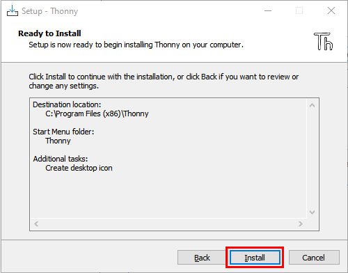

6. Wait for a while but DON'T click 


7. Click .


You will see the Thonny icon  on your desktop.


 **Basic Setting：**

Double-click Thonny, choose lanuage and initial settings and click .


1.  Click “**View**” → “**File**” and “**Shell**”

    
    

    
    

    
    

### Install the CP2102 Driver

Before using the Thonny, we need to install the CP2102 driver in the computer.

 **Windows system**

Check if the CP2102 driver has been installed.

1. Interface the ESP32 with your PC with a USB cable :

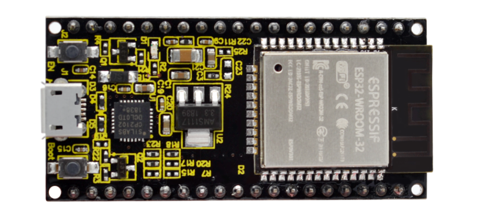


2. Click “This PC” and right-click "Manage”.


1.  Click “Device Manager”, if the CP2102 driver has been installed, Silicon Labs CP210x USB to UART Bridge(COMx) will be
    shown.
    
    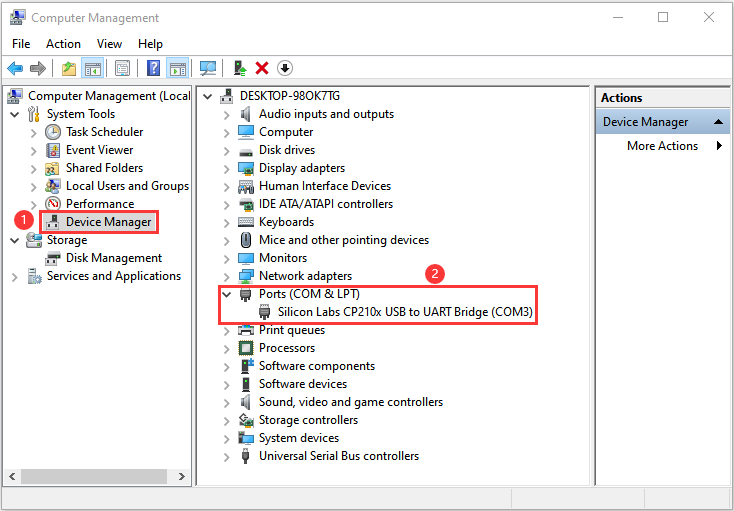
    
    
    If the CP2102 has not been installed.
    
    
    
    
    Click “CP2102USB to UART Bridge Controller” and "Update driver”.
    
    
    

1.  Click .

    
    

    Click  to choose "Python Tutorials\\1. Get started with Python\\CP2102 Driver File-Windows" and click **Next**.
    
    
    
    
    The CP2102 driver will be installed.
    
    
    
    
    
    

 MAC System

You can refer to the file  in the folder.

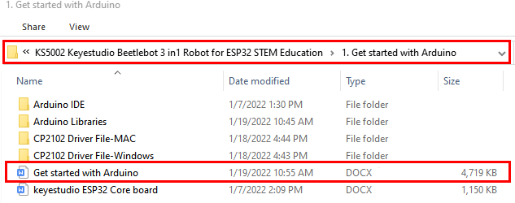

### Burn Micropython Firmware

To run a Python program on the ESP32 board, we need to burn the firmware to the ESP32 board first.

Download Micropython firmware

microPython website：<http://micropython.org/>

ESP32 firmware：[<span
class="underline">https://micropython.org/download/esp32/</span>](https://micropython.org/download/esp32/)


The firmware we use: **esp32-20210902-v1.17.bin**

Download firmware: [https://micropython.org/resources/firmware/esp32-20210902-v1.17.bin](https://micropython.org/resources/firmware/esp32-20220117-v1.18.bin)

Firmware: Keyestudio Beetlebot 3 in1 Robot for ESP32 STEM Education\\5. Python Tutorials\\1. Get started with Python\\Python\_Firmware.

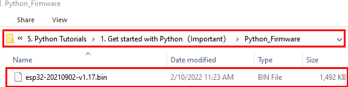

 Burn Micropython Firmware

Connect the ESP32 to your PC with a USB cable


Make sure the driver has been installed successfully and the COM port shown. Open Device Manager and click .


Open Thonny, click “run” and “Select interpreter...”.


Select Micropython (ESP32) and Silicon Labs CP210x USB to UART Bridge(COM3) and click Install or update firmware.


Select “Silicon Labs CP210x USB to UART Bridge(COM3)”, click “Browse...” and choose the firmware **esp32-20210902-v1.17.bin**

Check Erase flash before installing and Flash mode, then click 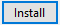.

(Note: if you fail to install the firmware, press the Boot on the ESP32 board and click  )


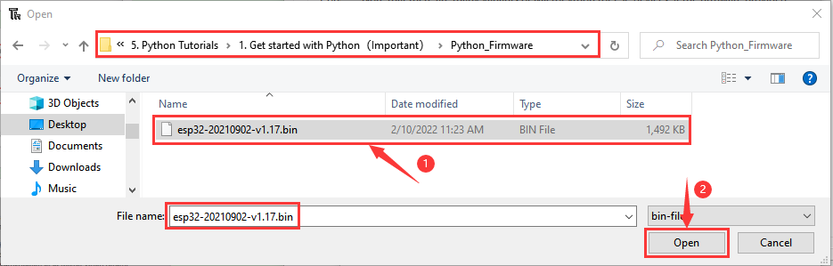


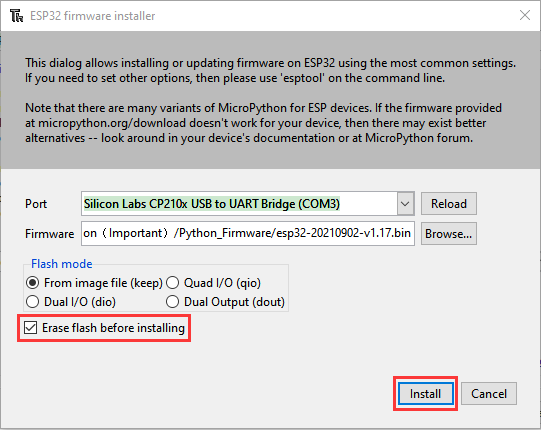


Then click **Close** and **OK**.


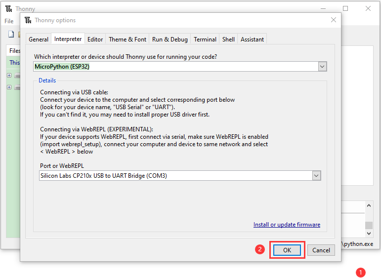

Turn off all windows and turn to the main page and click 


### Test Code

 Test the Shell commander

Input print ('hello world') in the “Shell” and press **Enter**


Connect the ESP32 to your PC. Users can program and debug programs with Thonny.

Open Thonny and click .


Then a new window pops up, click “This computer”.

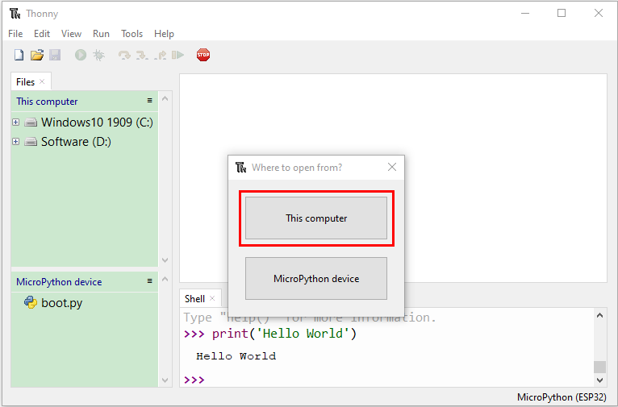


Select the file .

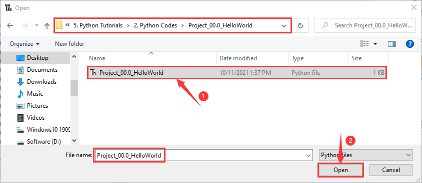


Click ,“Hello World”will be printed in the “Shell” monitor

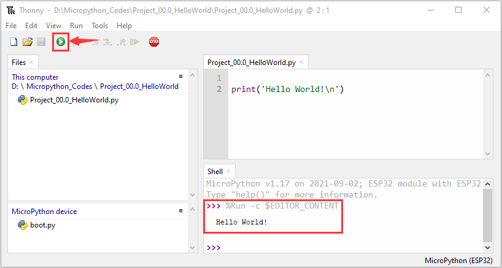


Note: Press the reset button to reboot

 Run the test code (offline)

After rebooting the ESP32, run the boot.py file under the root directory first then run your code file.

So, we need to add a guide program to run the code of users.

KS5002 Keyestudio Beetlebot 3 in1 Robot for ESP32 STEM Education\\Python Tutorials\\Python Codes/Micropython\_Codes.

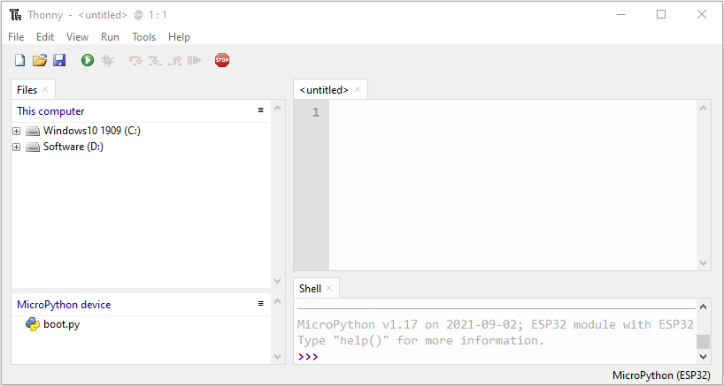


Click Project\_00.1\_Boot and double-click boot.py, then the code under MicroPython device can run offline.

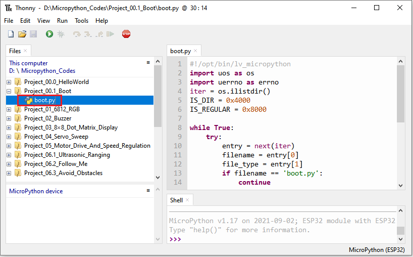


If you want to run the code offline, you nee to upload boot.py and program code to MicroPython device, then press the ESP32 button. We will take the Project\_00.0 and Project\_00.1 as an example. Select boot.py and right-click Upload to /.

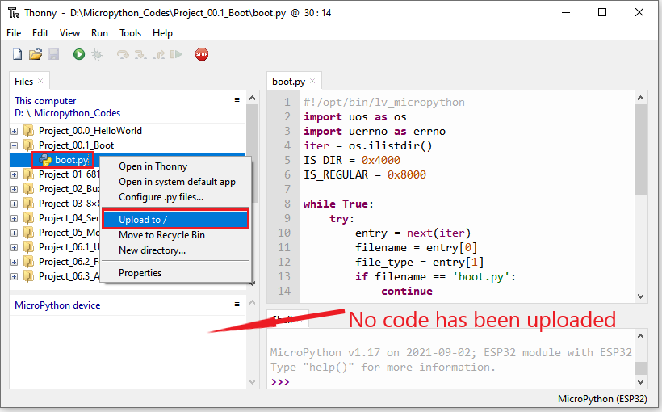


Similarly, upload the Project\_00.0\_HelloWorld.py file to the “MicroPython device”.

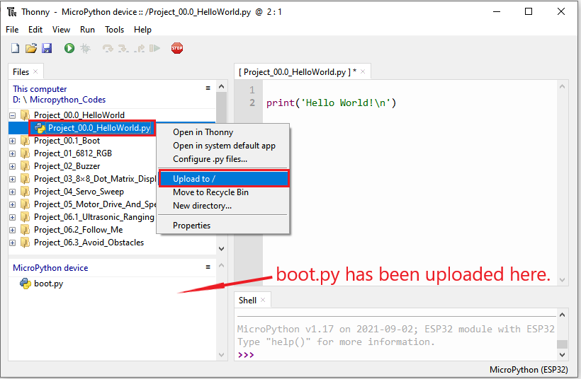


Press the **Reset** button, you will view code running in the Shell monitor

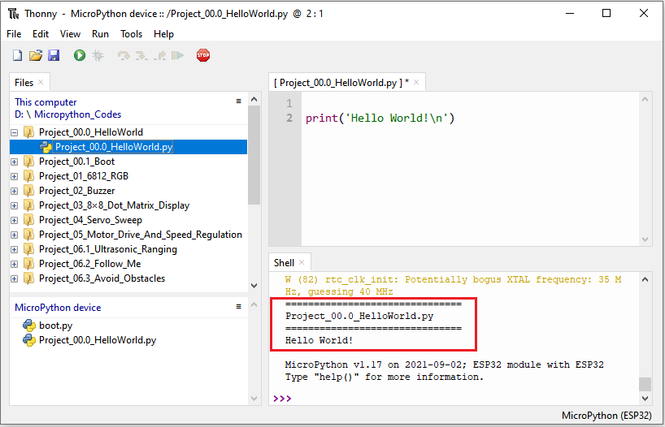

 Upload the code to the ESP32

We take the boot.py as an example. If we add a boot.py in each code directory, reboot the ESP32, the boot.py will run first

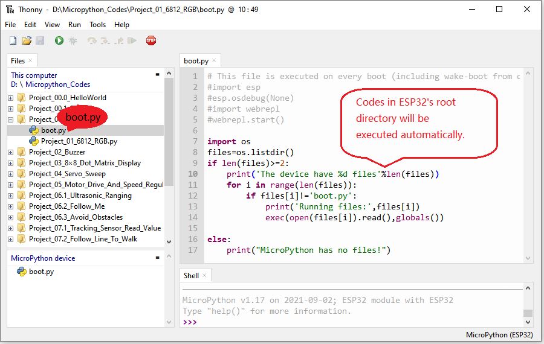


Project\_01\_6812\_RGB&lt;boot.py, right-click to select “Upload to /”. Then the code will be uploaded to the root directory of the ESP32 and click .

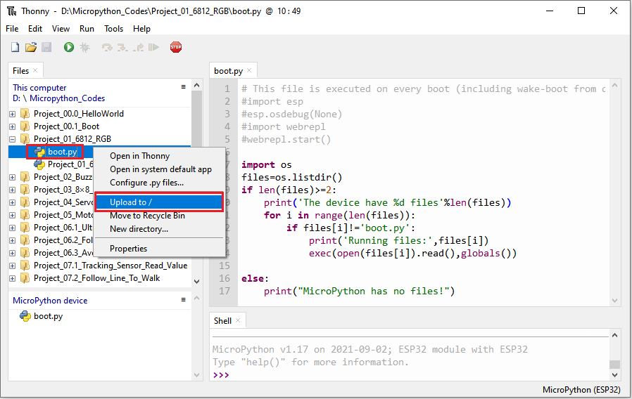


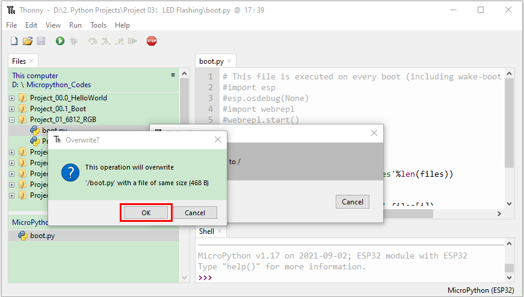

 Download the code to your PC:

MicroPython device boot.py, then right-click "Download to…"

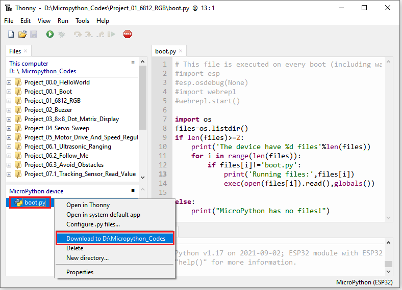

 Delete files of the ESP32

For example, click “boot.py” in the MicroPython device and right-click **Delete**

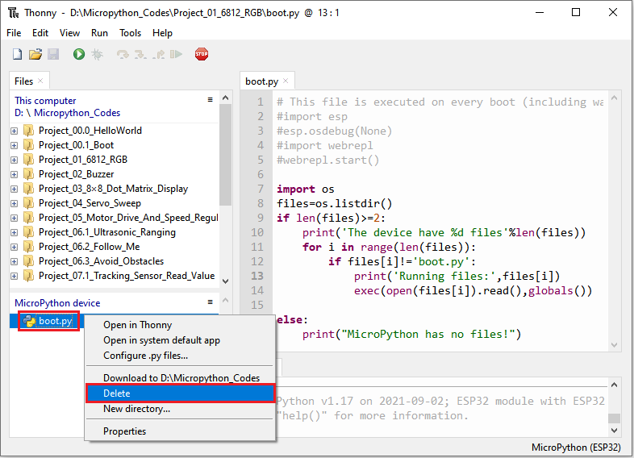


Select boot.py in the Project\_01\_6812\_RGB folder, right-click Move to Recycle Bin to delete it

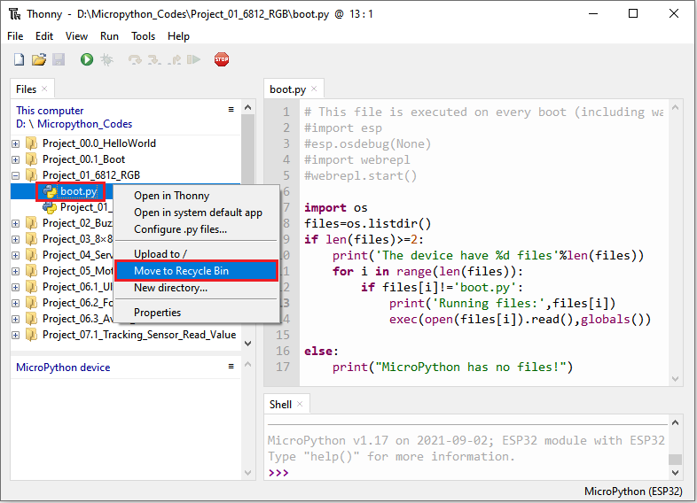

 Create and save code

Click “File” → “New” to create and edit code.


Enter the code in the new file. We take the Project\_01\_6812\_RGB.py as an example.

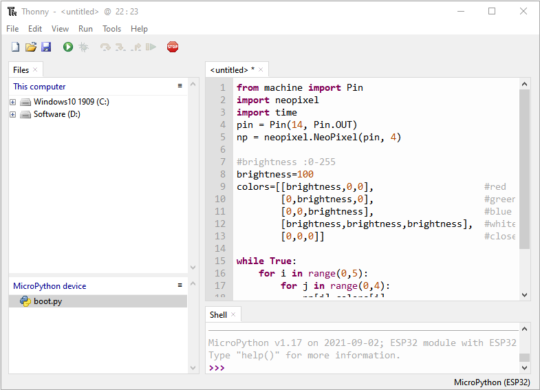

Click  to save the code to your PC or the ESP32.

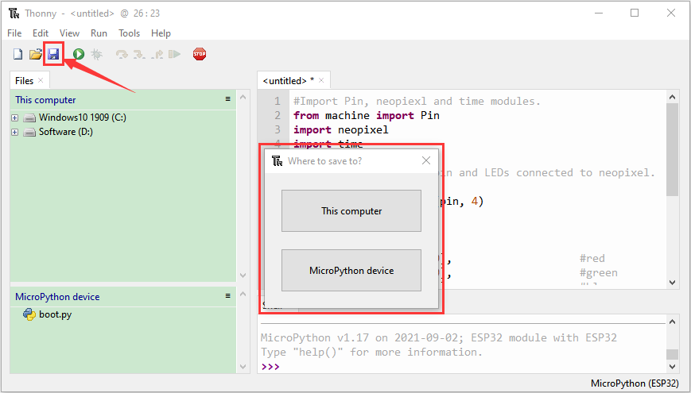


Select MicroPython device and enter main.py in the new page and click OK.

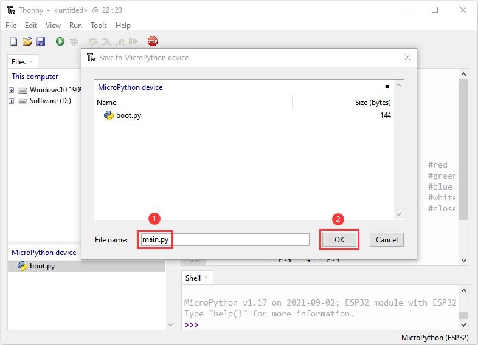

Then the code will be uploaded to the ESP32.

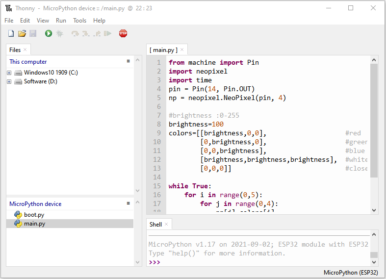


Disconnect the USB cable and reconnect it, you can see that the 4 RGB LEDs on the PCB board of the car flash red, green, blue and white color, loop alternately.

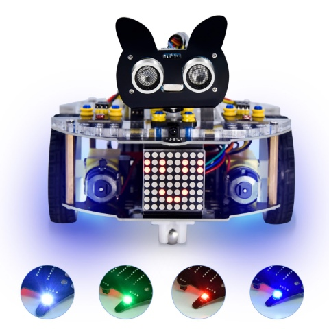


## Projects

### Project 1: 6812 RGB

 **1. Description：**

There are 4 RGB LEDs can be widely used in the decoration of buildings,
bridges, roads, gardens, courtyards and so on by colors adjustment.

In this experiment, we will demonstrate different lighting effects with
them.

 **2. Knowledge：**

**Working Principle**

From the schematic diagram, we can see that these four pixel lighting beads are all connected in series. In fact, no matter how many they are, we can use a pin to control a light and let it display any color. The pixel point contains a data latch signal shaping amplifier drive circuit, a high-precision internal oscillator and a 12V high-voltage programmable constant current control part, which effectively ensures the color of the pixel point light is highly consistent.

The data protocol adopts a single-wire zero-code communication method. After the pixel is powered up and reset, the S terminal receives the data transmitted from the controller. The first 24bit data sent is extracted by the first pixel and sent to the data latch of the pixel.


 **3. Test Code：**

The SK6812RGB on the PCB board is controlled by the GPIO 14 of the ESP32 board.

You can download test code from a link <https://fs.keyestudio.com/KS5002> You can save the code anywhere. We save the code in the drive D of our computer.

As shown below: D:\\Micropython\_Codes.

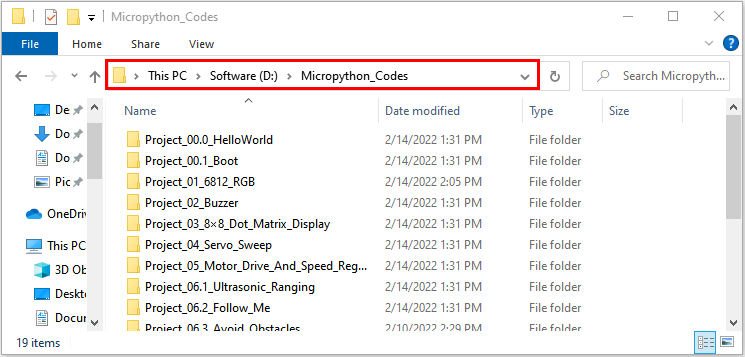

**Run the test code：**

Open “Thonny” and click “This computer” → “D:” → “Micropython\_Codes”

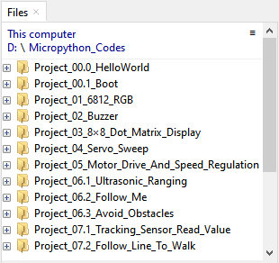

Click Project\_01\_6812\_RGB and double-click Project\_01\_6812\_RGB.py as shown below:

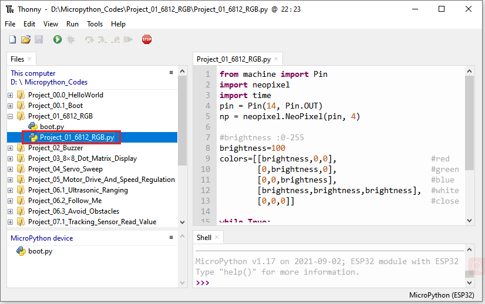


```python
#Import Pin, neopiexl and time modules.
from machine import Pin
import neopixel
import time

#Define the number of pin and LEDs connected to neopixel.
pin = Pin(14, Pin.OUT)
np = neopixel.NeoPixel(pin, 4)

#brightness :0-255
brightness=100                                
colors=[[brightness,0,0],                    #red
        [0,brightness,0],                    #green
        [0,0,brightness],                    #blue
        [brightness,brightness,brightness],  #white
        [0,0,0]]                             #close

#Nest two for loops to make the module repeatedly display five states of red, green, blue, white and OFF.    
while True:
    for i in range(0,5):
        for j in range(0,4):
            np[j]=colors[i]
            np.write()
            time.sleep_ms(50)
        time.sleep_ms(500)
    time.sleep_ms(500)
```

Connect the ESP32 board to your PC and click  or press **Reset**


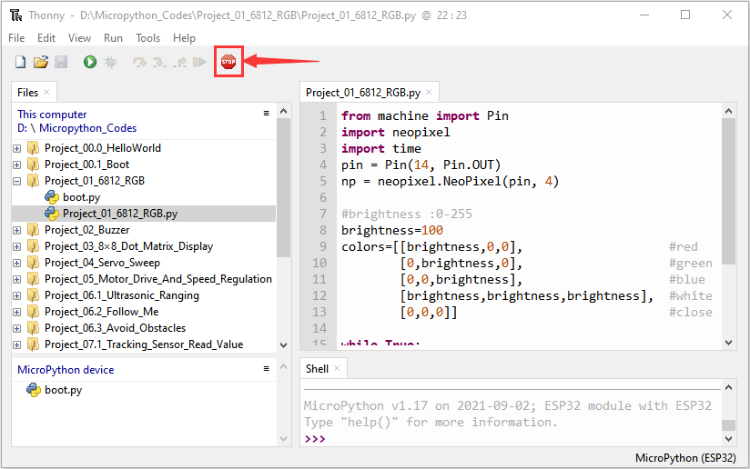

Click “Run current script”, the Shell monitor will show scripts and code will be run. 4 RGB lights will show red, green, blue and white color then go off, loop alternately.

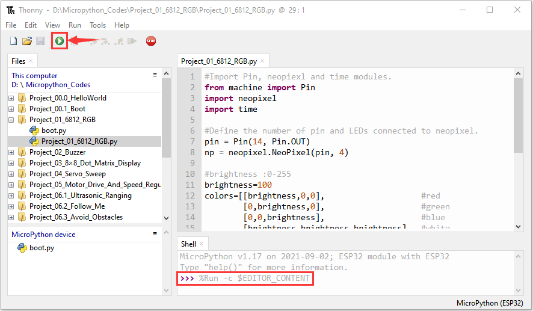

Note：

Unplug the ESP32 board or press Reset, 4 RGB LEDs show the same color and Thonny shows as follows;

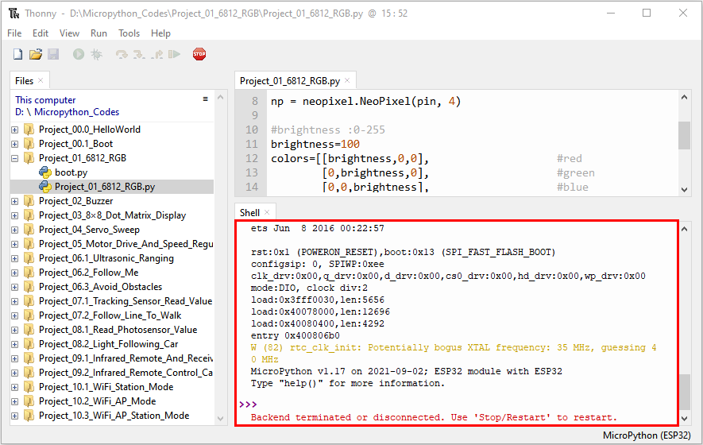

**Offline**

Upload the test code to the ESP32 board.

Right-click Project\_01\_6812\_RGB.py, select“Upload to /”to upload the code

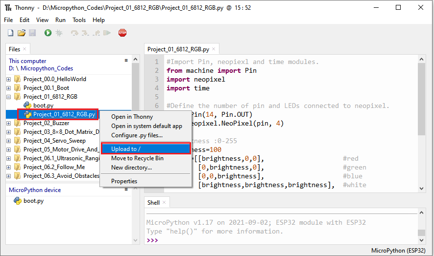

You can upload the boot.py in same way and click “OK”.

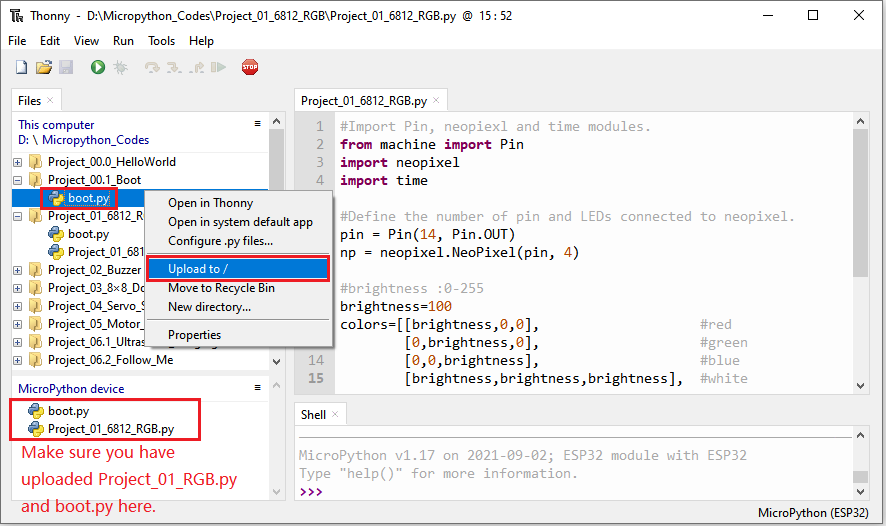

Press the Reset button on the ESP32 board, then the RGB LEDs will will show red, green, blue and white color then go off, loop alternately


Note: If you want to stop running code, just click .


### Project 2: Play Music

 **1. Description：**

There is a power amplifier component on the expansion board, which is often used to play music and serve as an external amplifying device for music playback devices.

In this experiment, we use the speaker amplifier component to play music.

 **2. Knowledge：**

Power amplifier modules(equivalent to a passive buzzer) don’t have internal oscillation circuits.

The power amplifier module can chime sounds with different frequency when power it up.

 **3. Test Code：**

The speaker component on the PCB board is controlled by the GPIO 2 of the ESP32 board.

You can download test code from a link<https://fs.keyestudio.com/KS5002> You can save the code anywhere. We save the code in the drive D of our computer.

As shown below: D:\\Micropython\_Codes.


Open “Thonny” and click “This computer” → “D:” → “Micropython\_Codes” → “Project\_02\_Buzzer”

Double-click "Project\_02\_Buzzer.py” as shown below:

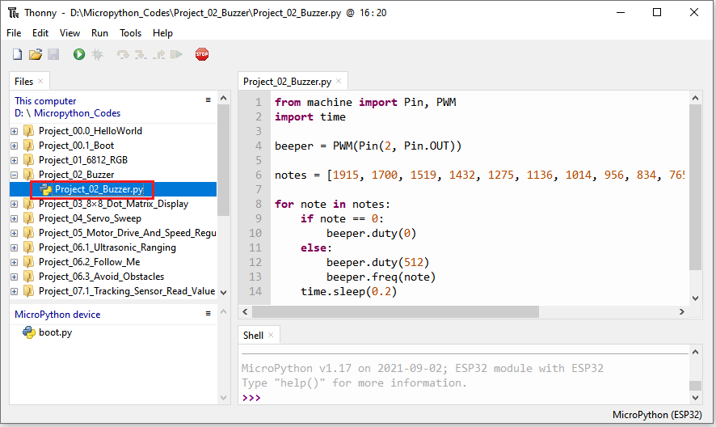

```python
from machine import Pin, PWM
import time

beeper = PWM(Pin(2, Pin.OUT)) 

notes = [1915, 1700, 1519, 1432, 1275, 1136, 1014, 956, 834, 765, 593, 468, 346, 224, 655, 715]

for note in notes:     
    if note == 0:        
        beeper.duty(0)
    else:
        beeper.duty(512)  
        beeper.freq(note) 
    time.sleep(0.2)       
    beeper.duty(0)        
    time.sleep(0.1)
```

Connect the ESP32 board to your PC and click 

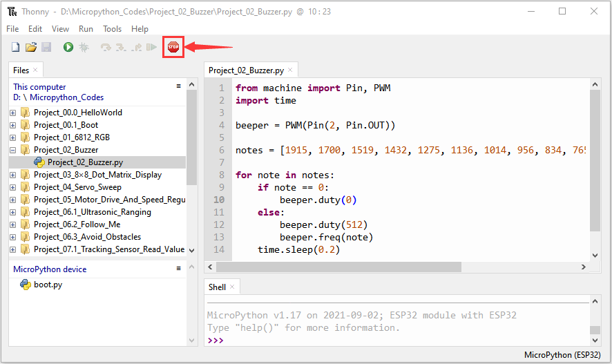

Click , the script starts running, then the speaker module on the PCB will emit sounds; press “Ctrl+C” or click  to exit

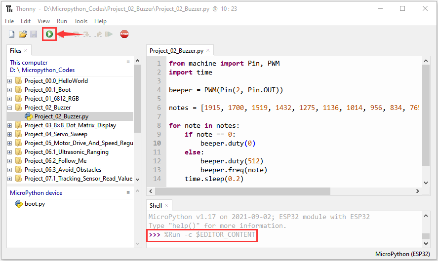

### Project 3: 8\*8 Dot Matrix Display

 **1. Description：**

Composed of LED emitting tube diodes, the 8\*8 LED dot matrix are applied widely to public information display like advertisement screen and bulletin board, by controlling LED to show words, pictures and videos, etc.

 **2. Knowledge：**

# Dot matrix

There are different types of matrices, including 4×4, 8×8 and 16×16 and etc. It contains 64 LEDs.

The inner structure of 8×8 dot matrix is shown below.


Every LED is installed on the cross point of row line and column line. When the voltage on a row line increases, and the voltage on the column line reduces, the LED on the cross point will light up. 8×8 dot matrix has 16 pins. Put the silk-screened side down and the numbers are 1, 8, 9 and 16 in anticlockwise order as marked below.


The definition inner pins are shown below:


For instance, to light up the LED on row 1 and column 1, you should increase the voltage of pin 9 and reduce the voltage of pin 13.

# **HT16K33 8X8 Dot Matrix**

The HT16K33 is a memory mapping and multi-purpose LED controller driver. The max. Display segment numbers in the device is 128 patterns (16 segments and 8 commons) with a 13\*3 (MAX.) matrix key scan circuit. The software configuration features of the HT16K33 makes it suitable for multiple LED applications including LED modules and display subsystems. The HT16K33 is compatible with most microcontrollers and communicates via a two-line bidirectional I2C-bus.

# **Working schematic of HT16K33 chip**


We design the drive module of 8\*8 dot matrix based on the above principle. We could control the dot matrix by I2C communication and two pins of microcontroller, according to the above diagram.

# **Specification**

- Input voltage: 5V    

- Rated input frequency: 400KHZ 

- Input power: 2.5W  

- Input current: 500mA  

 **3. Introduction for Modulus Tool**

The online version of dot matrix modulus tool:<http://dotmatrixtool.com/>

①Open the link to enter the following page.


②The dot matrix is 8\*8 in this project. So set the height to 8, width to 8; as shown below.


**③**Click **Byte Order** to select **Row Major**

Click **Endian** to select **Big Endian**(MSB)


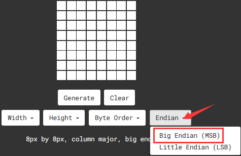

③ Generate hexadecimal data from the pattern

As shown below, the left button of the mouse is for selection while the right is for canceling. Thus you could use them to draw the pattern you want, then click **Generate**, to yield the hexadecimal data needed.


The generated hexadecimal code（0x00, 0x66, 0x00, 0x00, 0x18, 0x42, 0x3c, 0x00) is what will be displayed, so you need to save it for next procedure.

 **4. Wiring up：**

| 8*8 Dot matrix display | PCB Board |
| :--------------------: | :-------: |
|           G            |     G     |
|           5V           |    5V     |
|          SDA           |    SDA    |
|          SCL           |    SCL    |

 **5. Test Code：**

The 8\*8 dot matrix is controlled by GPIO21（SDA）and GPIO22（SCL）of the ESP32 board.

You can download test code from a link <https://fs.keyestudio.com/KS5002> You can save the code anywhere. We save the code in the drive D of our computer.

As shown below: D:\\Micropython\_Codes.


Open“Thonny”<“This computer”→“D:”→“Micropython_Codes”→“Project_03_8×8_Dot_Matrix_Display”; select“ht16k33.py” and“ht16k33matrix.py”and right-click“Upload to /”; wait“ht16k33.py”and“ht16k33matrix.py”uploaded to the ESP32 board. Then double-click.

Click Project_01_6812_RGB and double-click Project_01_6812_RGB.py as shown below:“Project_03_8×8_Dot_Matrix_Display.py”

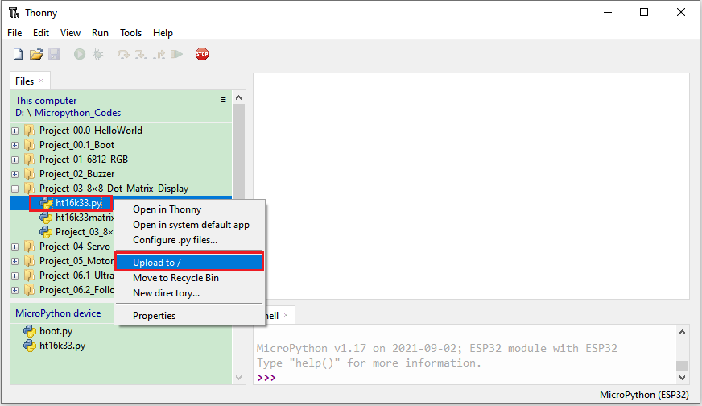

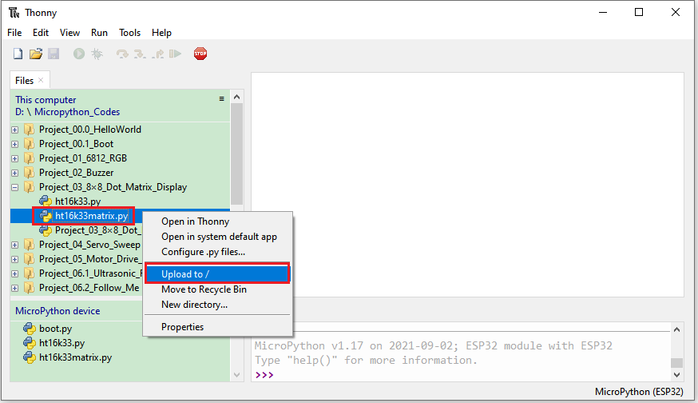

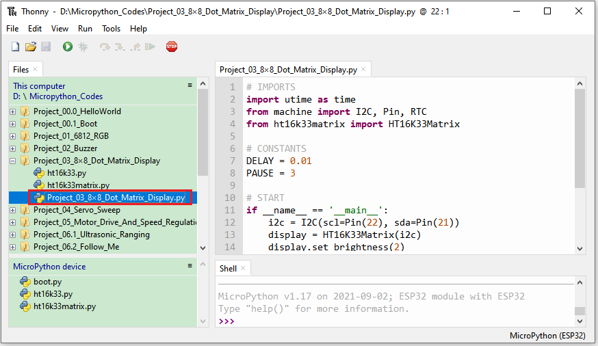


```python
# IMPORTS
import utime as time
from machine import I2C, Pin, RTC
from ht16k33matrix import HT16K33Matrix

# CONSTANTS
DELAY = 0.01
PAUSE = 3

# START
if __name__ == '__main__':
    i2c = I2C(scl=Pin(22), sda=Pin(21))
    display = HT16K33Matrix(i2c)
    display.set_brightness(2)

    # Draw a custom icon on the LED
    icon = b"\x00\x66\x00\x00\x18\x42\x3c\x00"
    display.set_icon(icon).draw()
    # Rotate the icon
    display.set_angle(0).draw()
    time.sleep(PAUSE)
```

Note: the code 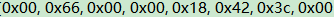 changes into the code.

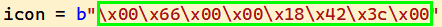

 **6. Test Result：**

Connect the ESP32 board to your PC and clock or press **Reset**


Click , the script starts running, then the 8\*8 module will show a smile pattern. Press“Ctrl+C”or click  to exit

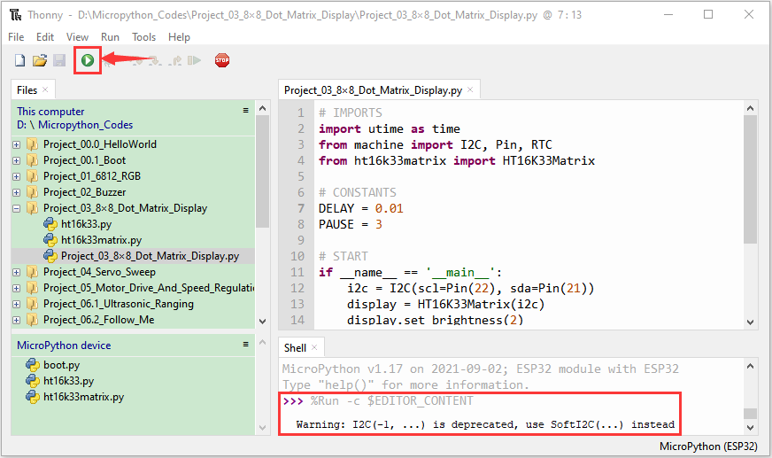

### Project 4: Servo Rotation

 **1. Description：**

There are two servos on the car. We take the servo connected to pin D9 as an example.

The servo is a motor that can rotate very accurately. It has been widely applied to toy cars, remote control helicopters, airplanes, robots and other fields. In this project, we will use the Nano motherboard to control the servo to spin.

 **2. Knowledge：**


Servo motor is a position control rotary actuator. It mainly consists of a housing, a circuit board, a core-less motor, a gear and a position sensor. Its working principle is that the servo receives the signal sent by MCU or receiver and produces a reference signal with a period of 20ms and width of 1.5ms, then compares the acquired DC bias voltage to the voltage of the potentiometer and obtain the voltage difference output.

When the motor speed is constant, the potentiometer is driven to rotate through the cascade reduction gear, which leads that the voltage difference is 0, and the motor stops rotating. Generally, the angle range of servo rotation is 0° --180 °

The rotation angle of servo motor is controlled by regulating the duty cycle of PWM (Pulse-Width Modulation) signal. The standard cycle of PWM signal is 20ms (50Hz). Theoretically, the width is distributed between 1ms-2ms, but in fact, it's between 0.5ms-2.5ms. The width corresponds the rotation angle from 0° to 180°. But note that for different brand motors, the same signal may have different rotation angles.  


In general, servo has three lines in brown, red and orange. The brown wire is grounded, the red one is a positive pole line and the orange one is a signal line.


 **3. Wire up：**

| Servo  |  PCB Board  |
| :----: | :---------: |
| Brown  |      G      |
|  Red   |     5V      |
| Orange | S1（GPIO4） |

 **4. Test Code：**

The servo for controlling the ultrasonic sensor is controlled by the GPIO4 of the ESP32 board.

You can download test code from a link <https://fs.keyestudio.com/KS5002> You can save the code anywhere. We save the code in the drive D of our computer.

As shown below: D:\\Micropython\_Codes.


Open“Thonny”<“This computer”→“D:”→“Micropython_Codes”→“Project_04_Servo_Sweep”

Select myservo.py, right-click Upload to/ to upload myservo.py to the ESP32;

Double-click“Project_04_Servo_Sweep.py”as shown below:

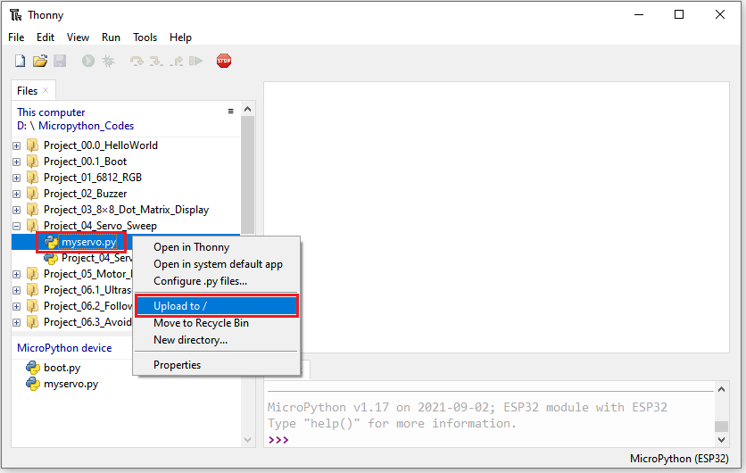

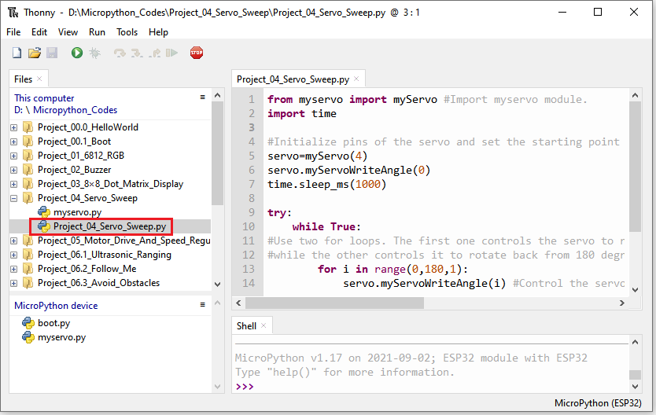


```python
from myservo import myServo #Import myservo module.
import time

#Initialize pins of the servo and set the starting point of the servo to 0 degree.
servo=myServo(4)
servo.myServoWriteAngle(0)
time.sleep_ms(1000)

try:
    while True:
#Use two for loops. The first one controls the servo to rotate from 0 degree to 180 degrees
#while the other controls it to rotate back from 180 degrees to 0 degree.
        for i in range(0,180,1):
            servo.myServoWriteAngle(i) #Control the servo to rotate to a specified angle within the range of 0-180 degrees.
            time.sleep_ms(15)
        for i in range(180,0,-1):
            servo.myServoWriteAngle(i)
            time.sleep_ms(15)        
except:
    servo.deinit()
```

 **5. Test Result：**

Connect the ESP32 board to your PC and click 

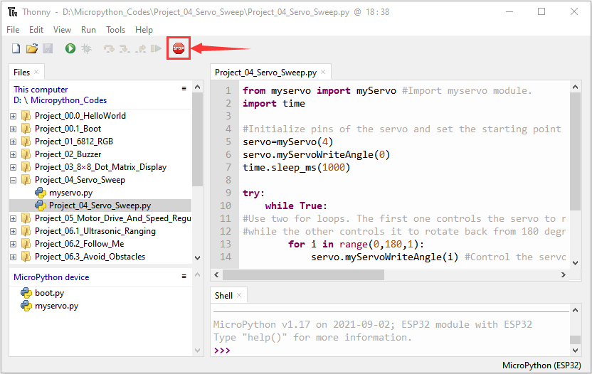

Place batteries in the battery holder, turn the power switch to ON end and power up.

Click , the script starts running, then the servo rotate from 0° to 180°, then from 180° to 0°, loop alternately.

Press “Ctrl+C” or click  to exit.

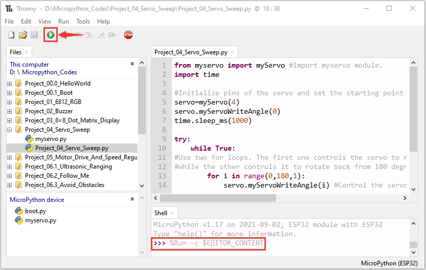

### Project 5: Motor Driving and Speed Control 

 **1. Description：**

There are many ways to drive motors. This car uses the most commonly used DRV8833 motor driver chip, which provides a dual-channel bridge electric driver for toys, printers and other motor integration applications.

In this experiment, we use the DRV8833 motor driver chip on the expansion board to drive the two DC motors, and demonstrate the effect of forward, backward, left-turning, and right-turning.

 **2. Knowledge：**

DRV8833 motor driver chip: Dual H-bridge motor driver with current control function, can drive two DC motors, one bipolar stepper motor, solenoid valve or other inductive loads. Each H-bridge includes circuitry to regulate or limit winding current.

An internal shutdown function with a fault output pin is used for over-current and short circuit protection, under-voltage lockout and over-temperature. A low-power sleep mode is also added. Let's take a look at the schematic diagram of the DRV8833 motor driver chip driving two DC motors: 

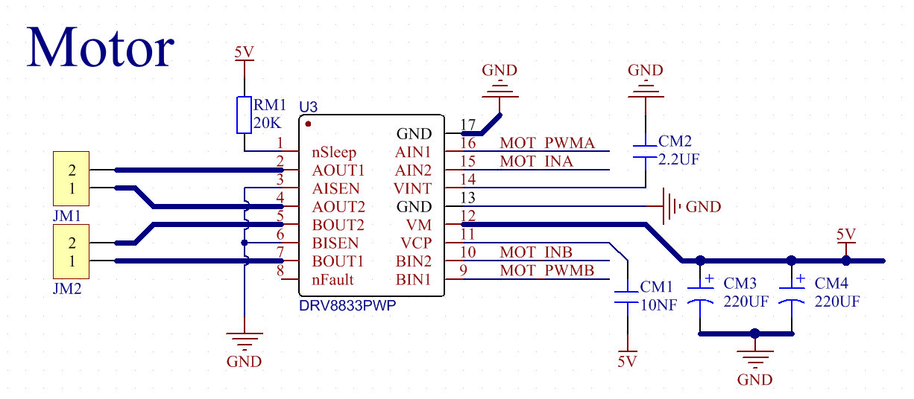


If you want to get insight to it, you can check the specification of this chip. Just browse it in the“Attachments”folder.


 **3. Specification：**

- Input voltage of logic part: DC 5V

- Input voltage of driving part : DC 5V

- Working current of logic part: \<30mA

- Operating current of driving part: \<2A

- Maximum power dissipation: 10W (T=80℃)

- Motor speed: 5V 200 rpm / min

- Motor drive form: dual H-bridge drive

- Control signal input level: high level 2.3V\<Vin\<5V, low level -0.3V\<Vin\<1.5V

- Working temperature: -25\~130℃


 **4. Drive the car to move**

From the above diagram, the direction pin of the left motor is GPIO33; the speed pin is GPIO26; GPIO32 is the direction pin of the right motor; and GPIO25 is speed pin.

PWM drives the robot car. The PWM value is in the range of 0-255. The more the PWM value is set, the faster the rotation of the motor.

|  Function  | GPIO33 | GPIO26（PWM) |  Left motor   | GPIO32 | GPIO25（PWM) |  Right motor  |
| :--------: | :----: | :----------: | :-----------: | :--: | :----: | :----------: |
|  forward   |  LOW   |     200      |   clockwise   |  LOW   |     200      |   clockwise   |
|  Go back   |  HIGH  |      50      | anticlockwise |  HIGH  |      50      | anticlockwise |
| Turn left  |  HIGH  |     200      | anticlockwise |  LOW   |     200      |   clockwise   |
| Turn right |  LOW   |     200      |   clockwise   |  HIGH  |     200      | anticlockwise |
|    Stop    |  LOW   |      0       |     stop      |  LOW   |      0       |     stop      |


You can download test code from a link <https://fs.keyestudio.com/KS5002> You can save the code anywhere. We save the code in the drive D of our computer.

As shown below: D:\\Micropython\_Codes.


Open“Thonny”and click“This computer”→“D:”→“Micropython\_Codes”→“Project\_05\_Motor\_Drive\_And\_Speed\_Regulation”;

Click Project\_05\_Motor\_Drive\_And\_Speed\_Regulation.py as shown below:

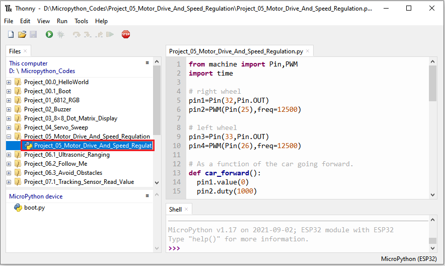


```python
from machine import Pin,PWM
import time

# right wheel
pin1=Pin(32,Pin.OUT)
pin2=PWM(Pin(25),freq=12500)

# left wheel
pin3=Pin(33,Pin.OUT)
pin4=PWM(Pin(26),freq=12500)

# As a function of the car going forward.
def car_forward(): 
  pin1.value(0)
  pin2.duty(1000) 
  pin3.value(0)
  pin4.duty(1000)  

# As a function of the car going backwards.
def car_back(): 
  pin1.value(1)
  pin2.duty(250) 
  pin3.value(1)
  pin4.duty(250)

# As a function of the car going left.
def car_left(): 
  pin1.value(0)
  pin2.duty(1000) 
  pin3.value(1)
  pin4.duty(500)  

# As a function of the car going right.
def car_right(): 
  pin1.value(1)
  pin2.duty(500) 
  pin3.value(0)
  pin4.duty(1000)

# As a function of the car stopping.
def car_stop(): 
  pin1.value(0)
  pin2.duty(0) 
  pin3.value(0)
  pin4.duty(0)   
try:
    while True:
        car_forward() #Car ahead
        time.sleep(2) # delay 2s
        car_back() # Car goes back
        time.sleep(2)    
        car_left() # Car to the left
        time.sleep(2)    
        car_right() # Car to the right
        time.sleep(2)    
        car_stop() # Car stop
        time.sleep(2)     
except:
    pass
```

 **5.Test Result**

Connect the ESP32 board to your PC and click 

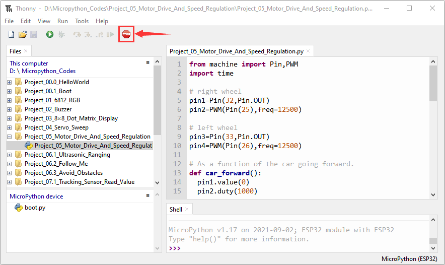

Place batteries, turn the power switch to ON end and power up. Click , the script starts running, the car will move forward for 2s, back for 2s, turn left for 2s, right for 2s and stops for 2s, loop alternately.

Press“Ctrl+C”or click  to exit.


### Project 6: Ultrasonic Sensor

There is an ultrasonic sensor on the car. It is a very affordable distance-measuring sensor. 

The ultrasonic sensor sends a high-frequency ultrasonic signal that human hearing can’t hear. When encountering obstacles, these signals will be reflected back immediately. After receiving the returned information, the distance between the sensor and the obstacle will be calculated by judging the time difference between the transmitted signal and the received signal. It is mainly used for object avoidance and ranging in various robotics projects.

### Project 6.1: Ultrasonic Ranging

 **1. Description：**

In this experiment, we use an ultrasonic sensor to measure distance and print the data on a serial monitor.

 **2. Knowledge：**

The HC-SR04 ultrasonic sensor uses sonar to determine distance to an object like what bats do. It offers excellent non-contact range detection with high accuracy and stable readings in an easy-to-use package. It comes complete with ultrasonic transmitter and receiver modules.

The HC-SR04 or the ultrasonic sensor is being used in a wide range of electronics projects for creating obstacle detection and distance measuring application as well as various other applications. Here we have brought the simple method to measure the distance with Arduino and ultrasonic sensor and how to use ultrasonic sensor with Arduino.


**Use method and timing chart of ultrasonic module:**

1.  Setting the delay time of Trig pin of SR04 to 10μs at least, which can trigger it to detect distance.

2.  After triggering, the module will automatically send eight 40KHz ultrasonic pulses and detect whether there is a signal return. This step will be completed automatically by the module.

3.  If the signal returns, the Echo pin will output a high level, and the duration of the high level is the time from the transmission of the ultrasonic wave to the return.


Time=Echo pulse width, unit: us

$$
Distance（cm）= time/ 58
$$

$$
Distance (inch) = time / 148
$$

The HC-SR04 ultrasonic sensor has four pins: Vcc, Trig, Echo and GND.

The Vcc pin provides power generating ultrasonic pulses and is connected to Vcc/+5V. The GND pin is grounded/GND.

The Trig pin is where the Arduino sends a signal to start the ultrasonic pulse. The Echo pin is where the ultrasonic sensor sends information about the duration of the ultrasonic pulse stroke to the Arduino control board.

 **3. Wiring Up**

| Ultrasonic Sensor |  PCB Board   |
| :---------------: | :----------: |
|        Vcc        |      5V      |
|       Trig        | S2（GPIO5）  |
|       Echo        | S1（GPIO18） |
|        Gnd        |      G       |

 **4. Test Code：**

The pin Trig and Echo of the ultrasonic sensor are controlled by the GPIO5 and GPIO18 of the ESP32 board.

You can download test code from a link <https://fs.keyestudio.com/KS5002> You can save the code anywhere. We save the code in the drive D of our computer.

As shown below: D:\\Micropython\_Codes.


Open “Thonny” and click This computer → D: → Micropython\_Codes → “Project\_06.1\_Ultrasonic\_Ranging”

Then double-click Project\_06.1\_Ultrasonic\_Ranging.py

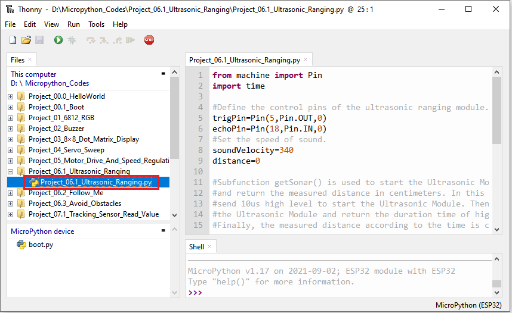

```python
from machine import Pin
import time

#Define the control pins of the ultrasonic ranging module.  
trigPin=Pin(5,Pin.OUT,0)
echoPin=Pin(18,Pin.IN,0)
#Set the speed of sound.
soundVelocity=340
distance=0

#Subfunction getSonar() is used to start the Ultrasonic Module to begin measurements,
#and return the measured distance in centimeters. In this function, first let trigPin
#send 10us high level to start the Ultrasonic Module. Then use pulseIn() to read
#the Ultrasonic Module and return the duration time of high level.
#Finally, the measured distance according to the time is calculated.
def getSonar():
    trigPin.value(1)
    time.sleep_us(10)
    trigPin.value(0)
    while not echoPin.value():
        pass
    pingStart=time.ticks_us()
    while echoPin.value():
        pass
    pingStop=time.ticks_us()
    pingTime=time.ticks_diff(pingStop,pingStart)
    distance=pingTime*soundVelocity//2//10000
    return int(distance)

#Delay for 2 seconds and wait for the ultrasonic module to stabilize,
#Print data obtained from ultrasonic module every 500 milliseconds.
time.sleep_ms(2000)
while True:
    time.sleep_ms(500)
    print('Distance: ',getSonar(),'cm' ) 
```

 **5. Test Result**

Connect the ESP32 board to your PC and click .

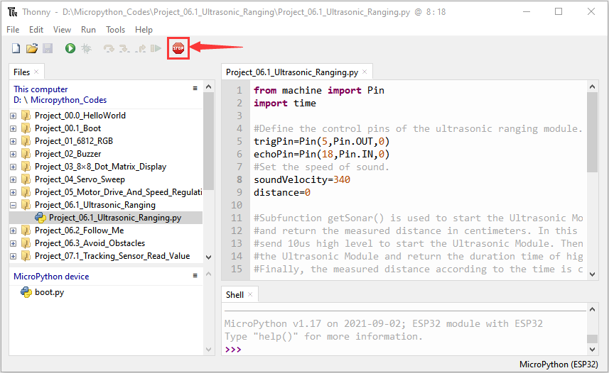

Click , the script starts running, then the shell monitor will print distance value between the ultrasonic sensor and the object; press“Ctrl+C”or click  to exit.

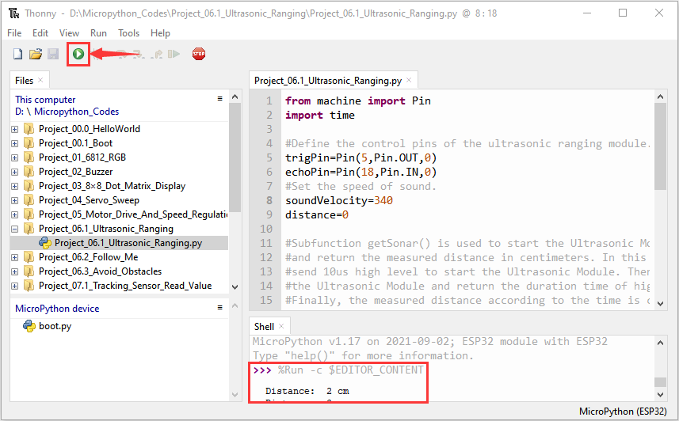


### Project 6.2: Light Following

 **1. Description：**

In the above experiments, we have learned about the 8\*8 dot matrix, motor drivers and speed regulation, ultrasonic sensors, servos and other hardware. In this experiment, we will combine them to create a follow car with the ultrasonic sensor. The can can follow an object to move through measuring distance.

 **2. Working Principle：**

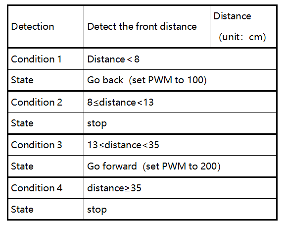

 **3. Flow Chart：**


 **4. Test Code：**

You can download test code from a link <https://fs.keyestudio.com/KS5002> You can save the code anywhere. We save the code in the drive D of our computer.

As shown below: D:\\Micropython\_Codes.


Open “Thonny” and click “This computer” → “D:” → “Micropython\_Codes” → “Project\_06.2\_Follow\_Me”, double-click “Project\_06.2\_Follow\_Me.py”as shown below:

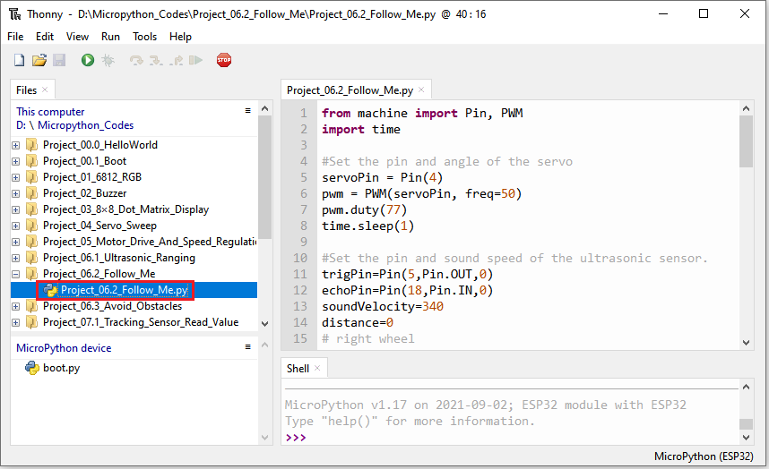

```python
from machine import Pin, PWM
import time

#Define GPIO4’s output frequency as 50Hz and its duty cycle as 77, and assign them to PWM
servoPin = Pin(4)
pwm = PWM(servoPin, freq=50)
pwm.duty(77)
time.sleep(1)

#Set the pin and sound speed of the ultrasonic sensor
trigPin=Pin(5,Pin.OUT,0)
echoPin=Pin(18,Pin.IN,0)
soundVelocity=340
distance=0
# right wheel
pin1=Pin(32,Pin.OUT)
pin2=PWM(Pin(25),freq=50,duty=0)
# left wheel
pin3=Pin(33,Pin.OUT)
pin4=PWM(Pin(26),freq=50,duty=0)

# As a function of the car going forward.
def car_forward(): 
  pin1.value(0)
  pin2.duty(800) 
  pin3.value(0)
  pin4.duty(800)  

# As a function of the car going backwards.
def car_back(): 
  pin1.value(1)
  pin2.duty(550) 
  pin3.value(1)
  pin4.duty(550)
  
# As a function of the car stopping.  
def car_stop():
  pin2.deinit()
  pin4.deinit()
  pin1.value(0)
  pin2.duty(0) 
  pin3.value(0)
  pin4.duty(0)

#Subfunction getSonar() is used to start the Ultrasonic Module to begin measurements,
#and return the measured distance in centimeters. In this function, first let trigPin
#send 10us high level to start the Ultrasonic Module. Then use pulseIn() to read
#the Ultrasonic Module and return the duration time of high level.
#Finally, the measured distance according to the time is calculated.
def getSonar(): 
    trigPin.value(1)
    time.sleep_us(10)
    trigPin.value(0)
    while not echoPin.value():
        pass
    pingStart=time.ticks_us()
    while echoPin.value():
        pass
    pingStop=time.ticks_us()
    pingTime=time.ticks_diff(pingStop,pingStart)
    distance=pingTime*soundVelocity//2//10000
    time.sleep_ms(10)
    return int(distance)

while True:
    Distance=getSonar() #Get the distance measured by ultrasound.
    print(Distance) #Send a pulse to calculate the distance in centimeters and print the result.
    if Distance<8: #If the distance is less than 8
        pin2=PWM(Pin(25),freq=50)
        pin4=PWM(Pin(26),freq=50)
        car_back() #Car goes back
    elif Distance>=8 and Distance<13: #If the distance is greater than or equal to 8, it's less than 13.
        car_stop() # Car stop
    elif Distance>=13 and Distance<35: #If the distance is greater than or equal to 13, it's less than 35.
        pin2=PWM(Pin(25),freq=50)
        pin4=PWM(Pin(26),freq=50)
        car_forward() #Car ahead
    else:
       car_stop()
```

 **5. Test Result**

Connect the ESP32 board to your PC and click 

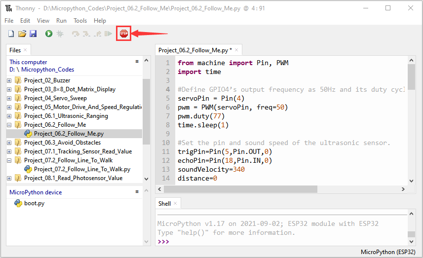

Place batteries, turn the power switch to ON end and power up.

Click , the script starts running, then the car will follow the obstacle to move.

Press “Ctrl+C” or click  to exit.


### Project 6.3: Dodge obstacles

 **1. Description：**

In this project, we will take advantage of the ultrasonic sensor to detect the distance away from the obstacle so as to avoid them

 **2. Working Principle：**

**Loop**: 8*8 Dot matrix display --> 

| Set servo to 90°      | Detect the distance away from the obstacle (cm) |
| --------------------- | ----------------------------------------------- |
| Set the servo to 180° | Distance away form the obstacle：a1（unit：cm） |
| Set the servo to 0°   | Distance away form the obstacle：a2（unit：cm） |

| Condition 1    | Condition 2 | State                                                        |
| -------------- | ----------- | ------------------------------------------------------------ |
| 0<distance＜10 |             | Stop<br />Show the “stop” pattern                            |
|                | a1＜a2      | Car turns right（set PWM to 200）<br />show “turning right” pattern<br />Set servo to 90° |
|                | a1≥a2       | Turn left（set PWM to 200）<br />display “left turning” pattern<br />Set servo to 90° |
| distance≥10    |             | Go forward（set PWM to 200）<br />The 8*8 dot matrix display shows “going forward” pattern |

 **3. Flow Chart：**


 **4. Test Code：**

You can download test code from a link <https://fs.keyestudio.com/KS5002> You can save the code anywhere. We save the code in the drive D of our computer.

As shown below: D:\\Micropython\_Codes.


Open “Thonny” and click “This computer” → “D:” → “Micropython\_Codes” → “Project\_06.3\_Avoid\_Obstacles”

Select“ht16k33.py”and“ht16k33matrix.py”and right-click“Upload to /”and upload them to the ESP32；

Double-click Project\_06.3\_Avoid\_Obstacles.py as shown below:

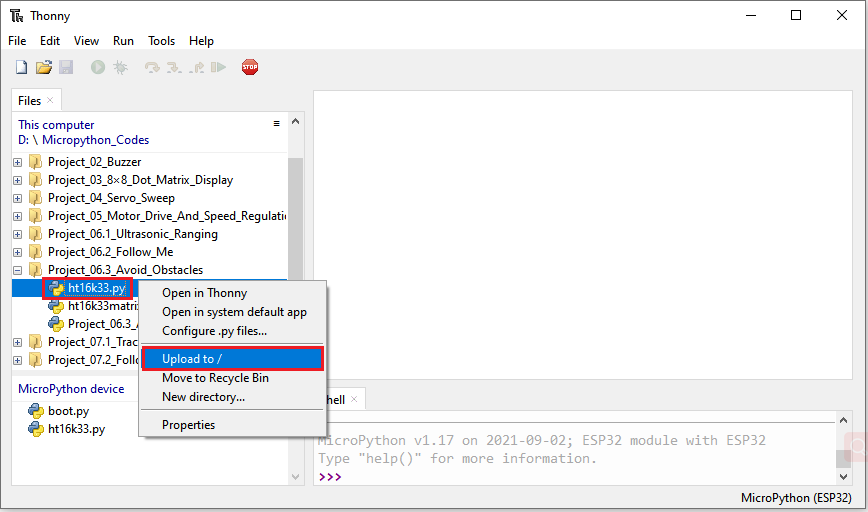

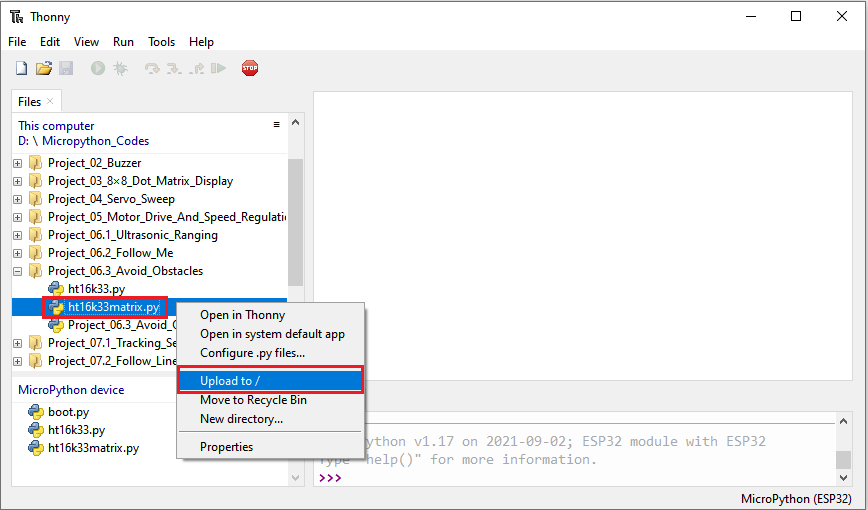

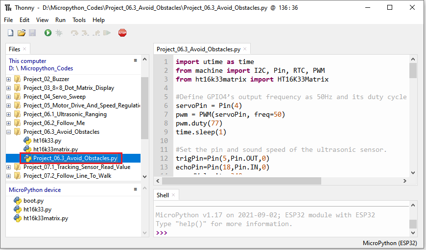


```python
import utime as time
from machine import I2C, Pin, RTC, PWM 
from ht16k33matrix import HT16K33Matrix

#Define GPIO4’s output frequency as 50Hz and its duty cycle as 77, and assign them to PWM.
servoPin = Pin(4)
pwm = PWM(servoPin, freq=50)
pwm.duty(77)
time.sleep(1)

#Set the pin and sound speed of the ultrasonic sensor.
trigPin=Pin(5,Pin.OUT,0)
echoPin=Pin(18,Pin.IN,0)
soundVelocity=340
distance=0
# right wheel
pin1=Pin(32,Pin.OUT)
pin2=PWM(Pin(25),freq=50,duty=0)
# left wheel
pin3=Pin(33,Pin.OUT)
pin4=PWM(Pin(26),freq=50,duty=0)

# As a function of the car going forward.
def car_forward():
  pin1.value(0)
  pin2.duty(200) 
  pin3.value(0)
  pin4.duty(250)  

# As a function of the car going left.
def car_left():
  pin1.value(0)
  pin2.duty(500) 
  pin3.value(1)
  pin4.duty(500)  

# As a function of the car going right.
def car_right():
  pin1.value(1)
  pin2.duty(500) 
  pin3.value(0)
  pin4.duty(500)

# As a function of the car stopping.
def car_stop():
  pin2.deinit()
  pin4.deinit()
  pin1.value(0)
  pin2.duty(0) 
  pin3.value(0)
  pin4.duty(0)
   
#Subfunction getSonar() is used to start the Ultrasonic Module to begin measurements,
#and return the measured distance in centimeters. In this function, first let trigPin
#send 10us high level to start the Ultrasonic Module. Then use pulseIn() to read
#the Ultrasonic Module and return the duration time of high level.
#Finally, the measured distance according to the time is calculated.  
def getSonar(): 
    trigPin.value(1)
    time.sleep_us(10)
    trigPin.value(0)
    while not echoPin.value():
        pass
    pingStart=time.ticks_us()
    while echoPin.value():
        pass
    pingStop=time.ticks_us()
    pingTime=time.ticks_diff(pingStop,pingStart)
    distance=pingTime*soundVelocity//2//10000
    time.sleep_ms(10)
    return int(distance)

# CONSTANTS
DELAY = 0.01
PAUSE = 3
# START
if __name__ == '__main__':
    i2c = I2C(scl=Pin(22), sda=Pin(21))
    display = HT16K33Matrix(i2c)
    display.set_brightness(2)

while True:
    Distance=getSonar() #Get the distance measured by ultrasound.
    if Distance>0 and Distance<10: #If the distance is greater than 0, it's less than 10.
        car_stop() # Car stop
        # Draw a custom icon on the LED
        icon = b"\x18\x18\x18\x18\x18\x00\x00\x18"
        display.set_icon(icon).draw()
        # Rotate the icon
        display.set_angle(0).draw()
        time.sleep(0.2)
        pwm = PWM(servoPin, freq=50)
        pwm.duty(128)
        time.sleep(0.3)
        a1=getSonar()
        time.sleep(0.2)
        pwm = PWM(servoPin, freq=50)
        pwm.duty(25)
        time.sleep(0.3)
        a2=getSonar()
        time.sleep(0.2)
        if a1>a2:
            pin2=PWM(Pin(25),freq=50)
            pin4=PWM(Pin(26),freq=50)
            car_left()
            icon = b"\x48\x24\x12\x09\x09\x12\x24\x48"
            display.set_icon(icon).draw()
            display.set_angle(0).draw()
            pwm = PWM(servoPin, freq=50)
            pwm.duty(77)
            time.sleep(0.3)
            icon = b"\x18\x24\x42\x99\x24\x42\x81\x00"
            display.set_icon(icon).draw()
            display.set_angle(0).draw()
        else:
            pin2=PWM(Pin(25),freq=50)
            pin4=PWM(Pin(26),freq=50)
            car_right()
            icon = b"\x12\x24\x48\x90\x90\x48\x24\x12"
            display.set_icon(icon).draw()
            # Rotate the icon
            display.set_angle(0).draw()
            pwm = PWM(servoPin, freq=50)
            pwm.duty(77)
            time.sleep(0.3)
            icon = b"\x18\x24\x42\x99\x24\x42\x81\x00"
            display.set_icon(icon).draw()
            display.set_angle(0).draw()
    else:
        pin2=PWM(Pin(25),freq=50)
        pin4=PWM(Pin(26),freq=50)
        car_forward() #Car ahead
        icon = b"\x18\x24\x42\x99\x24\x42\x81\x00"
        display.set_icon(icon).draw()
        display.set_angle(0).draw()
```

 **5. Test Result**

Connect the ESP32 board to your PC and click 

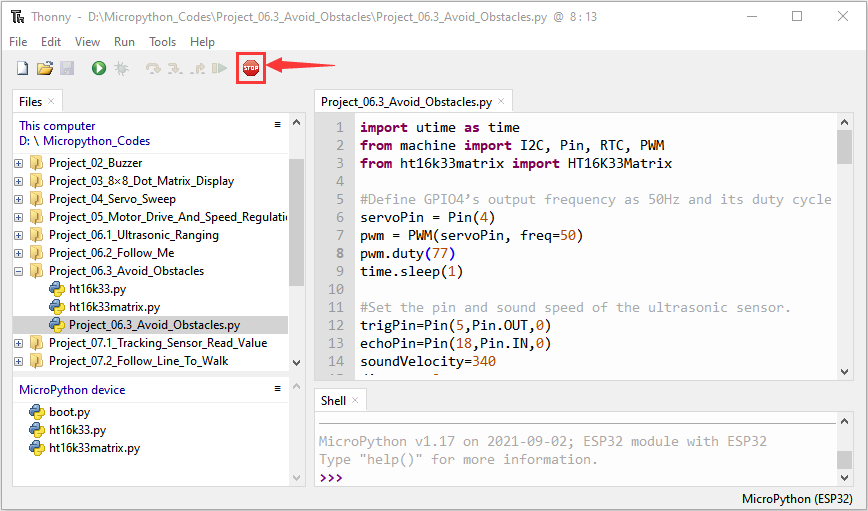

Place batteries, turn the power switch to ON end and power up.

Click , the script starts running, then the car can automatically dodge obstacles; press“Ctrl+C”or click  to exit

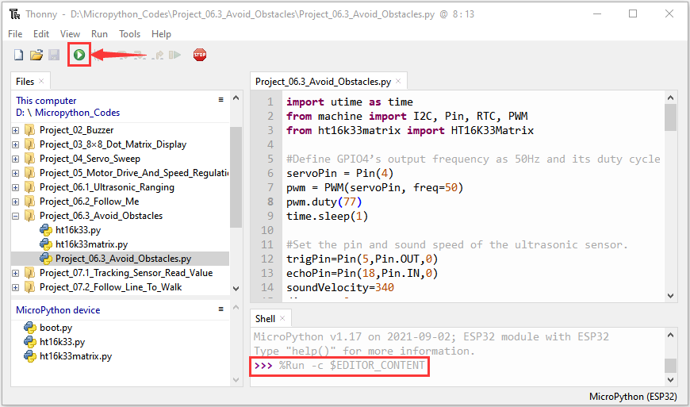

### Project 7: Line Tracking Sensor

There are two IR line tracking sensors on the car. They are actually two pairs of ST188L3 infrared tubes and used to detect black and white lines. In this project, we will make a line tracking car.

### **Project 7.1: Reading Values**

 **1.Description：**

In this experiment, we use ST188L3 infrared tubes to detect black and white lines, then print the data on the serial monitor.

 **2. Knowledge：**

**Infrared line tracking:**

The IR line tracking sensor boasts a pair of ST188L3 infrared tubes. ST188L3 tubes has an infrared emitting diode and a receiver tube. When the emitting diode emits an infrared signal then received by the receiving tube after being reflected by the white object. Once the receiving tube receives the signal, the output terminal will output a low level (0); when the infrared emitting diode emits an infrared signal, and the infrared signal is absorbed by the black object, a high level (1) will be output, thus realizing the function of detecting signals through infrared rays. 

Warning: Reflective optical sensors (including IR line tracking sensors) shouldn’t be applied under sunlight as there is a lot of invisible light such as infrared and ultraviolet. 

Values detected by the line tracking sensor are shown in the table.

The value will be 1 if detecting black or no objects and the value 0 will appear if detecting white objects.

he detected black object or no object represents 1, and the detected white object represents 0. 

<table border="1">
<tbody>
<tr class="odd">
<td>Left</td>
<td>Right</td>
<td>Value（Binary ）</td>
</tr>
<tr class="even">
<td>0</td>
<td>0</td>
<td>00</td>
</tr>
<tr class="odd">
<td>0</td>
<td>1</td>
<td>01</td>
</tr>
<tr class="even">
<td>1</td>
<td>0</td>
<td>10</td>
</tr>
<tr class="odd">
<td>1</td>
<td>1</td>
<td>11</td>
</tr>
</tbody>
</table>
 **3. Test Code：**

The line tracking sensors of the PCB board are controlled by GPIO17 and GPIO16 of the ESP32 board.

You can download test code from a link <https://fs.keyestudio.com/KS5002> You can save the code anywhere. We save the code in the drive D of our computer.

As shown below: D:\\Micropython\_Codes.


Open “Thonny” and click “This computer” → “D:” → “Micropython\_Codes” → “Project\_07.1\_Tracking\_Sensor\_Read\_Value”

Double-click Project\_07.1\_Tracking\_Sensor\_Read\_Value.py as shown below:

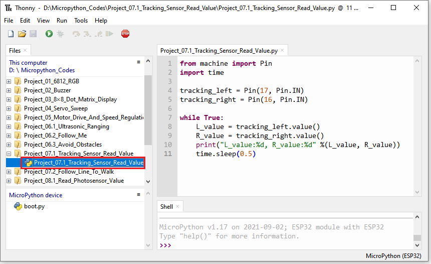

    from machine import Pin
    import time
    
    tracking_left = Pin(17, Pin.IN)
    tracking_right = Pin(16, Pin.IN)
    
    while True:
        L_value = tracking_left.value()
        R_value = tracking_right.value()
        print("L_value:%d, R_value:%d" %(L_value, R_value))
        time.sleep(0.5) 

 **4.Test Result**

Connect the ESP32 board to your PC and click 

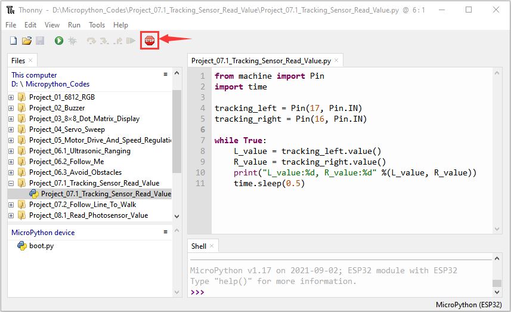

Click , the script starts running, Put a black thing under the line tracking sensor of the car and move it, you will see different indicators light up, and at the same time you will see the value on the serial monitor.

Press “Ctrl+C” or click  to exit.

The sensitivity can be adjusted by rotating the potentiometer. When the indicator light is adjusted to the critical point of on and off state, the sensitivity is the highest.

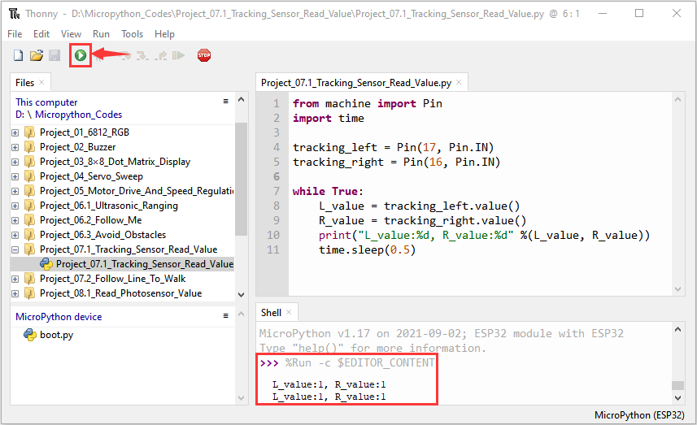

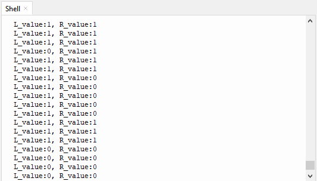

### Project 7.2: Line Tracking

 **1.Description：**

We’ve introduced the knowledge of motor drivers, speed regulation, and infrared line tracking. In this experiment, the car will perform different actions according to the values transmitted by the infrared tracking.

 **2.Working Principle：**

| Left | Right | Value（Binary ） | State        |
| ---- | ----- | ---------------- | ------------ |
| 0    | 0     | 00               | Stop         |
| 0    | 1     | 01               | Turn right   |
| 1    | 0     | 10               | Turn left    |
| 1    | 1     | 11               | Move forward |

 **3. Flow Chart：**


 **4. Test Code：**

You can download test code from a link <https://fs.keyestudio.com/KS5002> You can save the code anywhere. We save the code in the drive D of our computer.

As shown below: D:\\Micropython\_Codes.


Open “Thonny” and click “This computer” → “D:” → “Micropython\_Codes” → “Project\_07.2\_Follow\_Line\_To\_Walk”;

Double-click Project\_07.2\_Follow\_Line\_To\_Walk.py as shown below:

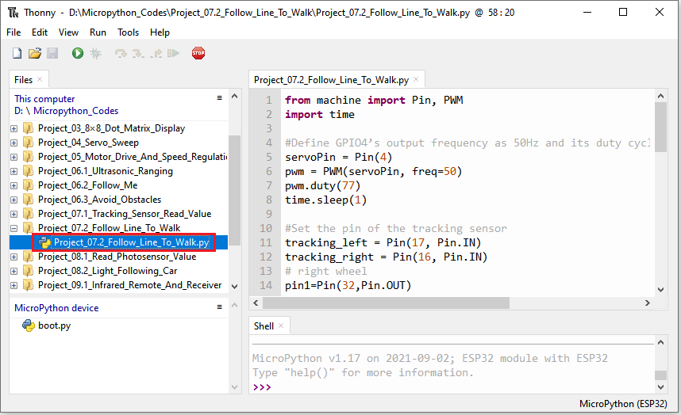


```python
from machine import Pin, PWM
import time

#Define GPIO4’s output frequency as 50Hz and its duty cycle as 77, and assign them to PWM.
servoPin = Pin(4)
pwm = PWM(servoPin, freq=50)
pwm.duty(77)
time.sleep(1)

#Set the pin of the tracking sensor
tracking_left = Pin(17, Pin.IN)
tracking_right = Pin(16, Pin.IN)
# right wheel
pin1=Pin(32,Pin.OUT)
pin2=PWM(Pin(25),freq=50,duty=0)
# left wheel
pin3=Pin(33,Pin.OUT)
pin4=PWM(Pin(26),freq=50,duty=0)

# As a function of the car going forward.
def car_forward(): 
  pin1.value(0)
  pin2.duty(200) 
  pin3.value(0)
  pin4.duty(200)  

# As a function of the car going left.
def car_left(): 
  pin1.value(0)
  pin2.duty(180) 
  pin3.value(1)
  pin4.duty(1023)  

# As a function of the car going right.
def car_right(): 
  pin1.value(1)
  pin2.duty(1023) 
  pin3.value(0)
  pin4.duty(220)

# As a function of the car stopping.
def car_stop():
  pin2.deinit()
  pin4.deinit()
  pin1.value(0)
  pin2.duty(0) 
  pin3.value(0)
  pin4.duty(0)

while True:
    L_value = tracking_left.value() #Left infrared tracking value is assigned to the variable L_value.
    R_value = tracking_right.value() #Right infrared tracking value is assigned to the variable R_value.
    if L_value == 1 and R_value == 1: #Black lines were detected in both left and right infrared tracking.
        pin2=PWM(Pin(25),freq=50)
        pin4=PWM(Pin(26),freq=50)
        car_forward() #Car ahead
    elif L_value == 1 and R_value == 0:
        pin2=PWM(Pin(25),freq=50)
        pin4=PWM(Pin(26),freq=50)
        car_left()
    elif L_value == 0 and R_value == 1:
        pin2=PWM(Pin(25),freq=50)
        pin4=PWM(Pin(26),freq=50)
        car_right()
    else:
        car_stop() 
```

 **5. Test Result**

Connect the ESP32 board to your PC and click 

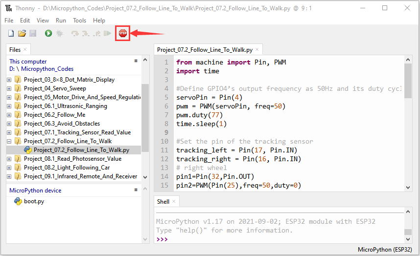

Place batteries, turn the power switch to ON end and power up.

Click , the script starts running, then it will perform different functions via values sent by line tracking sensors; press“Ctrl+C”or click  to exit.

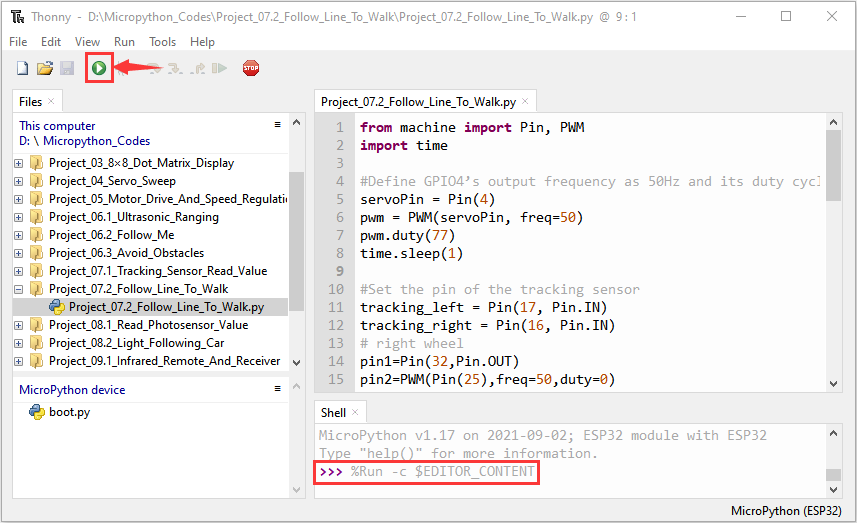

### Project 8: Light Following

There are two photoresistors on the car. They can vary with the light intensity and send information to the Nano board to control the car.

Photoresistors can determine and conduct the car to move by detecting light.

### Project 8.1 Read Values

 **1. Description：**

In this experiment, we will learn the working principle of the photoresistor

 **2. Knowledge：**

**Photoresistor:**

It mainly uses a photosensitive resistance element whose resistance varies from the light intensity. The signal terminal of the sensor is connected to the analog port of the microcontroller. When the light is stronger, the analog value at the analog port will increase; on the contrary, when the light intensity is weaker, the analog value of the microcontroller will reduce. In this way, the corresponding analog value can reflect the ambient light intensity.

 **3. Wire up：**

Through the wiring-up diagram, signal pins of two photoresistors are connected to GPIO34 and GPIO35 of the ESP32 board.

For the following experiment, we use the photoresistor connected to GPIO34 to finish experiments. First, let’s read analog values.

| Left photoresistor |  PCB board  |
| :----------------: | :---------: |
|         G          |      G      |
|         V          |      V      |
|         S          | S（GPIO34） |

 **4. Test Code：**

The left photoresistor is controlled by the GPIO34 of the ESP32 board.

You can download test code from a link <https://fs.keyestudio.com/KS5002> You can save the code anywhere. We save the code in the drive D of our computer.

As shown below: D:\\Micropython\_Codes.


Open “Thonny” and click “This computer” → “D:” → “Micropython\_Codes” → “Project\_08.1\_Read\_Photosensor\_Value”

Double-click Project\_08.1\_Read\_Photosensor\_Value.py as shown below:

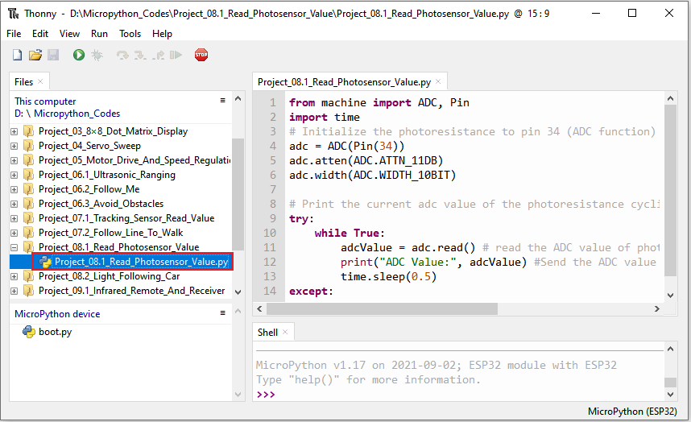


```python
from machine import ADC, Pin
import time
# Initialize the photoresistance to pin 34 (ADC function)
adc = ADC(Pin(34))
adc.atten(ADC.ATTN_11DB)
adc.width(ADC.WIDTH_10BIT)

# Print the current adc value of the photoresistance cyclically 
try:
    while True:
        adcValue = adc.read() # read the ADC value of photoresistance
        print("ADC Value:", adcValue) #Send the ADC value of photoresistance and print the result.
        time.sleep(0.5)
except:
    pass
```

 **5. Test Result**

Connect the ESP32 board to your PC and click 

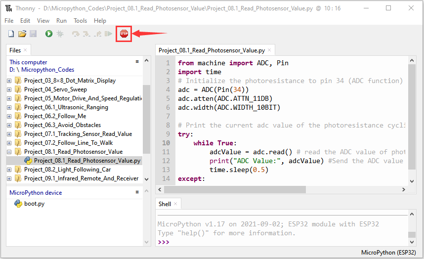

Click “Run current script”, the Shell monitor will show scripts and code will be run.

When the light intensifies, the analog value will get increased; on the contrary, the analog value will get reduced.

Press “Ctrl+C” or click  to exit

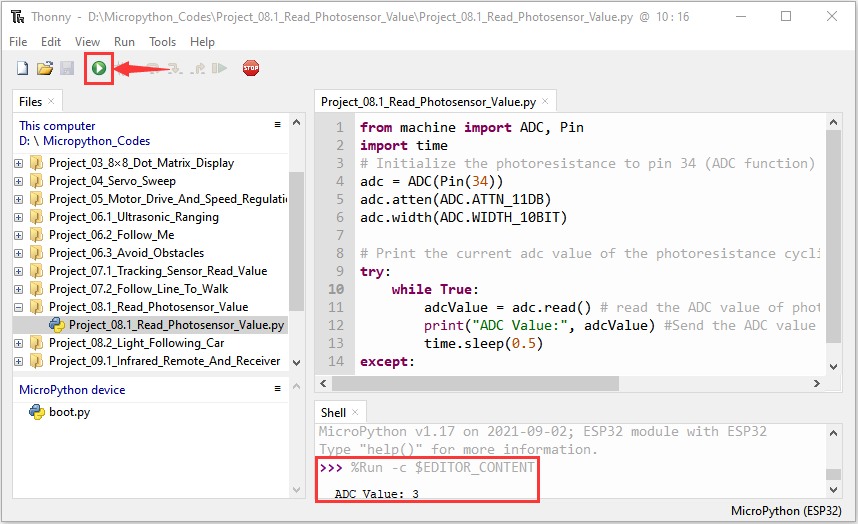

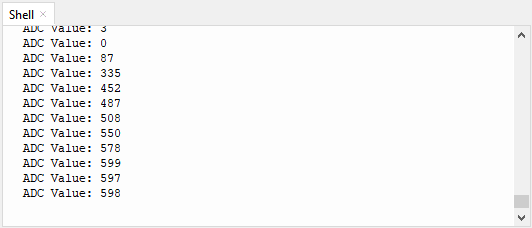

### Project 8.2: Light Following Car

 **1. Description：**

We have learned the working principle of photoresistor, motor and speed regulation. In this experiment, we will use a photoresistor to detect the intensity of light as as to achieve the light following effect.

 **2. Working Principle：**

| Analog value of the left sensor | Analog value of the right sensor |   Function    |
| :-----------------------------: | :------------------------------: | :-----------: |
|              >700               |               >700               | Move forward  |
|              >700               |               ≤700               | Move to left  |
|              ≤700               |               >700               | Move to right |
|              <700               |               <700               |     Stop      |

 **3. Wiring up：**

| Left Photoresistor |  PCB Board  |      | Right photoresistor |  PCB Board  |
| :----------------: | :---------: | ---- | :-----------------: | :---------: |
|         G          |      G      |      |          G          |      G      |
|         V          |      V      |      |          V          |      V      |
|         S          | S（GPIO34） |      |          S          | S（GPIO35） |


 **4. Test Code：**

The left and right photoresistors are controlled by GPIO34 and GPIO35 of the ESP32 board.

You can download test code from a link <https://fs.keyestudio.com/KS5002> You can save the code anywhere. We save the code in the drive D of our computer.

As shown below: D:\\Micropython\_Codes.


Open “Thonny” and click “This computer” → “D:” → “Micropython\_Codes” → “Project\_08.2\_Light\_Following\_Car”

Double-click Project\_08.2\_Light\_Following\_Car.py as shown below:

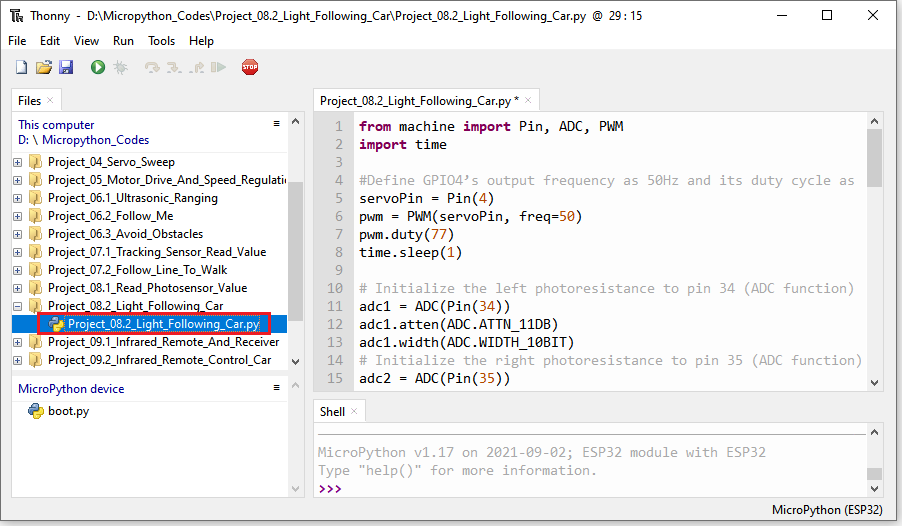


```python
from machine import Pin, ADC, PWM
import time

#Define GPIO4’s output frequency as 50Hz and its duty cycle as 77, and assign them to PWM.
servoPin = Pin(4)
pwm = PWM(servoPin, freq=50)
pwm.duty(77)
time.sleep(1)

# Initialize the left photoresistance to pin 34 (ADC function)
adc1 = ADC(Pin(34))
adc1.atten(ADC.ATTN_11DB)
adc1.width(ADC.WIDTH_10BIT)
# Initialize the right photoresistance to pin 35 (ADC function)
adc2 = ADC(Pin(35))
adc2.atten(ADC.ATTN_11DB)
adc2.width(ADC.WIDTH_10BIT)

# right wheel
pin1=Pin(32,Pin.OUT)
pin2=PWM(Pin(25),freq=50,duty=0)
# left wheel
pin3=Pin(33,Pin.OUT)
pin4=PWM(Pin(26),freq=50,duty=0)

# As a function of the car going forward.
def car_forward(): 
  pin1.value(0)
  pin2.duty(300) 
  pin3.value(0)
  pin4.duty(300)  

# As a function of the car going backwards.
def car_back(): 
  pin1.value(1)
  pin2.duty(200) 
  pin3.value(1)
  pin4.duty(200)

# As a function of the car going left.
def car_left(): 
  pin1.value(0)
  pin2.duty(200) 
  pin3.value(1)
  pin4.duty(900)  

# As a function of the car going right.
def car_right(): 
  pin1.value(1)
  pin2.duty(900) 
  pin3.value(0)
  pin4.duty(200)

# As a function of the car stopping.
def car_stop():
  pin2.deinit()
  pin4.deinit() 
  pin1.value(0)
  pin2.duty(0) 
  pin3.value(0)
  pin4.duty(0)   

while True:
    adcValue1 = adc1.read() # read the ADC value of the left photoresistance.
    adcValue2 = adc2.read() # read the ADC value of the right photoresistance.
    print("ADC Value1:", adcValue1 ,"ADC Value2:", adcValue2)
    time.sleep(0.5)
    if adcValue1 > 700 and adcValue2 > 700: #Range values measured by left and right photoresistances.
        pin2=PWM(Pin(25),freq=50)
        pin4=PWM(Pin(26),freq=50)
        car_forward() #Car ahead
    elif adcValue1 > 700 and adcValue2 <= 700:
        pin2=PWM(Pin(25),freq=50)
        pin4=PWM(Pin(26),freq=50) 
        car_left()
    elif adcValue1 <= 700 and adcValue2 > 700:
        pin2=PWM(Pin(25),freq=50)
        pin4=PWM(Pin(26),freq=50)
        car_right()
    else:
        car_stop()
```

 **5. Test Result**

Connect the ESP32 board to your PC and click 

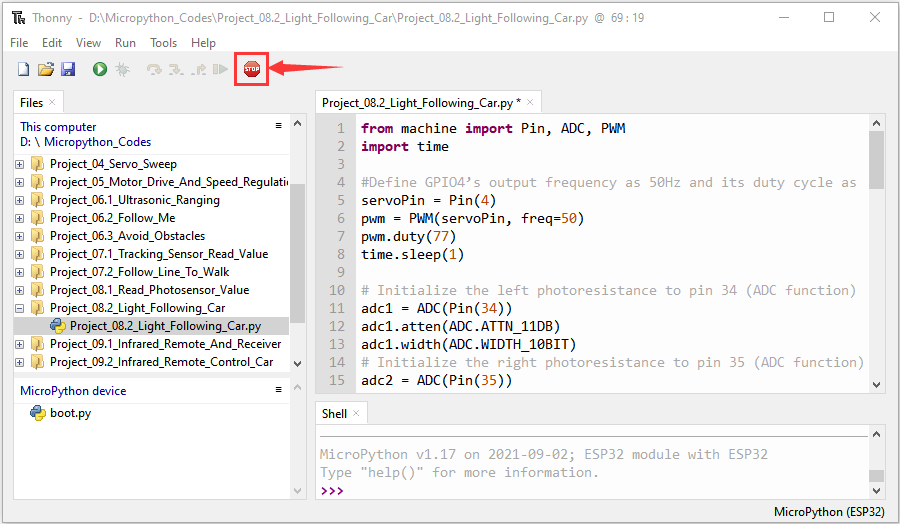

Place batteries, turn the power switch to ON end and power up.

Click , the script starts running, the car will follow the light to move.; press “Ctrl+C” or click  to exit.

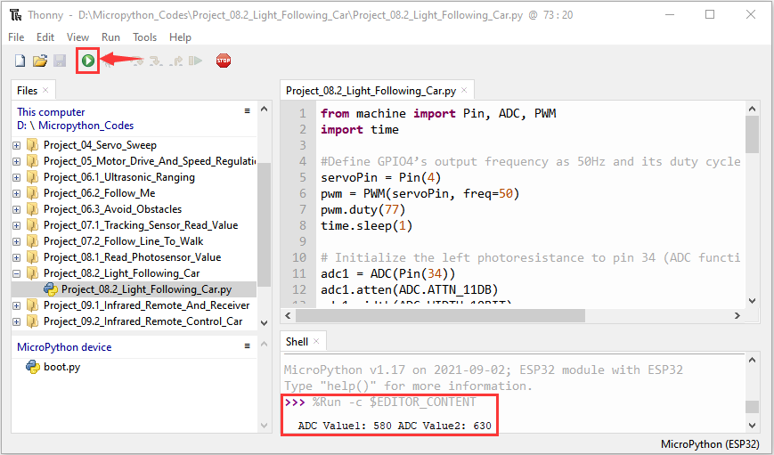

### Project 9: IR Remote Control

Infrared remote controls are everywhere in daily life. It is used to control various home appliances, such as TV, speakers, video recorders and satellite signal receivers.

The remote control is composed of an IR emitter, an IR receiver and a decoding MCU. In this project, we will make a IR remote control car.

### Project 9.1: IR Remote and Reception

 **1. Description：**

In this experiment, we will combine the IR receiver and the IR remote control to read key values and show them on the serial monitor.

 **2. Knowledge：**

# **IR Remote Control：**

It is a device with buttons. When the key is pressed, IR signals will be sent.

Infrared remote control technology is widely used, such as TVs, air conditioners and so on. And it can control air conditioners and TVs

The infrared remote control adopts NEC coding, and the signal period is 110ms.

The remote control is shown below:


# **Infrared (IR) receiver:**

It can receive infrared light and be used to detect the infrared signal emitted by the infrared remote control.

It can demodulate the received infrared light signal and convert it back to binary, and then transmit the information to the microcontroller.

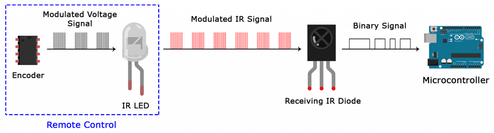

# **NEC Infrared communication protocol：**

**NEC Protocol**

To my knowledge the protocol I describe here was developed by NEC (Now Renesas). I've seen very similar protocol descriptions on the internet, and there the protocol is called Japanese Format.

I do admit that I don't know exactly who developed it. What I do know is that it was used in my late VCR produced by Sanyo and was marketed under the name of Fisher. NEC manufactured the remote control IC.

This description was taken from my VCR's service manual. Those were the days, when service manuals were filled with useful information\!

# **Features**

- 8 bit address and 8 bit command length.

- Extended mode available, doubling the address size.

- Address and command are transmitted twice for reliability.

- Pulse distance modulation.

- Carrier frequency of 38kHz.

- Bit time of 1.125ms or 2.25ms.

# **Modulation**


The NEC protocol uses pulse distance encoding of the bits. Each pulse is a 560µs long 38kHz carrier burst (about 21 cycles). A logical "1" takes 2.25ms to transmit, while a logical "0" is only half of that, being 1.125ms. The recommended carrier duty-cycle is 1/4 or 1/3

# **Protocol**


The picture above shows a typical pulse train of the NEC protocol. With this protocol the LSB is transmitted first. In this case Address $59 and Command $16 is transmitted. A message is started by a 9ms AGC burst, which was used to set the gain of the earlier IR receivers. This AGC burst is then followed by a 4.5ms space, which is then followed by the Address and Command. Address and Command are transmitted twice. The second time all bits are inverted and can be used for verification of the received message. The total transmission time is constant because every bit is repeated with its inverted length. If you're not interested in this reliability you can ignore the inverted values, or you can expand the Address and Command to 16 bits each! 

Keep in mind that one extra 560µs burst has to follow at the end of the message in order to be able to determine the value of the last bit.


A command is transmitted only once, even when the key on the remote control remains pressed. Every 110ms a repeat code is transmitted for as long as the key remains down. This repeat code is simply a 9ms AGC pulse followed by a 2.25ms space and a 560µs burst.


# **Extended NEC protocol**

The NEC protocol is so widely used that soon all possible addresses were used up. By sacrificing the address redundancy the address range was extended from 256 possible values to approximately 65000 different values. This way the address range was extended from 8 bits to 16 bits without changing any other property of the protocol. 

By extending the address range this way the total message time is no longer constant. It now depends on the total number of 1's and 0's in the message. If you want to keep the total message time constant you'll have to make sure the number 1's in the address field is 8 (it automatically means that the number of 0's is also 8). This will reduce the maximum number of different addresses to just about 13000. 

The command redundancy is still preserved. Therefore each address can still handle 256 different commands. 


Keep in mind that 256 address values of the extended protocol are invalid because they are in fact normal NEC protocol addresses. Whenever the low byte is the exact inverse of the high byte it is not a valid extended address.

 **3. Test Code：**

The IR receiver on the PCB board is controlled by GPIO19 of the ESP32 board.

You can download test code from a link <https://fs.keyestudio.com/KS5002> You can save the code anywhere. We save the code in the drive D of our computer.

As shown below: D:\\Micropython\_Codes.


Open “Thonny” and click “This computer” → “D:” → “Micropython\_Codes” → “Project\_09.1\_Infrared\_Remote\_And\_Receiver”. Select “irrecvdata.py” and right-click “Upload to /” and upload irrecvdata.py to ESP32

Double-click Project\_09.1\_Infrared\_Remote\_And\_Receiver.py as shown below:

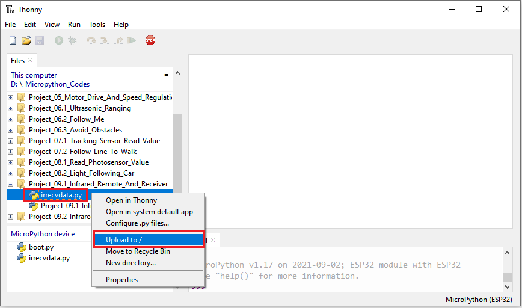

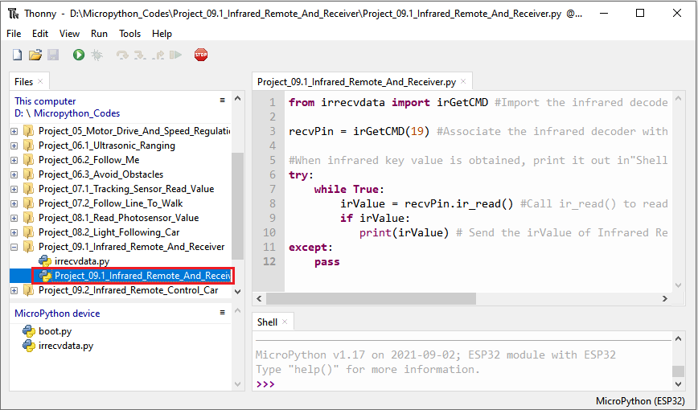

```python
from irrecvdata import irGetCMD #Import the infrared decoder.

recvPin = irGetCMD(19) #Associate the infrared decoder with Pin(19).

#When infrared key value is obtained, print it out in"Shell" repetitively.
try:
    while True:
        irValue = recvPin.ir_read() #Call ir_read() to read the value of the pressed key and assign it to IRValue.
        if irValue:
           print(irValue) # Send the irValue of Infrared Receiver and print the result.
except:
    pass
```

 **4. Test Result**

Connect the ESP32 board to your PC and click .

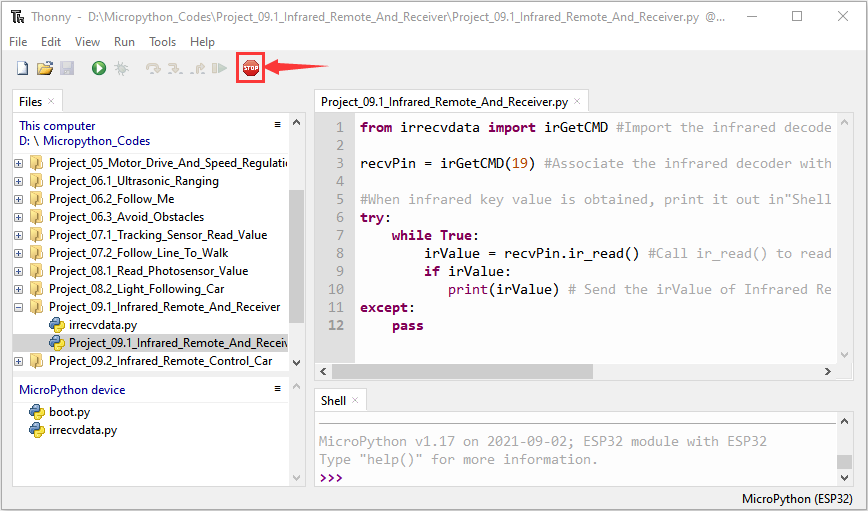

Click , the script starts running. Point the IR remote control at the IR receiver and press keys on the remote control, then the monitor will display key values.

Press “Ctrl+C” or click  to exit.

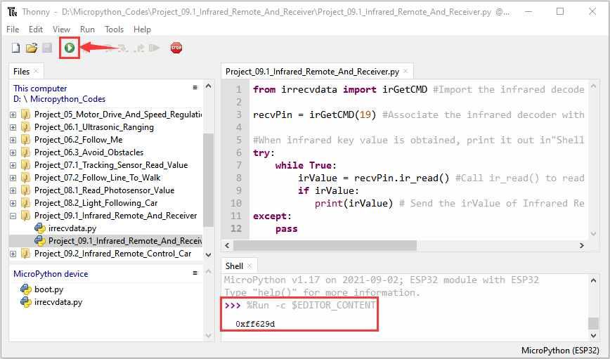

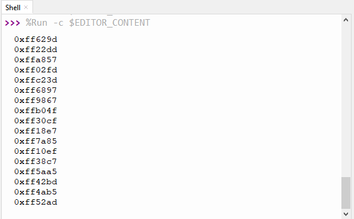

**Code of each key**


### Project 9.2: IR Remote Control Car

 **1. Description：**

In the above experiment, we have learned about the knowledge of the 8\*8 dot matrix display, the motor driver and speed regulation, the infrared receiver and the infrared remote control. In this experiment, we will use the infrared remote control and the infrared receiver to control the car.

 **2. Working Principle：**

|          Keys           | Keys Code | Functions                                    |
| :---------------------: | :-------: | -------------------------------------------- |
|  |  FF629D   | Go forward<br />Display “forward” pattern    |
|  |  FFA857   | Go back<br />Display “back” pattern          |
|  |  FF22DD   | Turn left<br />Show “left” pattern           |
|  |  FFC23D   | Turn right<br />Show “right turning” pattern |
|  |  FF02FD   | stop<br />show “stop” pattern                |

 **3. Flow Chart：**


 **4. Test Code：**

You can download test code from a link <https://fs.keyestudio.com/KS5002> You can save the code anywhere. We save the code in the drive D of our computer.

As shown below: D:\\Micropython\_Codes.


Open “Thonny” and click “This computer” → “D:” → “Micropython\_Codes” → “Project\_04\_Servo\_Sweep”, then select “ht16k33.py,”, “ht16k33matrix.py” and “irrecvdata.py”, right-click "Upload to /” to upload them to the ESP32.

Double-click Project\_09.2\_Infrared\_Remote\_Control\_Car.py as shown below:

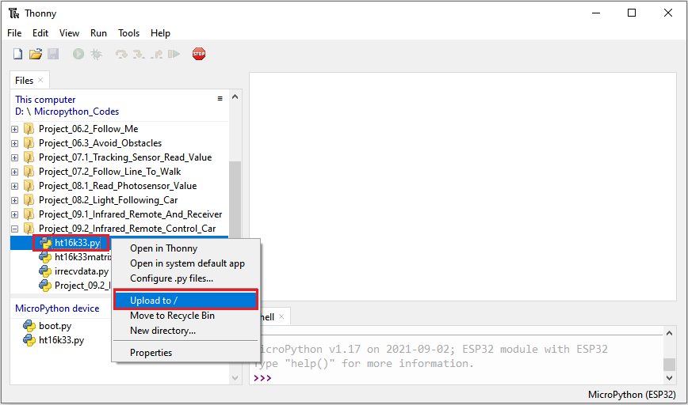

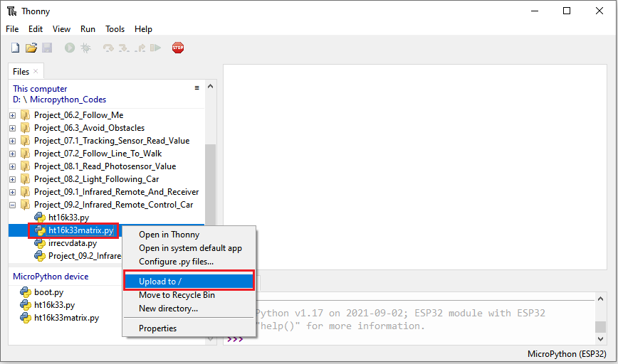

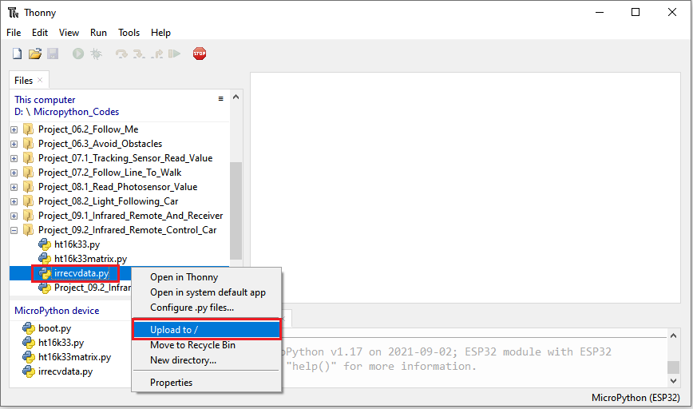

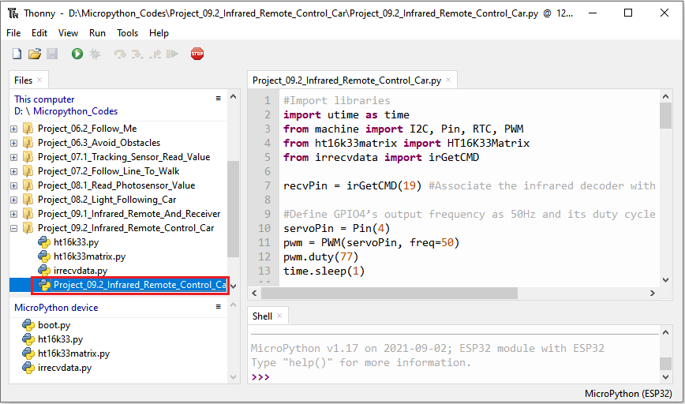

```python
#Import libraries
import utime as time
from machine import I2C, Pin, RTC, PWM 
from ht16k33matrix import HT16K33Matrix
from irrecvdata import irGetCMD 

recvPin = irGetCMD(19) #Associate the infrared decoder with Pin(19).

#Define GPIO4’s output frequency as 50Hz and its duty cycle as 77, and assign them to PWM.
servoPin = Pin(4)
pwm = PWM(servoPin, freq=50)
pwm.duty(77)
time.sleep(1)

# right wheel
pin1=Pin(32,Pin.OUT)
pin2=PWM(Pin(25),freq=50,duty=0)
# left wheel
pin3=Pin(33,Pin.OUT)
pin4=PWM(Pin(26),freq=50,duty=0)

# CONSTANTS
DELAY = 0.01
PAUSE = 3

# START
if __name__ == '__main__':
    i2c = I2C(scl=Pin(22), sda=Pin(21))
    display = HT16K33Matrix(i2c)
    display.set_brightness(2)
    
# As a function of the car going forward.
def car_forward(): 
  pin1.value(0)
  pin2.duty(1000) 
  pin3.value(0)
  pin4.duty(1000)  

# As a function of the car going backwards.
def car_back(): 
  pin1.value(1)
  pin2.duty(250) 
  pin3.value(1)
  pin4.duty(250)

# As a function of the car going left.
def car_left(): 
  pin1.value(0)
  pin2.duty(1000) 
  pin3.value(1)
  pin4.duty(500)  

# As a function of the car going right.
def car_right(): 
  pin1.value(1)
  pin2.duty(500) 
  pin3.value(0)
  pin4.duty(1000)

# As a function of the car stopping.
def car_stop():
  pin2.deinit()
  pin4.deinit()
  pin1.value(0)
  pin2.duty(0) 
  pin3.value(0)
  pin4.duty(0)
  
def handleControl(value): 
    if value == '0xff629d':
        pin2=PWM(Pin(25),freq=50)
        pin4=PWM(Pin(26),freq=50)
        car_forward() #Car ahead
   # Dot matrix shows a forward pattern 
        icon = b"\x18\x24\x42\x99\x24\x42\x81\x00"
        display.set_icon(icon).draw()
        display.set_angle(0).draw()
        time.sleep(PAUSE)
    elif value == '0xffa857':
        pin2=PWM(Pin(25),freq=50)
        pin4=PWM(Pin(26),freq=50)
        car_back() # Car goes back
    # Dot matrix shows a backward pattern
        icon = b"\x00\x81\x42\x24\x99\x42\x24\x18"
        display.set_icon(icon).draw()
        display.set_angle(0).draw()
        time.sleep(PAUSE)
    elif value == '0xff22dd': 
        pin2=PWM(Pin(25),freq=50)
        pin4=PWM(Pin(26),freq=50)
        car_left() # Car to the left
    # Dot matrix shows a left pattern
        icon = b"\x48\x24\x12\x09\x09\x12\x24\x48"
        display.set_icon(icon).draw()
        display.set_angle(0).draw()
        time.sleep(PAUSE)
    elif value == '0xffc23d': 
        pin2=PWM(Pin(25),freq=50)
        pin4=PWM(Pin(26),freq=50)
        car_right() # Car to the right
    # Dot matrix displays a right pattern
        icon = b"\x12\x24\x48\x90\x90\x48\x24\x12"
        display.set_icon(icon).draw()
        display.set_angle(0).draw()
        time.sleep(PAUSE)
    elif value == '0xff02fd': 
        car_stop() # Car to the right
    # Dot matrix displays a stop pattern
        icon = b"\x18\x18\x18\x18\x18\x00\x00\x18"
        display.set_icon(icon).draw()
        display.set_angle(0).draw()
        time.sleep(PAUSE)
try:
    while True:
        irValue = recvPin.ir_read() #Call ir_read() to read the value of the pressed key and assign it to IRValue.
        if irValue:
            print(irValue)
            handleControl(irValue)
except:
    pass
```

 **5. Test Result**

Connect the ESP32 board to your PC and click .

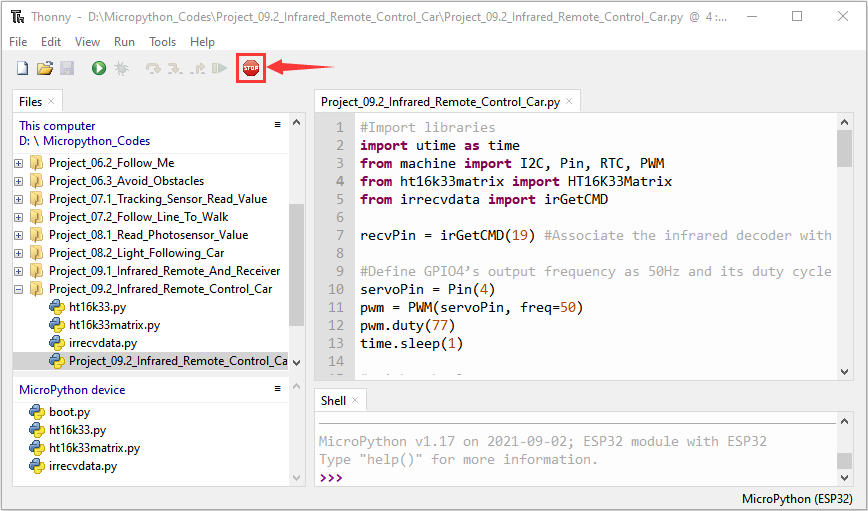

Place batteries, turn the power switch to ON end and power up.

Click , the script starts running, point the remote control at the IR receiver and press keys, then the car will make the corresponding movement.; press “Ctrl+C” or click  to exit.


### Project 10: WIFI Working Mode

In this chapter, we will focus on the WiFi infrastructure of the ESP32. ESP32 has 3 different WiFi working modes: Station mode, AP mode and AP+Station mode. All WiFi programming projects must configure WiFi operating mode before using WiFi, otherwise WiFi cannot be used.

### Project 10.1：WIFI Station Mode

 **1. Components**

| 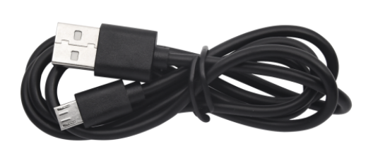 |  |
| ------------------------------------------------------------ | ------------------------------------------------------------ |
| USB  Cable x1                                                | ESP32*1                                                      |


Plug the ESP32 to the USB port of your PC

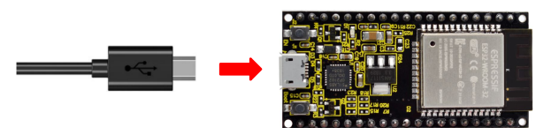

 **2. Component Knowledge：**

**Station mode：**

When setting Station mode, the ESP32 is taken as a WiFi client. It can connect to the router network and communicate with other devices on the router via a WiFi connection. As shown in the figure below, the PC and the router have been connected. If the ESP32 wants to communicate with the PC, the PC and the router need to be connected.


 **3. Test Code：**

You can download test code from a link <https://fs.keyestudio.com/KS5002> You can save the code anywhere. We save the code in the drive D of our computer.

As shown below: D:\\Micropython\_Codes.


Open “Thonny” and click “This computer” → “D:” → “Micropython\_Codes” → “Project\_10.1\_WiFi\_Station\_Mode”

Double-click Project\_10.1\_WiFi\_Station\_Mode.py as shown below:


```python
import time
import network #Import network module

#Enter correct router name and password
ssidRouter     = '********' #Enter the router name
passwordRouter = '********' #Enter the router password

def STA_Setup(ssidRouter,passwordRouter):
    print("Setup start")
    sta_if = network.WLAN(network.STA_IF) #Set ESP32 in Station mode
    if not sta_if.isconnected():
        print('connecting to',ssidRouter)
#Activate ESP32’s Station mode, initiate a connection request to the router
#and enter the password to connect.
        sta_if.active(True)
        sta_if.connect(ssidRouter,passwordRouter)
#Wait for ESP32 to connect to router until they connect to each other successfully.
        while not sta_if.isconnected():
            pass
#Print the IP address assigned to ESP32 in “Shell”.
    print('Connected, IP address:', sta_if.ifconfig())
    print("Setup End")

try:
    STA_Setup(ssidRouter,passwordRouter)
except:
    sta_if.disconnect()
```

 **4. Test Result**

Since the router name and password are different in various places, before running the code, the user needs to enter the correct router name and password in the red box shown above.

After entering the correct router name and password, click , the code will be run.

The Shell monitor will print the IP address of the ESP32 when connecting the ESP32 to your router.

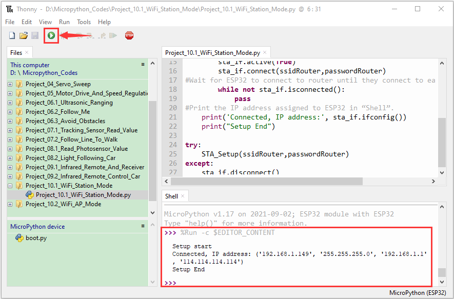

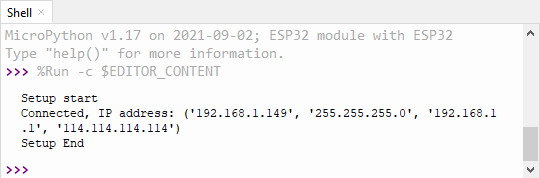

### Project 10.2：WIFI AP Mode

 **1. Component Knowledge：**

**AP Mode:**

When setting AP mode, a hotspot network will be created, waiting for other WiFi devices to connect. As shown below; take the ESP32 as the hotspot. If a phone or PC needs to communicate with the ESP32, it must be connected to the ESP32's hotspot. Communication is only possible after a connection is established via the ESP32.


 **2. Test Code:**

You can download test code from a link <https://fs.keyestudio.com/KS5002> You can save the code anywhere. We save the code in the drive D of our computer.

As shown below: D:\\Micropython\_Codes.


Open “Thonny” and click “This computer” → “D:” → “Micropython\_Codes” -> “Project\_10.2\_WiFi\_AP\_Mode”

Double-click “Project\_10.2\_WiFi\_AP\_Mode” as shown below:

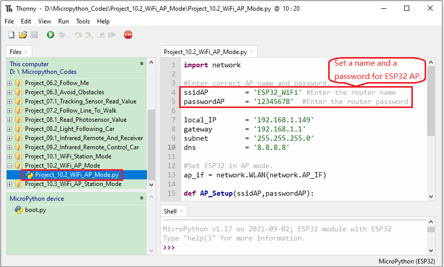

```python
import network

#Enter correct AP name and password.
ssidAP         = 'ESP32_WiFi' #Enter the router name
passwordAP     = '12345678'  #Enter the router password

local_IP       = '192.168.1.149'
gateway        = '192.168.1.1'
subnet         = '255.255.255.0'
dns            = '8.8.8.8'

#Set ESP32 in AP mode.
ap_if = network.WLAN(network.AP_IF)

def AP_Setup(ssidAP,passwordAP):
    ap_if.ifconfig([local_IP,gateway,subnet,dns]) #Configure IP address, gateway and subnet mask for ESP32.
    print("Setting soft-AP  ... ")
#Turn on an AP in ESP32, whose name is set by ssid_AP and password is set by password_AP
    ap_if.config(essid=ssidAP,authmode=network.AUTH_WPA_WPA2_PSK, password=passwordAP)
    ap_if.active(True)
    print('Success, IP address:', ap_if.ifconfig())
    print("Setup End\n")

try:
    AP_Setup(ssidAP,passwordAP)
except:
    print("Failed, please disconnect the power and restart the operation.")
    ap_if.disconnect() #If the program is running abnormally, the AP disconnection function will be called.
```

 **3. Test Result**

You can modify the AP name and password or keep them unchanged.

Click “Run current script”, the code will be run. Open the AP function of the ESP32, the Shell monitor will print the information.

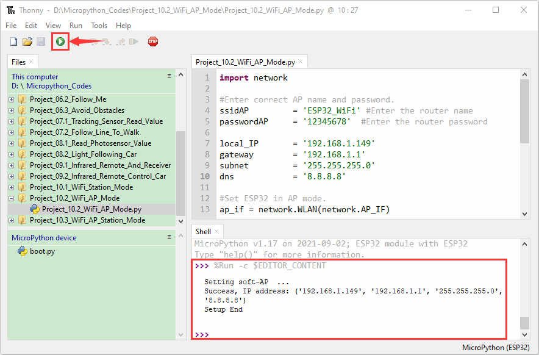

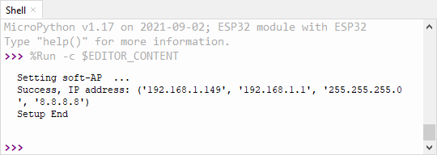

Enable Wifi, then you can see the ssid\_AP which is called "ESP32\_Wifi" in this code. You can enter the password "12345678" to connect it, or you can modify its AP name and password by code.


### Project 10.3：WIFI AP+Station Mode

 **1. Component Knowledge：**

**AP+Station mode**

In addition to the AP mode and the Station mode, **AP+Station mode** can be used at the same time. Turn on the Station mode of the ESP32, connect it to the router network, and it can communicate with the Internet through the router. Then turn on the AP mode to create a hotspot network. Other WiFi devices can be connected to the router network or the hotspot network to communicate with the ESP32.

 **2. Test Code：**

You can download test code from a link <https://fs.keyestudio.com/KS5002> You can save the code anywhere. We save the code in the drive D of our computer.

As shown below: D:\\Micropython\_Codes.


Open “Thonny” and click “This computer” → “D:” → “Micropython\_Codes” → “Project\_10.3\_WiFi\_AP\_Station\_Mode”

Double-click Project\_10.3\_WiFi\_AP\_Station\_Mode.py as shown below:

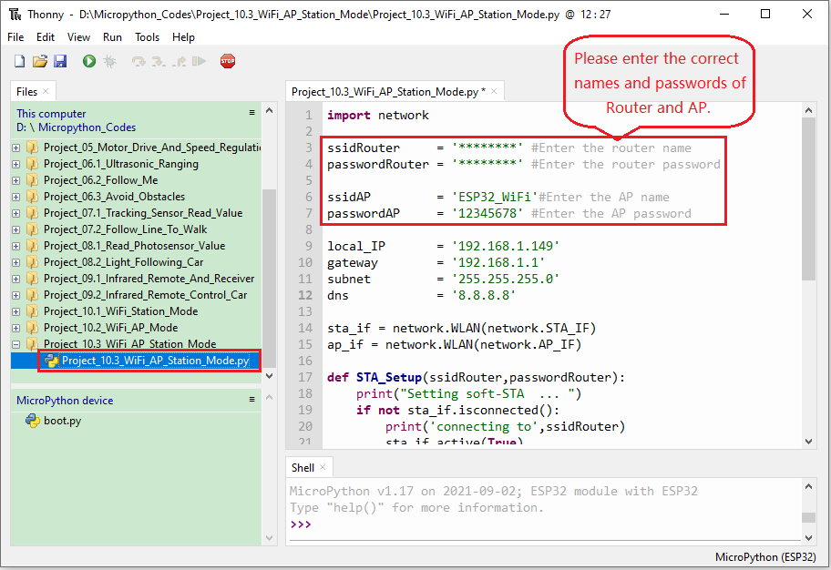

```python
import network

ssidRouter     = '********' #Enter the router name
passwordRouter = '********' #Enter the router password

ssidAP         = 'ESP32_WiFi'#Enter the AP name
passwordAP     = '12345678' #Enter the AP password

local_IP       = '192.168.1.149'
gateway        = '192.168.1.1'
subnet         = '255.255.255.0'
dns            = '8.8.8.8'

sta_if = network.WLAN(network.STA_IF)
ap_if = network.WLAN(network.AP_IF)
    
def STA_Setup(ssidRouter,passwordRouter):
    print("Setting soft-STA  ... ")
    if not sta_if.isconnected():
        print('connecting to',ssidRouter)
        sta_if.active(True)
        sta_if.connect(ssidRouter,passwordRouter)
        while not sta_if.isconnected():
            pass
    print('Connected, IP address:', sta_if.ifconfig())
    print("Setup End")
    
def AP_Setup(ssidAP,passwordAP):
    ap_if.ifconfig([local_IP,gateway,subnet,dns])
    print("Setting soft-AP  ... ")
    ap_if.config(essid=ssidAP,authmode=network.AUTH_WPA_WPA2_PSK, password=passwordAP)
    ap_if.active(True)
    print('Success, IP address:', ap_if.ifconfig())
    print("Setup End\n")

try:
    AP_Setup(ssidAP,passwordAP)    
    STA_Setup(ssidRouter,passwordRouter)
except:
    sta_if.disconnect()
    ap_if.idsconnect()
```

 **3. Test Result**

Before running the code, you need to modify ssidRouter, passwordRouter, ssidAP, and passwordAP. After making sure that the code is modified correctly, click , the code starts to run, and the "Shell" window will display the following:

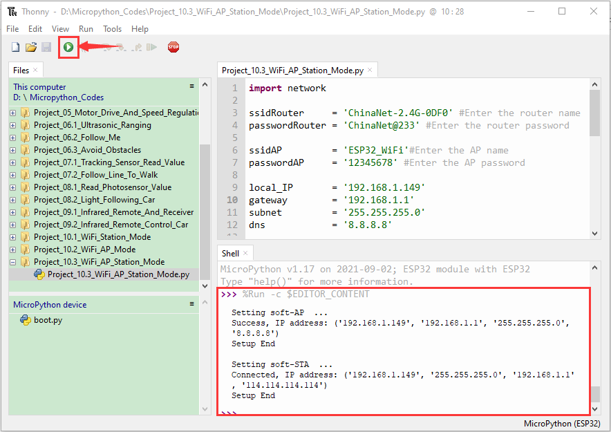

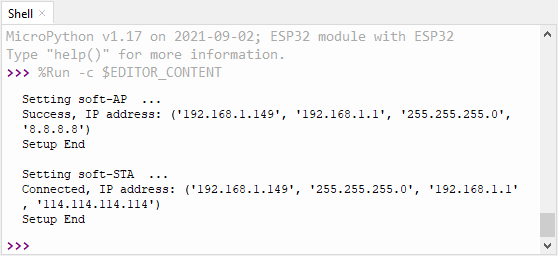

Enable WiFi, then you can see ssid\_AP on the ESP 32 board.


## Resources

Download code,libraries and more details, please refer to the following link:

<https://fs.keyestudio.com/KS5002>
