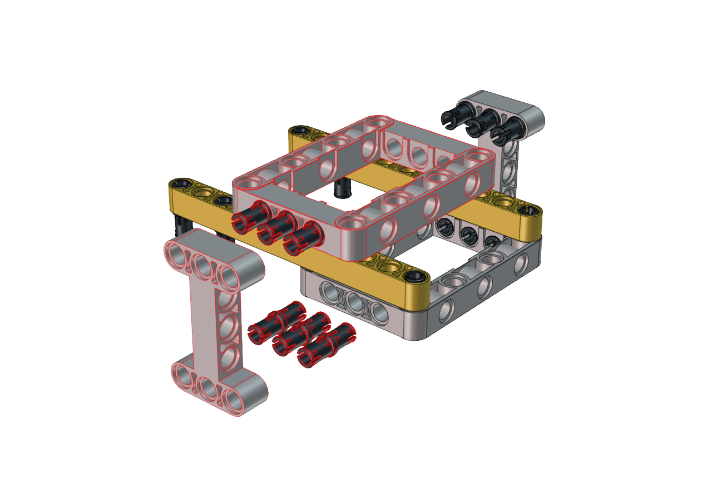
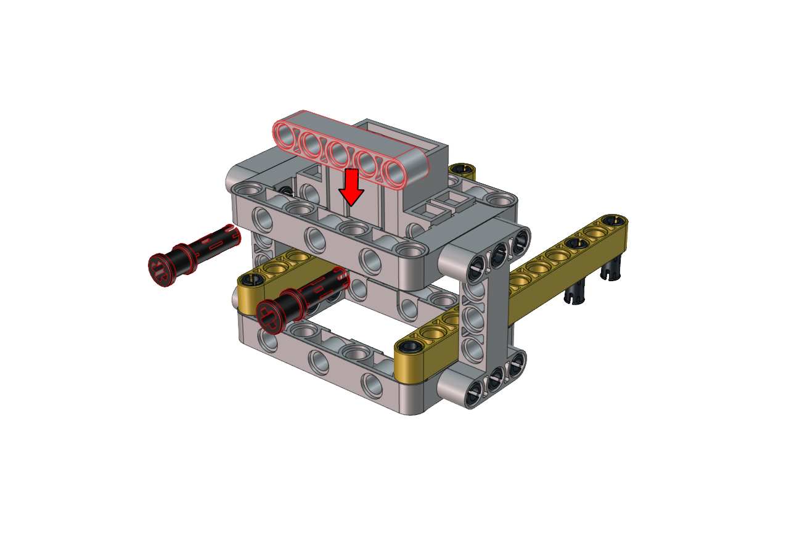

# Soccer Robot

## **Description：**

 Can you imagine that a robot can play soccer? This idea has became
realistic. As we know, the RoboCup championship is generally held
each year. In this part, we will create a soccer robot to play
soccer.

## **How to install the soccer robot**

                              
 Step 1
 Remove two photoresistors

------

 Required Parts

------

------

------

 Step 2
 Required Parts

------

------

------

 Step 3
 Required Parts

------

------

------

 Step 4
 Required Parts

------

------

------

 Step 5
 Required Parts

------

------

------

 Step 6
 Required Parts

------

Note the installation direction of the part marked by the red circle

------

------

 Step 7
 Required Parts

------

------

------

 Step 8
 Required Parts

------

Adjust the angle of the claw. Then make it close and face front

------

------

 Step 9
 Required Parts

------

 Set the angle of the servo to 180 degree

| Wire Up Servo |  PCB Board  |
| :-----------: | :---------: |
|     Brown     |      G      |
|      Red      |     5V      |
|    Orange     | S2（GPIO23) |

Upload the code of the servo to the main board of the Beetlebot car, as shown below

    //*************************************************************************************
    #include <Arduino.h>

    int channel_PWM = 4;  
    int freq_PWM = 50;   
    int resolution_PWM = 10;   
    const int PWM_Pin = 23;  

    void setup() {
    ledcSetup(channel_PWM, freq_PWM, resolution_PWM); 
    ledcAttachPin(PWM_Pin, channel_PWM);  
    }

    void loop() {
    ledcWrite(channel_PWM, 128);  
    }
    //*************************************************************************************

You can also initialize the angle of the servo through the following code

Keep the claw close and face front before installing the gear

------

------

 Step 10

 Required Parts

------

------

------

 Step 11

 Required Parts

------

------

------

------

 Wiring Diagram

 Wire up the LEGO servo

 ## Install a soccer goal

 Step 1                                                                 
 Required Parts

------

------

------

​                               

 Step 2

Required Parts

------

------

------

 Step 3
Required Parts

------

------

------

Then the soccer goal is installed well.

##  **Test Code for Arduino：**

    #include <WiFi.h>
    #include <ESPmDNS.h>
    #include <WiFiClient.h>

    #define INA 32
    #define PWMA 25
    #define INB 33
    #define PWMB 26

    const char* ssid = "ChinaNet-2.4G-0DF0";
    const char* password = "ChinaNet@233";
    // TCP server at port 80 will respond to HTTP requests
    WiFiServer server(80);
    int channel_PWM = 3; 
    int freq_PWM = 50;
    int resolution_PWM = 10;
    const int servopin = 4;
    void setup(void)
    {
        Serial.begin(115200);
        pinMode(INA, OUTPUT);
        ledcAttachPin(PWMA, 0);
        ledcSetup(0, 50, 8);
        pinMode(INB, OUTPUT);
        ledcAttachPin(PWMB,1);
        ledcSetup(1, 50, 8);
        ledcSetup(3, 50, 10); 
        ledcAttachPin(23, 3); 
        ledcWrite(channel_PWM, set_angle(180));
        delay(300);
        // Connect to WiFi network
        WiFi.begin(ssid, password);
        Serial.println("");
        // Wait for connection
        while (WiFi.status() != WL_CONNECTED) {
            delay(500);
            Serial.print(".");
        }
        Serial.println("");
        Serial.print("Connected to ");
        Serial.println(ssid);
        Serial.print("IP address: ");
        Serial.println(WiFi.localIP());

        // Set up mDNS responder:
        // - first argument is the domain name, in this example
        //   the fully-qualified domain name is "esp32.local"
        // - second argument is the IP address to advertise
        //   we send our IP address on the WiFi network
        if (!MDNS.begin("esp32")) {
            Serial.println("Error setting up MDNS responder!");
            while(1) {
                delay(1000);
            }
        }
        Serial.println("mDNS responder started");

        // Start TCP (HTTP) server
        server.begin();
        Serial.println("TCP server started");

        // Add service to MDNS-SD
        MDNS.addService("http", "tcp", 80);
    }

    void loop(void)
    {
        // Check if a client has connected
        WiFiClient client = server.available();
        if (!client) {
            return;
        }
        //Serial.println("");
        //Serial.println("New client");

        // Wait for data from client to become available
        while(client.connected() && !client.available()){
            delay(1);
        }

        // Read the first line of HTTP request
        String req = client.readStringUntil('\r');
        //Serial.println(req);
        // First line of HTTP request looks like "GET /path HTTP/1.1"
        // Retrieve the "/path" part by finding the spaces
        int addr_start = req.indexOf(' ');
        int addr_end = req.indexOf(' ', addr_start + 1);
        if (addr_start == -1 || addr_end == -1) {
            //Serial.print("Invalid request: ");
            //Serial.println(req);
            return;
        }
        req = req.substring(addr_start + 1, addr_end);
        //Serial.print("Request: ");
        Serial.println(req);
        String s;
        if (req == "/")
        {
            IPAddress ip = WiFi.localIP();
            String ipStr = String(ip[0]) + '.' + String(ip[1]) + '.' + String(ip[2]) + '.' + String(ip[3]);
            s = "HTTP/1.1 200 OK\r\nContent-Type: text/html\r\n\r\n<!DOCTYPE HTML>\r\n<html>Hello from ESP32 at ";
            s += ipStr;
            s += "</html>\r\n\r\n";
            Serial.println("Sending 200");
            client.println(WiFi.localIP());
        }
        else if(req == "/btn/F")
        {
        digitalWrite(INA, LOW);
        ledcWrite(0, 110);
        digitalWrite(INB, LOW);
        ledcWrite(1, 100);
        }
        else if(req == "/btn/B")
        {
        digitalWrite(INA, HIGH);
        ledcWrite(0, 155);
        digitalWrite(INB, HIGH);
        ledcWrite(1, 155);
        }
        else if(req == "/btn/L")
        {
        digitalWrite(INA, LOW);
        ledcWrite(0, 100);
        digitalWrite(INB, HIGH);
        ledcWrite(1, 155);
        }
        else if(req == "/btn/R")
        {
        digitalWrite(INA, HIGH);
        ledcWrite(0, 155);
        digitalWrite(INB, LOW);
        ledcWrite(1, 100);
        }
        else if(req == "/btn/S")
        {
        digitalWrite(INA, LOW);
        ledcWrite(0, 0);
        digitalWrite(INB, LOW);
        ledcWrite(1, 0);
        }
        else if(req == "/btn/p")
        {
        Serial.write('p');
        ledcWrite(channel_PWM, set_angle(180));
        }
        else if(req == "/btn/q")
        {
        Serial.write('q');
        client.println("q");
        }
        else if(req == "/btn/x")
        {
        ledcWrite(channel_PWM, set_angle(160));
        }

    }

    int set_angle(int angle)
    {
    int servo_angle = map(angle, 0, 180, 25, 128);
    return servo_angle;
    }

##  **Test Code for Kidsblock：**

Build up the soccer goal with building blocks and place it at fixed
location, connect the robot car through Wifi.

Put a small soccer in the middle of the claw of the robot car, press
and hold down the button

to enable the claw to hold the soccer,
then press buttons

to adjust the car’s movement direction
so as to put the soccer close to the soccer goal. At last, release
the button 
to allow the soccer to drop on the
floor and roll to the soccer goal. If not, repeat the above step to
shoot the goal.

If your friend owns this kind of soccer robot, you guys can hold a
soccer match. It sounds amazing, right?.
