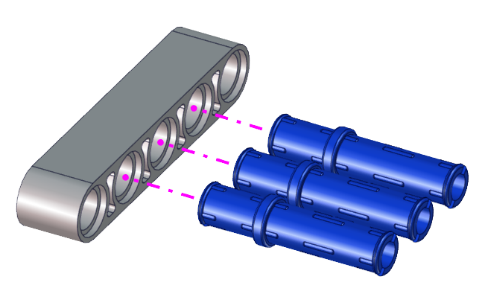

# Handling Robot Tutorial

## Description：

Among many industrial robots, handling robots are undoubtedly effective, applied in industrial manufacturing, warehousing and logistics, tobacco, medicine, food, chemical and other industries, or in post offices, libraries, ports and parking lots. In this experiment, we will use LEGO blocks to build a handling robot to carry things.

## Install APP

**⚠️<span style="color: rgb(255, 76, 65);">Special note:</span>** If you have downloaded and installed the APP, this step is skipped; If not, please refer to the installation instructions of link: [Project 18：Read WiFi APP Button String](https://docs.keyestudio.com/projects/KS5002/en/latest/docs/Arduino_C%20Tutorial/Arduino_C_Tutorial.html#project-18-read-wifi-app-button-string) .


## How to build up a handling robot


 **Step 1**

 Dismantle the ultrasonic sensor


------


 Required components


------

Install


------

Complete


------


 **Step 2**

 Required components


------

Install


------

Complete


------


 **Step 3**

 Required components


------

Install


------

Complete


------


 **Step 4**

 Required components


------

Install


------

Complete


------


 **Step 5**

 Required components


------

Install


------

Complete


------


 **Step 6**

 Required components


------

Install


------

Complete


------


 **Step 7**

 Required components


------

Install


------

Complete


------


 **Step 8**

 Required components


------

Install


------

Complete


------


 **Step 9**

 Required components


------


 Set the angle of the servo to 180 degree

|    Wire servo up Servo  |  PCB Board    |
| ---- | ---- |
|   Brown   |  G    |
|   Red   |   5V   |
|   Orange   |   S2（GPIO23）   |

**Method 1：Arduino code**

Upload the code of the servo to the main board of the Beetlebot car, as shown below

```C
#include <Arduino.h>
// servo channels 
int channel_PWM = 3;  
// Servo frequency, then the period is 1/50, which is 20ms, PWM has a total of 16 channels, 0-7 high-speed channels are driven by 80Mhz clock, and the last 8 low-speed channels are driven by 1Mhz clock
int freq_PWM = 50;   
//PWM resolution, the value is between 0-20, here is 10, then the pwm value filled in the following ledcWrite is between 0-2 to the 10th power, that is, 0-1024.
int resolution_PWM = 10;   
//
const int PWM_Pin = 23;  //connect pwm to GPIO23
void setup() {
  ledcSetup(channel_PWM, freq_PWM, resolution_PWM); // Set servo channel, servo frequency, PWM resolution.
  ledcAttachPin(PWM_Pin, channel_PWM);  //connect LEDC channels to IO ports

  ledcWrite(channel_PWM, 25);  //The 20ms high level is about 0.5ms, which is 0.5/20*1024, and the angle of the steering gear is 25°.
  delay(1000);
  ledcWrite(channel_PWM, 128);  //The 20ms high level is about 2.5ms, which is 2.5/20*1024, and the angle of the steering gear is 180°.
  delay(1000);
}
void loop() {

} 
``` 
 
How to get it ?

In folder **..\Codes\Handling_Robot_Code\270° Servo Angle initialization** , open file **270_Servo_Angle_initialization.ino** , or copy and paste the above test code into the Arduino IDE.
 


**Method 2：KidsBlock(Scratch) code**

 You can also initialize the angle of the servo through the following code


How to get it?

Open file **270°_Servo_Angle_initialization.sb3** with KidsBlock IDE, in folder **..\Codes\Handling_Robot_Code\270° Servo Angle initialization**.


------

Install


------

Complete


------


 Step 10

 Required components


------

Install





------

Complete


------

 Wire up servo


<!-- -->

## Test Code for Arduino

**⚠️ATTENTION:** Before uploading code, please replace the WiFi name(**REPLACE_WITH_YOUR_SSID**) in the code and the passwords(**REPLACE_WITH_YOUR_PASSWORD**) into yours.

```c
#include <WiFi.h>
#include <ESPmDNS.h>
#include <WiFiClient.h>

#define INA 32
#define PWMA 25
#define INB 33
#define PWMB 26

/*REPLACE WITH YOUR NETWORK CREDENTIALS(Put your SSID & Password)*/
const char* ssid = "REPLACE_WITH_YOUR_SSID"; //Enter SSID here
const char* password = "REPLACE_WITH_YOUR_PASSWORD"; //Enter Password here
// TCP server at port 80 will respond to HTTP requests
WiFiServer server(80);

//servo
int channel_PWM = 3; // servo channel
// Servo frequency. The period is 1/50, which is 20ms. The PWM has a total of 16 channels, of which the 0-7 bit high-speed channel is driven by an 80Mhz clock, and the following eight low-speed channels are driven by a 1Mhz clock.
int freq_PWM = 50;
// PWM resolution, ranging from 0 to 20. If this is 10, the pwm value in ledcWrite is between 0 and 2 to the power of 10, which is 0 to 1024. If the requirements are not high, you can just use 1000.
int resolution_PWM = 10;
// Bind I/O ports. This is used in the binding function below. After binding, this IO becomes the output of the PWM.
const int servopin = 4;//Define the IO pin of the servo as gpio4.

void setup(void)
{
    Serial.begin(115200);
    pinMode(INA, OUTPUT);
    ledcAttachPin(PWMA, 2);
    ledcSetup(2, 1200, 8);//Set the LEDC channel 2 frequency to 1200 and the PWM resolution to 8, that is, the duty cycle to 256.
    pinMode(INB, OUTPUT);
    ledcAttachPin(PWMB,1);
    ledcSetup(1, 1200, 8);//Set the LEDC channel 1 frequency to 1200 and the PWM resolution to 8, that is, the duty cycle to 256.
    
    ledcSetup(3, 50, 10); // Set the frequency of servo channel 3 to 50 and the PWM resolution to 10.
    ledcAttachPin(23, 3);  //Bind the LEDC channel to the specified I/O port for output.
    ledcWrite(channel_PWM, set_angle(180));
    delay(300);

    // Connect to WiFi network
    WiFi.begin(ssid, password);
    Serial.println("");

    // Wait for connection
    while (WiFi.status() != WL_CONNECTED) {
        delay(500);
        Serial.print(".");
    }
    Serial.println("");
    Serial.print("Connected to ");
    Serial.println(ssid);
    Serial.print("IP address: ");
    Serial.println(WiFi.localIP());

    // Set up mDNS responder:
    // - first argument is the domain name, in this example
    //   the fully-qualified domain name is "esp32.local"
    // - second argument is the IP address to advertise
    //   we send our IP address on the WiFi network
    if (!MDNS.begin("esp32")) {
        Serial.println("Error setting up MDNS responder!");
        while(1) {
            delay(1000);
        }
    }
    Serial.println("mDNS responder started");

    // Start TCP (HTTP) server
    server.begin();
    Serial.println("TCP server started");

    // Add service to MDNS-SD
    MDNS.addService("http", "tcp", 80);
}

void loop(void)
{
    // Check if a client has connected
    WiFiClient client = server.available();
    if (!client) {
        return;
    }
    //Serial.println("");
    //Serial.println("New client");

    // Wait for data from client to become available
    while(client.connected() && !client.available()){
        delay(1);
    }

    // Read the first line of HTTP request
    String req = client.readStringUntil('\r');
    //Serial.println(req);
    // First line of HTTP request looks like "GET /path HTTP/1.1"
    // Retrieve the "/path" part by finding the spaces
    int addr_start = req.indexOf(' ');
    int addr_end = req.indexOf(' ', addr_start + 1);
    if (addr_start == -1 || addr_end == -1) {
        //Serial.print("Invalid request: ");
        //Serial.println(req);
        return;
    }
    req = req.substring(addr_start + 1, addr_end);
    //Serial.print("Request: ");
    Serial.println(req);
    String s;
    if (req == "/")
    {
        IPAddress ip = WiFi.localIP();
        String ipStr = String(ip[0]) + '.' + String(ip[1]) + '.' + String(ip[2]) + '.' + String(ip[3]);
        s = "HTTP/1.1 200 OK\r\nContent-Type: text/html\r\n\r\n<!DOCTYPE HTML>\r\n<html>Hello from ESP32 at ";
        s += ipStr;
        s += "</html>\r\n\r\n";
        Serial.println("Sending 200");
        client.println(WiFi.localIP());
    }
    else if(req == "/btn/F")
    {
      digitalWrite(INA, LOW);
      ledcWrite(2, 100);
      digitalWrite(INB, LOW);
      ledcWrite(1, 100);
    }
    else if(req == "/btn/B")
    {
      digitalWrite(INA, HIGH);
      ledcWrite(2, 155);
      digitalWrite(INB, HIGH);
      ledcWrite(1, 155);
    }
    else if(req == "/btn/L")
    {
      digitalWrite(INA, LOW);
      ledcWrite(2, 100);
      digitalWrite(INB, HIGH);
      ledcWrite(1, 155);
    }
    else if(req == "/btn/R")
    {
      digitalWrite(INA, HIGH);
      ledcWrite(2, 155);
      digitalWrite(INB, LOW);
      ledcWrite(1, 100);
    }
    else if(req == "/btn/S")
    {
      digitalWrite(INA, LOW);
      ledcWrite(2, 0);
      digitalWrite(INB, LOW);
      ledcWrite(1, 0);
    }
    else if(req == "/btn/p")
    {
      Serial.write('p');
      ledcWrite(channel_PWM, set_angle(130));
      delay(100);
    }
    else if(req == "/btn/q")
    {
      Serial.write('q');
      client.println("q");
    }
    else if(req == "/btn/x")
    {
      ledcWrite(channel_PWM, set_angle(180));
      delay(100);
    }

}

int set_angle(int angle)
{
  int servo_angle = map(angle, 0, 180, 25, 128);
  return servo_angle;
}
```

## Test Code for Kidsblock

**⚠️ATTENTION:** Before uploading code, please replace the WiFi name(**REPLACE_WITH_YOUR_SSID**) in the code and the passwords(**REPLACE_WITH_YOUR_PASSWORD**) into yours.


Connect Wifi, click buttons to make the car to move toward building blocks and put some building blocks on the robot.

Then press  to drive the robot to move.

Hold down the button  to drive the robot to drop building blocks, then building blocks can be conveyed
