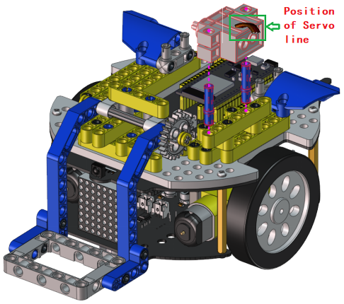
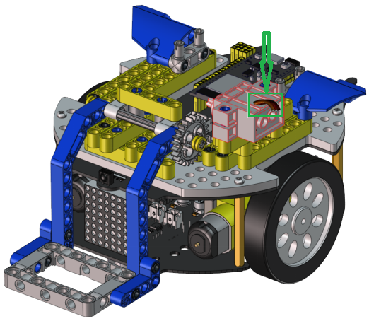

# Handling Robot Tutorial

## Description：

Among many industrial robots, handling robots are undoubtedly effective, applied in industrial manufacturing, warehousing and logistics, tobacco, medicine, food, chemical and other industries, or in post offices, libraries, ports and parking lots. In this experiment, we will use LEGO blocks to build a handling robot to carry things.

## Install APP

**⚠️<span style="color: rgb(255, 76, 65);">Special note:</span>** If you have downloaded and installed the APP, this step is skipped; If not, please refer to the installation instructions of link: [Project 18：Read WiFi APP Button String](https://docs.keyestudio.com/projects/KS5002/en/latest/docs/Arduino_C%20Tutorial/Arduino_C_Tutorial.html#project-18-read-wifi-app-button-string) .


## How to build up a handling robot


 **Step 1**

 Dismantle the ultrasonic sensor


------


 Required components


------

Install


------

Complete


------


 **Step 2**

 Required components


------

Install


------

Complete


------


 **Step 3**

 Required components


------

Install


------

Complete


------


 **Step 4**

 Required components


------

Install


------

Complete


------


 **Step 5**

 Required components


------

Install


------

Complete


------


 **Step 6**

 Required components


------

Install


------

Complete


------


 **Step 7**

 Required components


------

Install


------

Complete


------


 **Step 8**

 Required components


------

Install





------

Complete




------


 **Step 9**

 Required components


------


 Set the angle of the servo to 180 degree

|    Wire servo up Servo  |  PCB Board    |
| ---- | ---- |
|   Brown   |  G    |
|   Red   |   5V   |
|   Orange   |   S2（GPIO23）   |

**Method 1：Arduino code**

Upload the code of the servo to the main board of the Beetlebot car, as shown below

```C
#include <Arduino.h>
#include <ESP32Servo.h>

Servo myservo;  // create servo object to control a servo

int servoPin = 23; // Servo motor pin

void setup() {
  myservo.setPeriodHertz(50);           // standard 50 hz servo
  myservo.attach(servoPin, 500, 2500);  // attaches the servo on servoPin to the servo object

  myservo.write(0);  // the angle of the steering gear is 0°.
  delay(1000);
  myservo.write(90);  // the angle of the steering gear is 90°.
  delay(1000);
  myservo.write(0);  // the angle of the steering gear is 0°.
  delay(1000);
}
void loop() {

}
``` 
 
How to get it ?

In folder **..\Codes\Handling_Robot_Code\270° Servo Angle initialization** , open file **270_Servo_Angle_initialization.ino** , or copy and paste the above test code into the Arduino IDE.
 


**Method 2：KidsBlock(Scratch) code**

 You can also initialize the angle of the servo through the following code


How to get it?

Open file **270°_Servo_Angle_initialization.sb3** with KidsBlock IDE, in folder **..\Codes\Handling_Robot_Code\270° Servo Angle initialization**.


------

Install


------

Complete


------


 Step 10

 Required components


------

Install


------

Complete


------

 Wire up servo


<!-- -->

## Test Code for Arduino

**⚠️ATTENTION:** Before uploading code, please replace the WiFi name(**REPLACE_WITH_YOUR_SSID**) in the code and the passwords(**REPLACE_WITH_YOUR_PASSWORD**) into yours.

```c
#include <WiFi.h>
#include <ESPmDNS.h>
#include <WiFiClient.h>

#include <ESP32Servo.h>
//motor
#define left_ctrl  33  //define direction control pins of the left motor as gpio33
#define left_pwm  26   //define PWM control pins of the left motor as gpio26.
#define right_ctrl  32 //define direction control pins of the right motor as gpio32.
#define right_pwm  25  //define PWM control pins of the right motor as gpio25

/*REPLACE WITH YOUR NETWORK CREDENTIALS(Put your SSID & Password)*/
const char* ssid = "REPLACE_WITH_YOUR_SSID"; //Enter SSID here
const char* password = "REPLACE_WITH_YOUR_PASSWORD"; //Enter Password here
// TCP server at port 80 will respond to HTTP requests
WiFiServer server(80);

//servo
const int servoPin = 23;//set the pin of the servo to gpio23.
Servo myservo;  // create servo object to control a servo

void setup(void)
{
    Serial.begin(115200);
    pinMode(left_ctrl,OUTPUT); //set control pins of the left motor to OUTPUT
    ledcAttach(left_pwm, 1200, 8); //Set the frequency of left_pwm pin to 1200, PWM resolution to 8 that duty cycle is 256.
    pinMode(right_ctrl,OUTPUT);//set direction control pins of the right motor to OUTPUT..
    ledcAttach(right_pwm, 1200, 8); //Set the frequency of right_pwm pin to 1200, PWM resolution to 8 that duty cycle is 256.
  
    myservo.setPeriodHertz(50);           // standard 50 hz servo
    myservo.attach(servoPin, 500, 2500);  // attaches the servo on servoPin to the servo object.
    myservo.write(180);  // the initial angle of the servo is set to 180° .
    delay(300);

    // Connect to WiFi network
    WiFi.begin(ssid, password);
    Serial.println("");

    // Wait for connection
    while (WiFi.status() != WL_CONNECTED) {
        delay(500);
        Serial.print(".");
    }
    Serial.println("");
    Serial.print("Connected to ");
    Serial.println(ssid);
    Serial.print("IP address: ");
    Serial.println(WiFi.localIP());

    // Set up mDNS responder:
    // - first argument is the domain name, in this example
    //   the fully-qualified domain name is "esp32.local"
    // - second argument is the IP address to advertise
    //   we send our IP address on the WiFi network
    if (!MDNS.begin("esp32")) {
        Serial.println("Error setting up MDNS responder!");
        while(1) {
            delay(1000);
        }
    }
    Serial.println("mDNS responder started");

    // Start TCP (HTTP) server
    server.begin();
    Serial.println("TCP server started");

    // Add service to MDNS-SD
    MDNS.addService("http", "tcp", 80);
}

void loop(void)
{
    // Check if a client has connected
    WiFiClient client = server.available();
    if (!client) {
        return;
    }
    //Serial.println("");
    //Serial.println("New client");

    // Wait for data from client to become available
    while(client.connected() && !client.available()){
        delay(1);
    }

    // Read the first line of HTTP request
    String req = client.readStringUntil('\r');
    //Serial.println(req);
    // First line of HTTP request looks like "GET /path HTTP/1.1"
    // Retrieve the "/path" part by finding the spaces
    int addr_start = req.indexOf(' ');
    int addr_end = req.indexOf(' ', addr_start + 1);
    if (addr_start == -1 || addr_end == -1) {
        //Serial.print("Invalid request: ");
        //Serial.println(req);
        return;
    }
    req = req.substring(addr_start + 1, addr_end);
    //Serial.print("Request: ");
    Serial.println(req);
    String s;
    if (req == "/")
    {
        IPAddress ip = WiFi.localIP();
        String ipStr = String(ip[0]) + '.' + String(ip[1]) + '.' + String(ip[2]) + '.' + String(ip[3]);
        s = "HTTP/1.1 200 OK\r\nContent-Type: text/html\r\n\r\n<!DOCTYPE HTML>\r\n<html>Hello from ESP32 at ";
        s += ipStr;
        s += "</html>\r\n\r\n";
        Serial.println("Sending 200");
        client.println(WiFi.localIP());
    }
    else if(req == "/btn/F")
    {
      digitalWrite(left_ctrl,LOW); //set direction control pins of the left motor to LOW.
      ledcWrite(left_pwm, 150); //the left motor outputs PWM 150
      digitalWrite(right_ctrl,LOW); //set control pins of the right motor to LOW.
      ledcWrite(right_pwm, 150); //the right motor outputs PWM 150
    }
    else if(req == "/btn/B")
    {
      digitalWrite(left_ctrl, HIGH);
      ledcWrite(left_pwm, 150);
      digitalWrite(right_ctrl, HIGH);
      ledcWrite(right_pwm, 150);
    }
    else if(req == "/btn/L")
    {
      digitalWrite(left_ctrl,HIGH); 
      ledcWrite(left_pwm, 150); 
      digitalWrite(right_ctrl,LOW); 
      ledcWrite(right_pwm, 150);
    }
    else if(req == "/btn/R")
    {
      digitalWrite(left_ctrl,LOW); 
      ledcWrite(left_pwm, 150); 
      digitalWrite(right_ctrl,HIGH); 
      ledcWrite(right_pwm, 150);
    }
    else if(req == "/btn/S")
    {
      digitalWrite(left_ctrl,LOW);
      ledcWrite(left_pwm, 0);
      digitalWrite(right_ctrl,LOW);
      ledcWrite(right_pwm, 0); 
    }
    else if(req == "/btn/p")
    {
      Serial.write('p');
      myservo.write(130);
      delay(200);
    }
    else if(req == "/btn/q")
    {
      Serial.write('q');
      client.println("q");
    }
    else if(req == "/btn/x")
    {
      myservo.write(180);
      delay(200);
    }
}
```

## Test Code for Kidsblock

**⚠️ATTENTION:** Before uploading code, please replace the WiFi name(**REPLACE_WITH_YOUR_SSID**) in the code and the passwords(**REPLACE_WITH_YOUR_PASSWORD**) into yours.


Connect Wifi, click buttons to make the car to move toward building blocks and put some building blocks on the robot.

Then press  to drive the robot to move.

Hold down the button  to drive the robot to drop building blocks, then building blocks can be conveyed
