# KS5002 Keyestudio Beetlebot 3 in 1 Robot for STEM Education-Scratch


## **Get started with Arduino**

**Contents**

**1. Windows System：**


**1.1 Installing Arduino IDE**

When you get control board, you need to download Arduino IDE and driver firstly.

You could download Arduino IDE from the official website: <https://www.arduino.cc/>, click the **SOFTWARE** on the browse bar,
click“DOWNLOADS” to enter download page, as shown below:


There are various versions of IDE for Arduino. Just download a version compatible with your system. Here we will show you how to download and install the windows version of Arduino IDE.


There are two versions of IDE for WINDOWS system. You can choose between the installer (.exe) and the Zip file. For installer, it can be directly downloaded, without the need of installing it manually while for Zip package, you will need to install the driver manually.


You just need to click JUST DOWNLOAD. After the Arduino is downloaded, click“I Agree”to continue installing


Click **Next**


Then click **Install.**


If the following page appears, click **Install.**


1.2 Install a driver on Windows：

If you have installed the driver, just skip it.

Before using the ESP32 board, you must install a driver, otherwise it will not communicate with computer.

Unlike the USB series chip (ATMEGA8U2) of the Arduino UNO R3, the ESP32 board is used the CP2102 chip USB series chip and USB type C interface.

The driver of the CP2102 chip is included in 1.8.0 version and newer version of Arduino IDE. Usually, you connect the board to the computer and wait for Windows to begin its driver installation process. After a few moments, the process will succeed.

If the driver installation process fail, you need to install the driver manually.

Note:

1\. Please make sure that your IDE is updated to 1.8.0 or newer version

2. If the version of Arduino IDE you download is below 1.8, you should download the driver of CP2102 and install it manually.

Link to download the driver of CP2102:

[**https://fs.keyestudio.com/CP2102-WIN**](https://fs.keyestudio.com/CP2102-WIN)

To install the drive manually, open the device manager of computer. Right click Computer----- Click Properties-----Click Device Manager. Look under Ports (COM & LPT) or other device.

A yellow exclamation mark means that the CP2102 driver installation failed.


Double-click  and click **Update drive...**”


Click“Browse my computer for updated driver software”.


There is a DRIVERS folder in Arduino software installed package（), open driver folder and you can see
the driver of CP210X series chips.

Click“Browse”, then find the driver folder, or you could enter“driver”to search in rectangular box, then click“Next”,


Open device manager, you will find the yellow exclamation mark disappear. The driver of CP2102 is installed successfully.


1.3. Install the ESP32 on Arduino IDE：

Note：you need to download Arduino IDE 1.8.5 or advanced version to install the ESP32

1)  Clickto open Arduino IDE
    


2)  **Click File**” →**“Preferences”**，copy the website address <https://dl.espressif.com/dl/package_esp32_index.json> in the “**Additional Boards Manager URLs:**”and click“**OK**”


Click“**Tools**”→“**Board:**”then click “**Boards Manager...**”to enter“**Boards Manager**”.

Enter **ESP32**”as follows, then click **Install**


After installing, click“**Close**”

1.4. **Arduino IDE Setting**

Clickicon to pen Arduino IDE.


When downloading the sketch to the board, you must select the correct name of Arduino board that matches the board connected to your computer. As shown below;

(Note: we use the ESP32 board in this tutorial; therefore, we select ESP32**)**


Set the board type as follows;


Then select the correct COM port (you can see the corresponding COM port after the driver is successfully installed).


A- Used to verify whether there is any compiling mistakes or not.

B- Used to upload the sketch to your Arduino board.

C- Used to create shortcut window of a new sketch.

D- Used to directly open an example sketch.

E- Used to save the sketch.

F- Used to send the serial data received from board to the serial monitor.

2.**Mac System**


2.1. **Download Arduino IDE:**

​    


**2.2 How to install the CP2102 driver：**

If you have installed the driver, just skip it. Connect the ESP32 board to your computer, and open Arduino IDE


Click **Tools→Board:ESP32 Dev Module and /dev/cu.usbserial-0001.**

Click  to upload code.

Note: If code is uploaded unsuccessfully, you need to install driver of CP2102, please continue to follow the instructions as below:

Download the driver of CP2102: <https://www.silabs.com/products/development-tools/software/usb-to-uart-bridge-vcp-drivers>

Select Mac OSX edition, as shown below;


Unzip the downloaded package.


Open folder and double-click **SiLabsUSBDriverDisk.dmg** file.


You will view the following files as follows:


Double-click Install CP210x VCP Driver, tick **on’t warn me when opening application on this** **disk image** and tap **Open.**


Tap **Continue**


Tap **Agree,** and **Continue**


Click **Continue** and input your password.


**Select Open Security Preferences**


Click the lock to unlock security & privacy preference.


Tap **Unlock and** enter **your Username and password**


Then click **Allow**


Back to installation page, and wait to install.


Successfully installed


Then enter ArduinoIDE, click **Tools** and select Board**ESP32 Dev Module** and **/dev/cu.usbserial-0001**


Click to upload code and show“Done uploading”.

**3. How to Add Libraries?**

**(1) What are Libraries ?**

[Libraries ](https://www.arduino.cc/en/Reference/Libraries)are a collection of code that make it easy for you to connect a sensor,display, module, etc.

For example, the built-in LiquidCrystal library helps talk to LCD displays. There are hundreds of additional libraries available on the Internet for download.

The built-in libraries and some of these additional libraries are listed in the reference. (https://www.arduino.cc/en/Reference/Libraries)

**(2) How to Install a Library ?**

Here we will introduce the most simple way to add libraries .

**Step 1:** After downloading well the Arduino IDE, you can right-click the icon of Arduino IDE.

Find the option "Open file location"


**Step 2:** Click **Open file location** \>libraries


**Step 3:** Next, find out the“libraries”folder (seen in the link: https://fs.keyestudio.com/KS5002)


Copy in the libraries folder of Arduino. Then click“Replace the files in the destination”


## **Keyestudio ESP32 Core Board**


Description:

This keyestudio ESP32 core board is a Mini development board based on the ESP-WROOM-32 module.

The board has brought out most I/O ports to pin headers of 2.54mm pitch. These provide an easy way of connecting peripherals according to your own needs.

When it comes to developing and debugging with the development board, the both side standard pin headers can make your operation more simple and handy.

The ESP-WROOM-32 module is the industry's leading integrated WiFi + Bluetooth solution with less than 10 external components.

It integrates antenna switch, RF balun, power amplifiers, low noise amplifiers, filters and power management modules.

At the same time, it also integrates with TSMC's low-power 40nm technology, so that power performance and RF performance are safe and reliable, easy to expand to a variety of applications.

Technical Details:

  - Microcontroller: ESP-WROOM-32 module

  - USB to Serial Port Chip: CP2102-GMR

  - Operating Voltage: DC 5V

  - Operating Current: 80mA (average)

  - Current Supply: 500mA (Minimum)

  - Operating Temperature Range: -40℃ \~ +85℃

  - WiFi mode: Station/SoftAP/SoftAP+Station/P2P

  - WiFi protocol: 802.11 b/g/n/e/i (802.11n, speed up to 150 Mbps

  - WiFi frequency range: 2.4 GHz \~ 2.5 GHz

  - Bluetooth protocol: conform to Bluetooth v4.2 BR/EDR and BLE standards
    
  - Dimensions: 55mm\*26mm\*13mm

  - Weight: 9.3g
    
    

**Pin out**


Warning: The voltage level of the ESP32 pins is 3.3V. If you want to connect the ESP32 to other devices that operate at 5V, you should use a level shifter to convert the voltage levels.

● Power pins: The module has two power pins: +5V and 3.3V. You can use these two pins to power other devices and modules.


● GND pin: There are 3 pins for grounding of this module.

Enable Pin (EN): This pin is used to enable and disable the module. The module is enabled when the pin is high, and disabled when the pin is low.

● Input/Output Pins (GPIO): You can use 32 GPIO pins to communicate with LEDs, switches and other input/output devices.

You can pull up or pull down these pins

Note: GPIO6 to GPIO11 pins (SCK/CLK, SDO/SD0, SDI/SD1, SHD/SD2, SWP/SD3 and SCS/CMD pins) are used for SPI communication of the module's internal flash memory, we do not recommend using them.

● ADC: You can use the 16 ADC pins on this module to convert analog voltages (the output of some sensors) into digital voltages. Some of these converters are connected to internal amplifiers and are capable of measuring small voltages with high accuracy.

● DAC: The ESP32 module has two A/D converters with 8-bit precision.

● Touch pads: There are 10 pins on the ESP32 module, which are sensitive to changes in capacitance. You can connect these pins to some pads (pads on the PCB) and use them as a touch switch.

● SPI: There are two SPI interfaces on this module which can be used to connect the display screen, the SD / microSD memory card module and external flash memory, etc.

● I2C: SDA and SCL pins are used for I2C communication.

● Serial communication (UART): There are two UART serial interfaces on this module. You can transfer information up to 5Mbps between two devices with these pins. UART0 also has CTS and RTS controls.

● PWM: Almost all ESP32 input/output pins can be used for PWM (Pulse Width Modulation), which can control motors, LED lights, colors, and more.


Install the Beetlebot car


|       Step 1        |                                                              |
| :-----------------: | :----------------------------------------------------------: |
| Components Required |  |
|                     |  |
|                     |  |

| Step 2              |                                                              |
| ------------------- | ------------------------------------------------------------ |
| Components Required |  |
|                     |  |
|                     |  |

| Step 3              |                                                              |
| ------------------- | ------------------------------------------------------------ |
| Components Required |  |
|                     |  |
|                     |  |

| Step 4              |                                                              |
| ------------------- | ------------------------------------------------------------ |
| Components Required |  |
|                     |  |
|                     |  |

| Step 5                                                       |
| ------------------------------------------------------------ |
| Connect the motor and the 8*8 dot matrix display to PCB boards: |

|                          Left motor                          |                         Right motor                          |
| :----------------------------------------------------------: | :----------------------------------------------------------: |
|                              L                               |                              R                               |
|                                                              |                                                              |
|                       **8*8 display**                        |                        **PCB board**                         |
|                              G                               |                              G                               |
|                              5V                              |                              5V                              |
|                             SDA                              |                             SDA                              |
|                             SCL                              |                             SCL                              |
|                                                              |                                                              |
|  |  |

| Step 5              |                                                              |
| ------------------- | ------------------------------------------------------------ |
| Components Required |  |
|                     |  |
|                     |  |

| Step 6              |                                                              |
| ------------------- | ------------------------------------------------------------ |
| Components Required |  |
|                     |  |
|                     |  |

| Step 7              |                                                              |
| ------------------- | ------------------------------------------------------------ |
| Components Required |  |
|                     |  |
|                     |  |

| Step 8              |                                                              |
| ------------------- | ------------------------------------------------------------ |
| Components Required |  |
|                     |  |
|                     |  |

| Step 9                                                       |
| ------------------------------------------------------------ |
| Adjust the angle of the servo to 90 degree before installing the car |

|    Servo    |     PCB     |
| :---------: | :---------: |
| Brown line  |      G      |
|  Red line   |     5V      |
| Orange line | S1（GPIO4） |

**Method 1：Arduino**

```c
#include <Arduino.h>
// servo channels 
int channel_PWM = 3;  
// Servo frequency, then the period is 1/50, which is 20ms, PWM has a total of 16 channels, 0-7 high-speed channels are driven by 80Mhz clock, and the last 8 low-speed channels are driven by 1Mhz clock
int freq_PWM = 50;   
//PWM resolution, the value is between 0-20, here is 10, then the pwm value filled in the following ledcWrite is between 0-2 to the 10th power, that is, 0-1024.
int resolution_PWM = 10;   
//
const int PWM_Pin = 4;  //connect pwm to GPIO4
void setup() {
  ledcSetup(channel_PWM, freq_PWM, resolution_PWM); // Set servo channel, servo frequency, PWM resolution.
  ledcAttachPin(PWM_Pin, channel_PWM);  //connect LEDC channels to IO ports
}
void loop() {
  ledcWrite(channel_PWM, 77);  //The 20ms high level is about 2.5ms, which is 2.5/20*1024, and the angle of the steering gear is 90°.
}
```

Copy the above code to the main board of the Beetlebot car; or you can check this code as follows; 


**Method 2：Scratch-KidsBlock code**

You also can adjust the initial angle of the servo via Scratch-KidsBlock code.


Or you can get it in the following folder


**Method 3：MicroPython code**

```python
from machine import Pin, PWM
import time

#Define GPIO4’s output frequency as 50Hz and its duty cycle as 77, and assign them to PWM
servoPin = Pin(4)
pwm = PWM(servoPin, freq=50)
pwm.duty(77)
time.sleep(1)
```


| Step 9              |                                                              |
| ------------------- | ------------------------------------------------------------ |
| Components Required |  |
|                     |  |

| Step 10             |                                                              |      |
| ------------------- | ------------------------------------------------------------ | ---- |
| Components Required |  |      |
|                     |  |      |
|                     |  |      |

| Step 11             |                                                              |      |
| ------------------- | ------------------------------------------------------------ | ---- |
| Components Required |  |      |
|                     |  |      |
|                     |  |      |

Wiring up


| Ultrasonic Sensor |     PCB      |
| :---------------: | :----------: |
|        Vcc        |      5V      |
|       Trig        | S2（GPIO5）  |
|       Echo        | S1（GPIO18） |
|        Gnd        |      G       |


|    Servo    |     PCB     |
| :---------: | :---------: |
| Brown line  |      G      |
|  Red line   |     5V      |
| Orange line | S1（GPIO4） |


| Left photoresistor |     PCB     |      | right photoresistor |     PCB     |
| :----------------: | :---------: | ---- | :-----------------: | :---------: |
|         G          |      G      |      |          G          |      G      |
|         V          |      V      |      |          V          |      V      |
|         S          | S（GPIO34） |      |          S          | S（GPIO35） |


| Complete Installation |  |
| --------------------- | ------------------------------------------------------------ |
|  |  |


Install a soccer goal 

| Step 1                           |                                  |
|----------------------------------|----------------------------------|
|  Required Parts                  |  |
|                                  |  |
|                                  |  |
| |  |
| **Step 2**                       |                                  |
|  Required Parts                  |  |
|                                  | 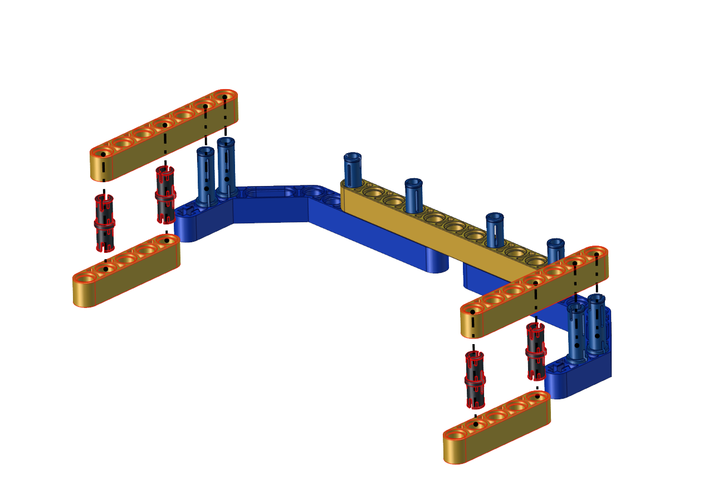 |
|                                  |  |
|                                  |                                  |
| **Step 3**                       |                                  |
|  Required Parts                  |  |
|                                  |  |
|                                  |  |
|  | **Then the soccer goal is installed well.** |


Install the soccer robot

| Step 1                           |                                  |
|----------------------------------|----------------------------------|
| Remove two photoresistors        |  |
| Required Parts                   |  |
|                                  |  |
|                                  |  |
|                                  |                                  |
| **Step 2**                       |                                  |
| Required Parts                   |  |
|                                  |  |
|                                  |  |
|                                  |                                  |
| **Step 3**                       |                                  |
| Required Parts                   |  |
|                                  |  |
|                                  | 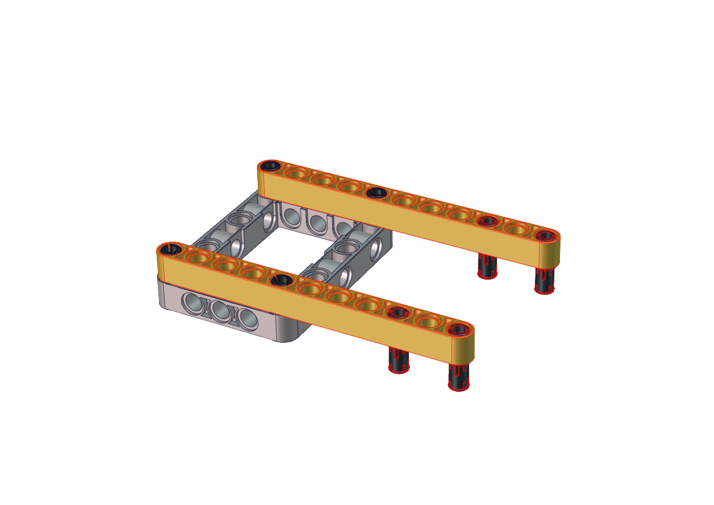 |
|                                  |                                  |
| **Step 4**                       |                                  |
| Required Parts                   |  |
|                                  |  |
|                                  |  |
|                                  |                                  |
| **Step 5**                       |                                  |
| Required Parts                   |  |
|                                  |  |
|                                  |  |
|                                  |                                  |
| **Step 6**                       |                                  |
| Required Parts                   |  |
|  |  |
|                                  |  |
|                                  |                                  |
| **Step 7**                       |                                  |
| Required Parts                   |  |
|                                  |  |
|                                  |  |
|                                  |                                  |
| **Step 8**                       |                                  |
| Required Parts                   | 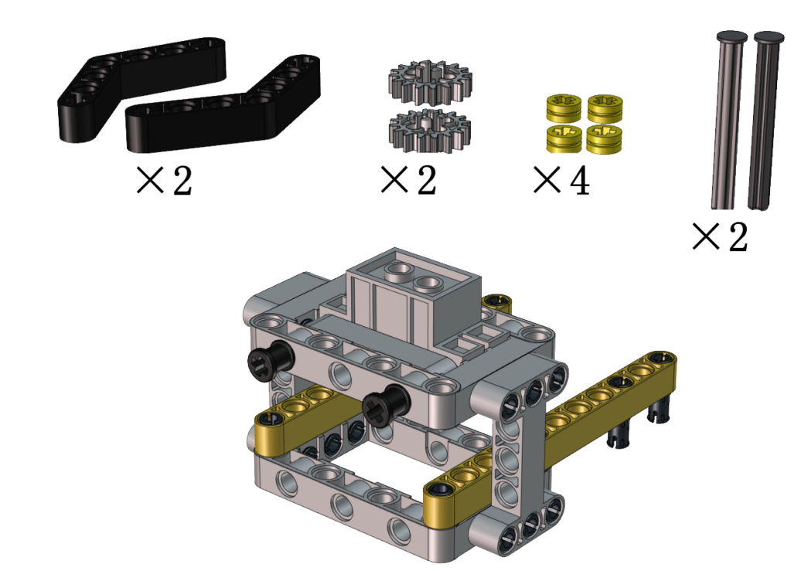 |
|     | Adjust the angle of the claw. Then make it close and face front |
|  |  |
|                                  |  |

| Step 9                                   |
| ---------------------------------------- |
| Set the angle of the servo to 180 degree |

| Servo  |  PCB Board   |
| :----: | :----------: |
| Brown  |      G       |
|  Red   |      5V      |
| Orange | S2（GPIO23） |

```c
//*********************************************************************
#include <Arduino.h>

//Servo channels 
int channel_PWM = 4;  
// Servo frequency, then the period is 1/50, which is 20ms, PWM has a total of 16 channels, 0-7 high-speed channels are driven by 80Mhz clock, and the last 8 low-speed channels are driven by 1Mhz clock.
int freq_PWM = 50;   
// PWM resolution, the value is between 0-20, here is 10, then the pwm value filled in the following ledcWrite is between 0-2 to the 10th power, that is, 0-1024.
int resolution_PWM = 10;   
//
const int PWM_Pin = 23;  //connect pwm to GPIO23 output.

void setup() {
  ledcSetup(channel_PWM, freq_PWM, resolution_PWM); // Set servo channel, servo frequency, PWM resolution..
  ledcAttachPin(PWM_Pin, channel_PWM);  //
}

void loop() {
  ledcWrite(channel_PWM, 128);  //The 20ms high level is about 2.5ms, which is 2.5/20*1024, and the angle of the steering gear is 180°.
.
}
//*************************************************
```

Upload the code of the servo to the main board of the Beetlebot car, as shown below:


You can also initialize the angle of the servo through the following code


Check the Scratch-KidsBlock code as follows，then upload the code to the main board of the Beetlebot car


| Step 9         |                                                              |
| -------------- | ------------------------------------------------------------ |
| Required Parts |  |
|                | Keep the claw close and face front before installing the gear |
|                |  |
|                |  |
|                |                                                              |
| **Step 10**    |                                                              |
| Required Parts |  |
|                |  |
|                |  |
|                |                                                              |
| **Step 11**    |                                                              |
| Required Parts |  |
|                |  |
|                |  |
|                |  |

| Wiring Diagram         |                                                              |
| ---------------------- | ------------------------------------------------------------ |
| Wire up the LEGO servo |  |


Install the catapult

| Step 1              |                                                  |
| ------------------- | ------------------------------------------------ |
| Required components |   |
|                     |   |
|                     |   |
|                     |                                                  |
| **Step 2**          |                                                  |
| Required components |   |
|                     | 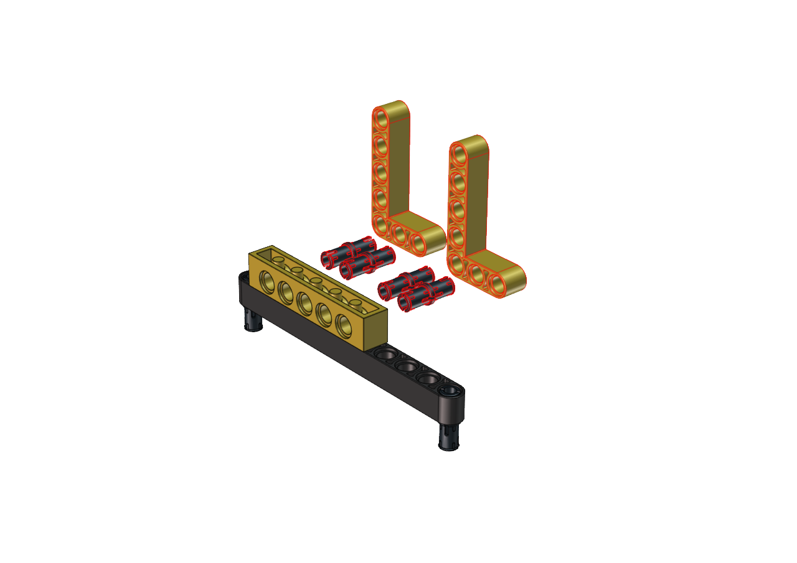  |
|                     |   |
|                     |                                                  |
| **Step 3**          |                                                  |
| Required components |   |
|                     |   |
|                     |   |
|                     |                                                  |
| **Step 4**          |                                                  |
| Required components |   |
|                     |   |
|                     |   |
|                     |                                                  |
| **Step 5**          |                                                  |
| Required components |   |
|                     |   |
|                     | 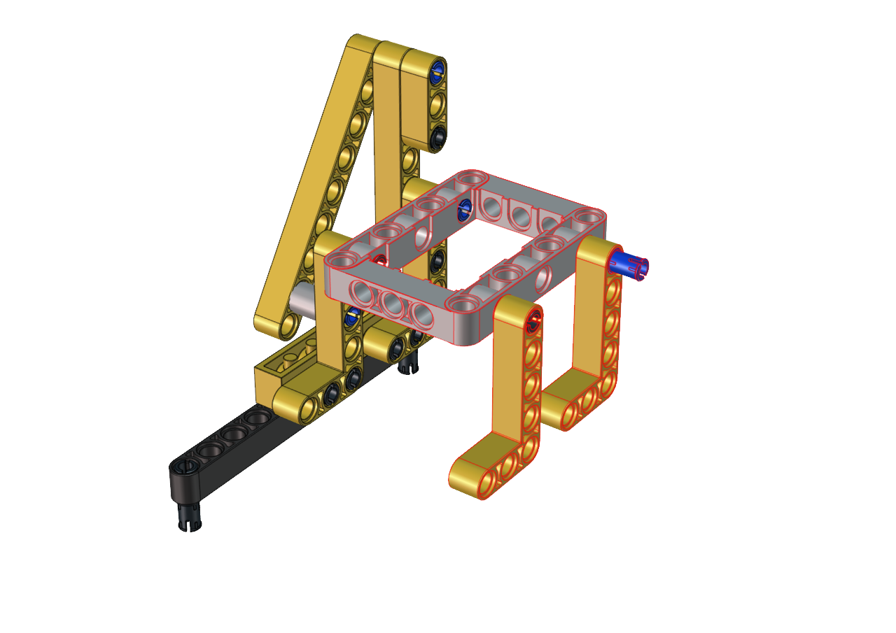  |
|                     |                                                  |
| **Step 6**          |                                                  |
| Required components |   |
|                     | 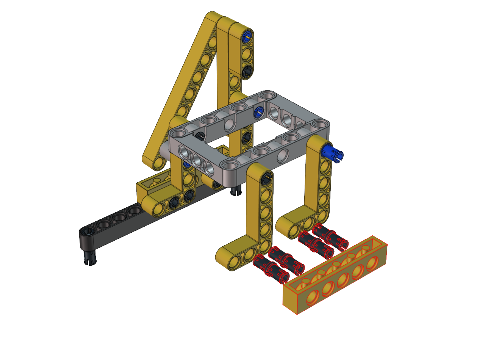  |
|                     | 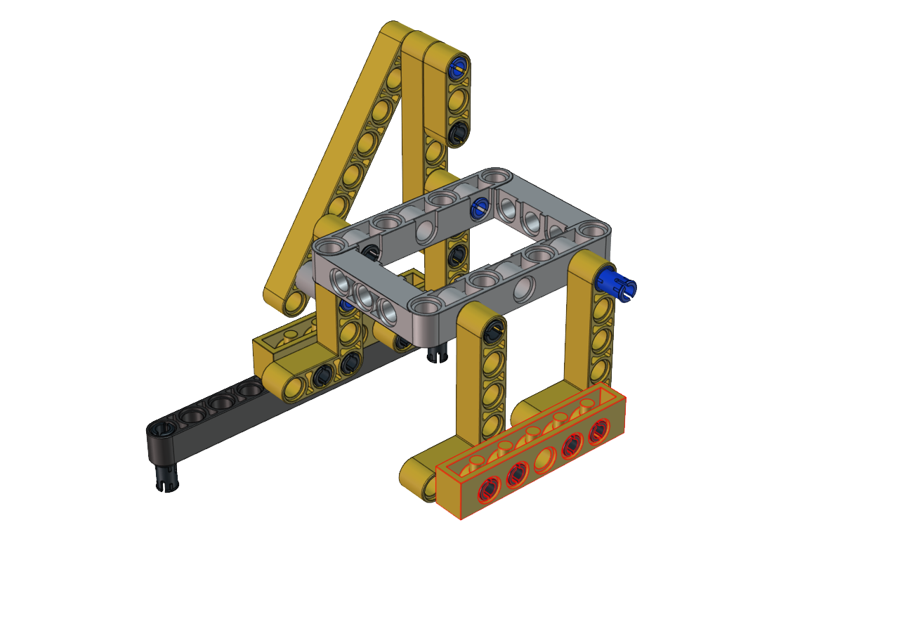  |
|                     |                                                  |
| **Step 7**          |                                                  |
| Required components |   |
|                     | 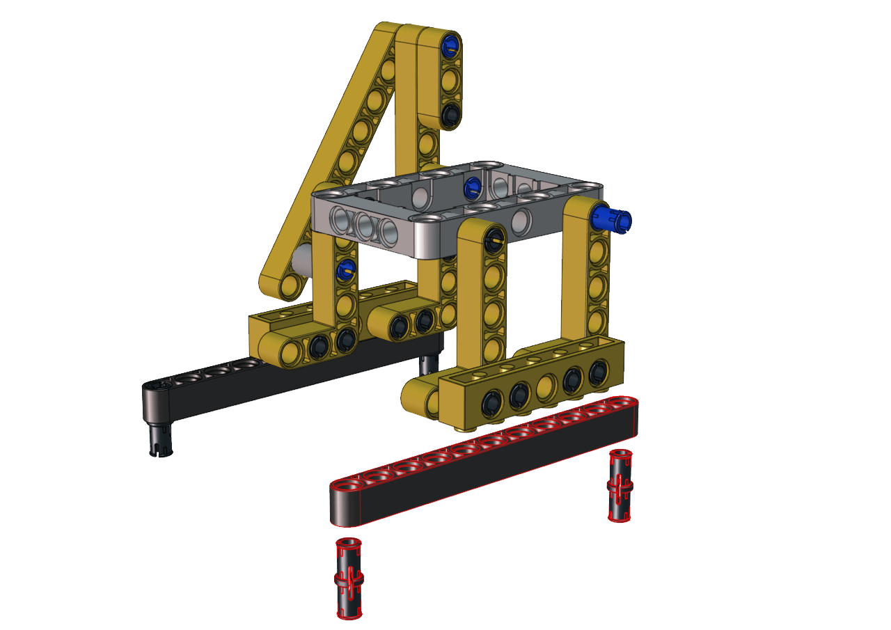  |
|                     | 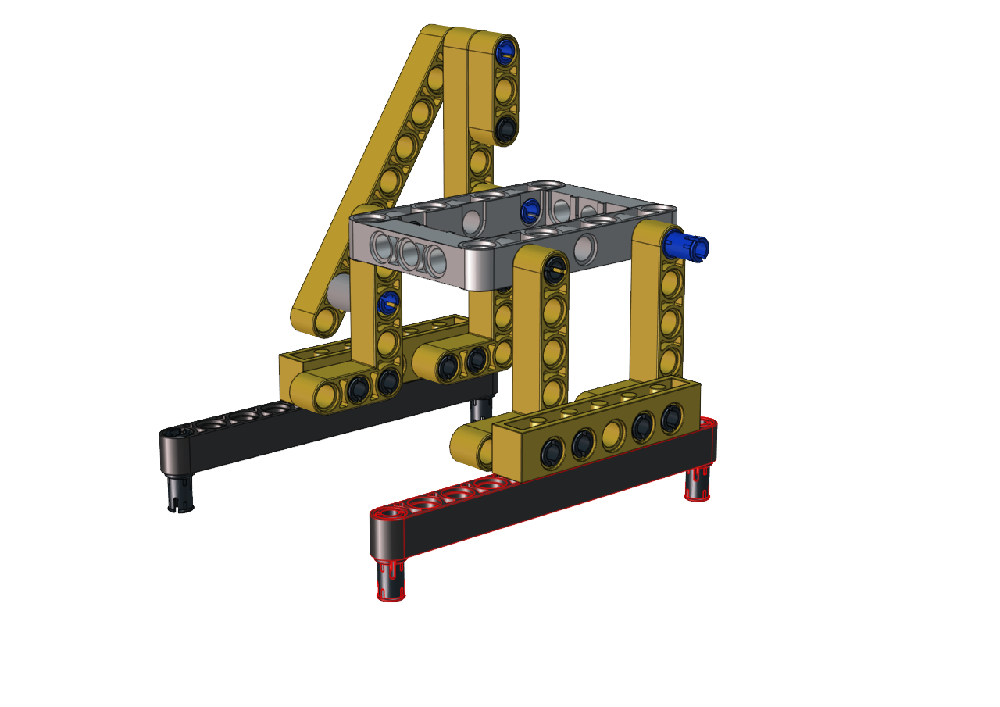  |
|                     |                                                  |
| **Step 8**          |                                                  |
| Required components |   |
|                     |   |
|                     |   |
|                     |                                                  |
| **Step 9**          |                                                  |
| Required components |   |
|                     |   |
|                     |   |
|                     |                                                  |
| **Step 10**         |                                                  |
| Required components |   |
|                     |   |
|                     |   |
|                     |                                                  |
| **Step 11**         |                                                  |
| Required components | 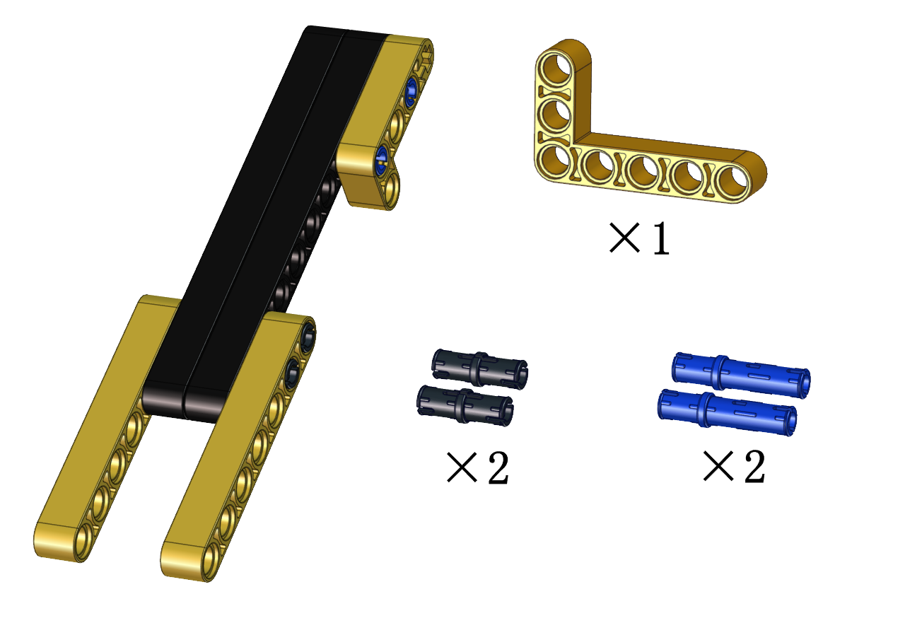  |
|                     |  |
|                     |   |
|                     |                                                  |
| **Step 12**         |                                                  |
| Required components |   |
|                     |   |
|                     |   |
|                     |                                                  |
| **Step 13**         |                                                  |
| Required components |   |
|                     |   |
|                     |   |
|                     |                                                  |
| **Step 14**         |                                                  |
| Required components |   |
|                     |   |
|                     |   |
|                     |                                                  |
| **Step 15**         |                                                  |
| Required components |   |
|                     |   |
|                     |   |
|                     |                                                  |
| **Step 16**         |                                                  |
| Required components |   |
|                     |   |
|                     | 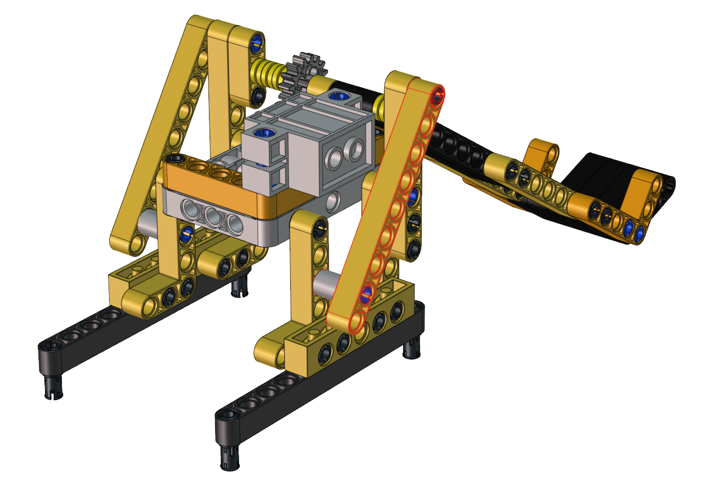  |

| Step 17                                  |
| ---------------------------------------- |
| Set the angle of the servo to 180 degree |

| Servo  |  PCB Board   |
| :----: | :----------: |
| Brown  |      G       |
|  Red   |      5V      |
| Orange | S2（GPIO23） |

```c
//*********************************************************************
#include <Arduino.h>

//Servo channels 
int channel_PWM = 4;  
// Servo frequency, then the period is 1/50, which is 20ms, PWM has a total of 16 channels, 0-7 high-speed channels are driven by 80Mhz clock, and the last 8 low-speed channels are driven by 1Mhz clock.
int freq_PWM = 50;   
// PWM resolution, the value is between 0-20, here is 10, then the pwm value filled in the following ledcWrite is between 0-2 to the 10th power, that is, 0-1024.
int resolution_PWM = 10;   
//
const int PWM_Pin = 23;  //connect pwm to GPIO23 output.

void setup() {
  ledcSetup(channel_PWM, freq_PWM, resolution_PWM); // Set servo channel, servo frequency, PWM resolution..
  ledcAttachPin(PWM_Pin, channel_PWM);  //
}

void loop() {
  ledcWrite(channel_PWM, 128);  //The 20ms high level is about 2.5ms, which is 2.5/20*1024, and the angle of the steering gear is 180°.
.
}
//************************************************
```

Upload the code of the servo to the main board of the Beetlebot car, as shown below


You can also initialize the angle of the servo through the following code


Check the Scratch-KidsBlock code as follows，then upload the code to the main board of the Beetlebot car


| Step 17             |                                                              |
| ------------------- | ------------------------------------------------------------ |
| Required components |  |
|                     |  |
|                     |  |
|                     |                                                              |
| **Step 18**         |                                                              |
| Required components |  |
|                     |  |
|                     |  |

| Wiring up           |                                                              |
| ------------------- | ------------------------------------------------------------ |
| Interface the servo |  |


Install the handling robot

| Step 1                           |                                  |
|----------------------------------|----------------------------------|
| Dismantle the ultrasonic sensor  | 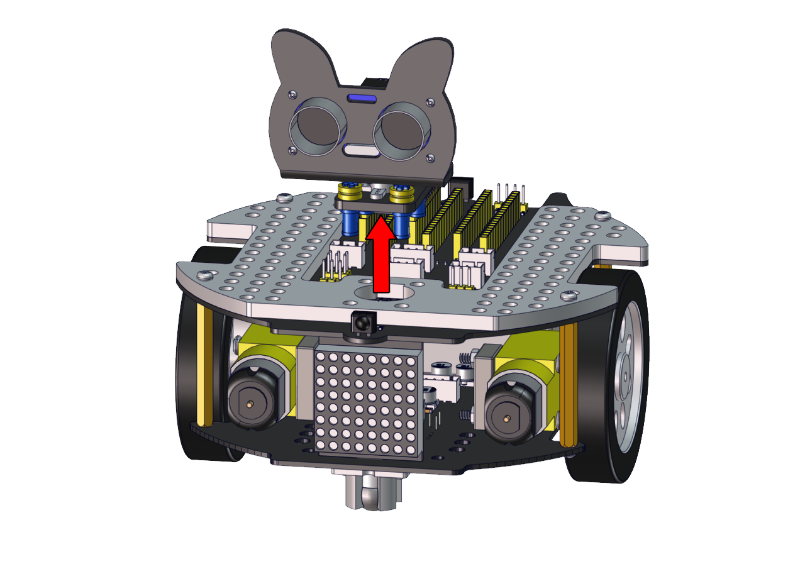  |
| Required components              |   |
|                                  |  |
|                                  |   |
| |  |
| **Step 2**                       |                                  |
| Required components              |   |
|                                  |   |
|                                  |   |
|                                  |                                  |
| **Step 3**                       |                                  |
| Required components              |   |
|                                  |   |
|                                  |   |
|                                  |                                  |
| **Step 4**                       |                                  |
| Required components              |   |
|                                  |   |
|                                  |   |
|                                  |                                  |
| **Step 5**                       |                                  |
| Required components              |   |
|                                  |   |
|                                  |   |
|                                  |                                  |
| **Step 6**                       |                                  |
| Required components              |   |
|                                  |  |
|                                  | 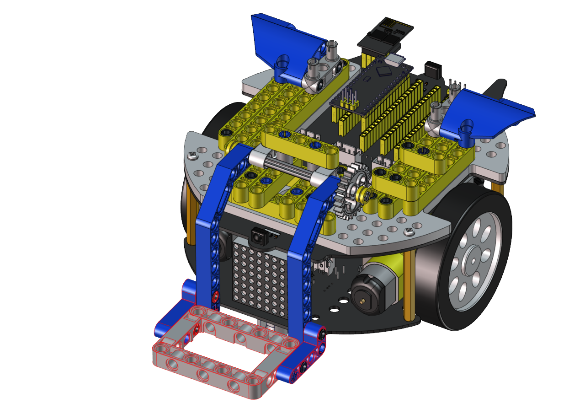 |
|                                  |                                  |
| **Step 7**                       |                                  |
| Required components              |   |
|                                  |   |
|                                  |  |
|                                  |                                  |
| **Step 8**                       |                                  |
| Required components |  |
|                                  |  |
|                                  |   |

| Step 9                                   |
| ---------------------------------------- |
| Set the angle of the servo to 180 degree |

| Servo  | PCB Board |
| :----: | :-------: |
| Brown  |     G     |
|  Red   |    5V     |
| Orange | S2（A0）  |

```c
//*********************************************************************
#include <Arduino.h>

//Servo channels 
int channel_PWM = 4;  
// Servo frequency, then the period is 1/50, which is 20ms, PWM has a total of 16 channels, 0-7 high-speed channels are driven by 80Mhz clock, and the last 8 low-speed channels are driven by 1Mhz clock.
int freq_PWM = 50;   
// PWM resolution, the value is between 0-20, here is 10, then the pwm value filled in the following ledcWrite is between 0-2 to the 10th power, that is, 0-1024.
int resolution_PWM = 10;   
//
const int PWM_Pin = 23;  //connect pwm to GPIO23 output.

void setup() {
  ledcSetup(channel_PWM, freq_PWM, resolution_PWM); // Set servo channel, servo frequency, PWM resolution..
  ledcAttachPin(PWM_Pin, channel_PWM);  //
}

void loop() {
  ledcWrite(channel_PWM, 128);  //The 20ms high level is about 2.5ms, which is 2.5/20*1024, and the angle of the steering gear is 180°.
.
}
//*********************************************************************
```

Upload the code of the servo to the main board of the Beetlebot car, as shown below

 

You can also initialize the angle of the servo through the following code

 

Check the Scratch-KidsBlock code as follows，then upload the code to the main board of the Beetlebot car


| Step 9              |                                                              |
| ------------------- | ------------------------------------------------------------ |
| Required components |  |
|                     |  |
|                     |  |
|                     |                                                              |
| **Step 10**         |                                                              |
| Required components |  |
|                     |  |
|                     |  |
|                     |  |
|                     |  |
|                     |  |

| Wiring up     |                                                              |
| ------------- | ------------------------------------------------------------ |
| Wire up servo |  |


