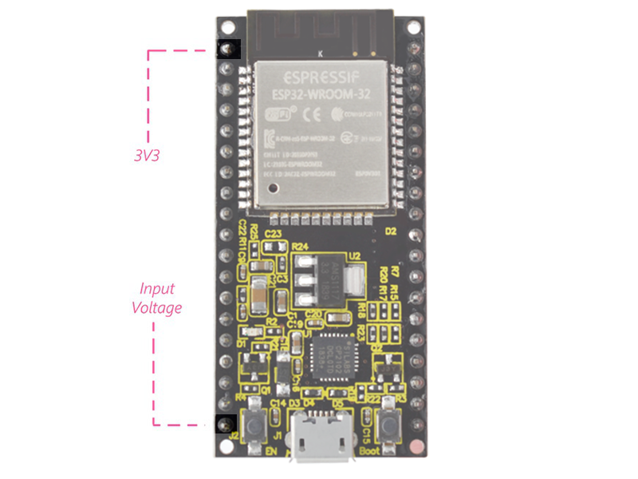
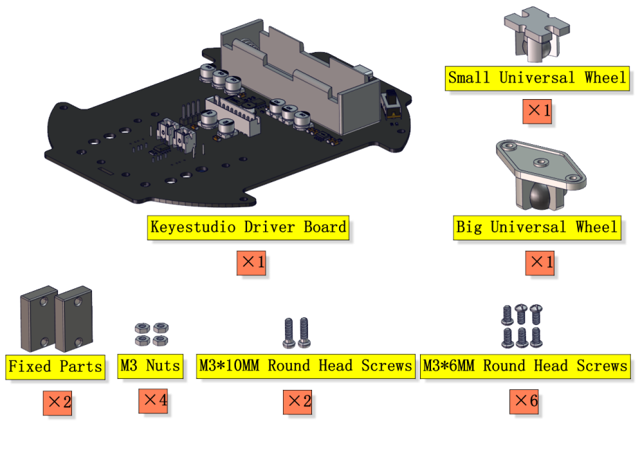
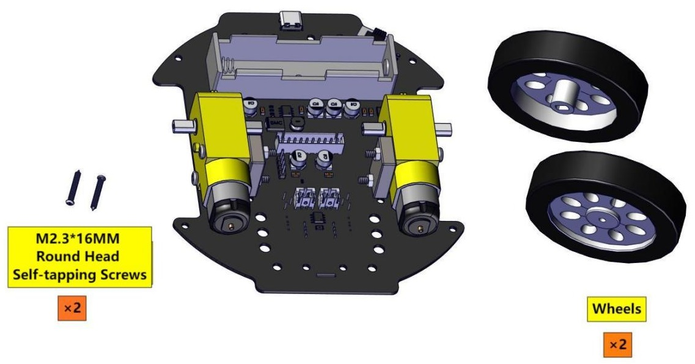
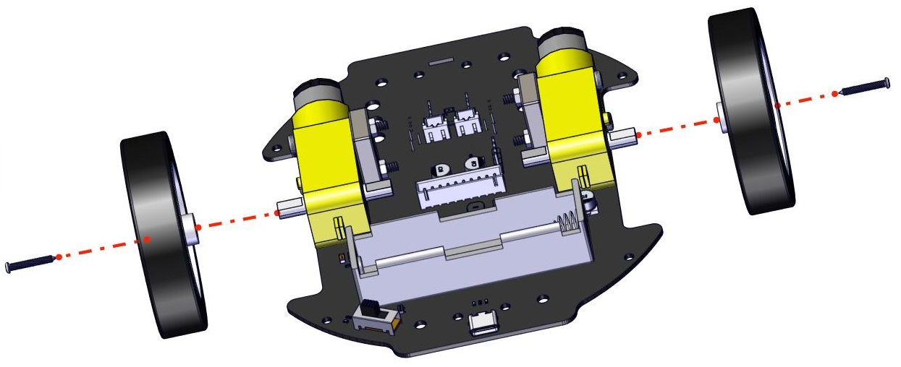
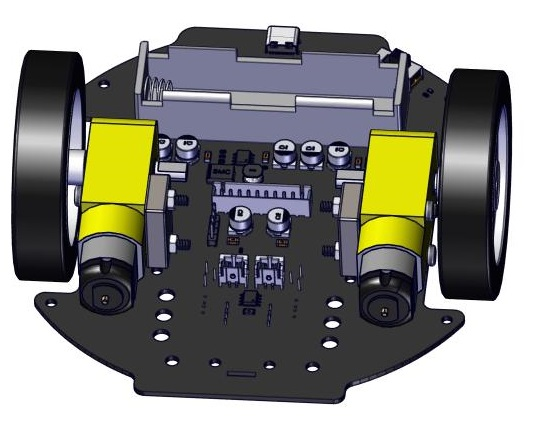
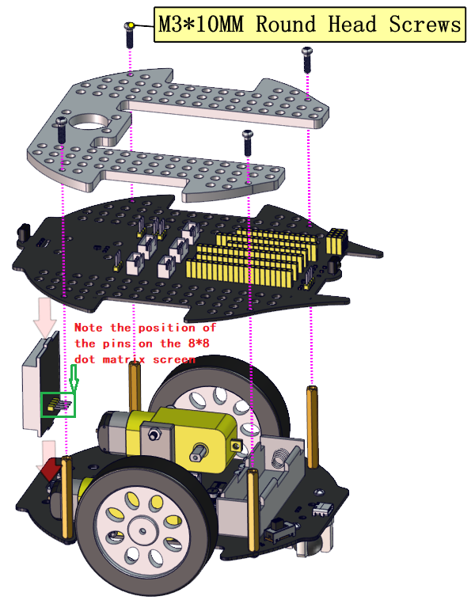
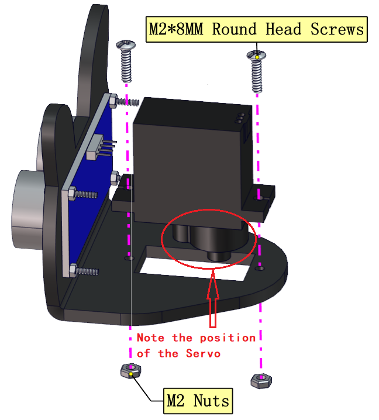
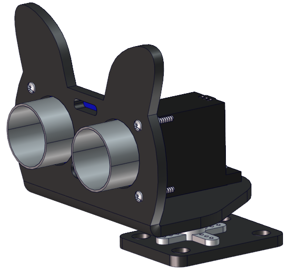

**Thank you for choosing keyestudio!**

**We will endeavour to provide you with better products and services!**

------

**About keyestudio**

Keyestudio is the best-selling brand owned by KEYES Corporation. Our product contains Arduino development and expansion boards, sensors and modules, Raspberry Pi, micro:bit expansion boards as well as smart cars and learning kits, which can help customers at any level to learn about Arduino.

Notably, all of our products are in line with international quality standards and are greatly appreciated in a broad menu of different markets across the world.

Welcome to check out more contents from our official website: [http://www.keyestudio.com](http://www.keyestudio.com)

------

**Obtain Information and After-sales Service**

1. If something is found missing or broken, or you have some difficulty learning the kit, please feel free to contact us. Welcome to send email to us: [service@keyestudio.com](http://m.138.gz.cn/webadmin/~CAmsnCrrNXhTAySKCerrIfWjjZuuWVfI/~/usr/mod_edituser.jsp?;uid=service@keyestudio.com;;clearCache=)

2. We will endeavour to update projects and products continuously from your sincere advice! Thanks!

------

**Warning**

1. This product contains tiny pin headers, so please keep out of reach of children under 7 to prevent from lacerations. 
2. This product also contains conductive parts(control board and electronic modules). Please operate according to the requirements of tutorials. Otherwise, improper operation may damage parts due to overheating. In this case, do not touch it and immediately disconnect the circuit power.

------

**Copyright**

The Keyestudio trademark and logo are the copyright of **KEYES DIY ROBOT co.,LTD**. All products under Keyestudio brand can’t be copied, sold or resold without authorization by anyone or any company. If you are interested in our products, please contact to our sales representatives: [fennie@keyestudio.com](http://m.138.gz.cn/webadmin/~CAmsnCrrNXhTAySKCerrIfWjjZuuWVfI/~/usr/mod_edituser.jsp?;uid=fennie@keyestudio.com;;clearCache=)

------

**KS5002-Keyestudio-Beetlebot-3-in-1-Robot-for-STEM**

---

# Introduction


The Beetlebot smart robot, compatible with LEGO building blocks, is a STEM educational product which can automatically dodge obstacles, follow black lines and light to move. Besides, it has three cool forms such as the soccer robot, the siege robot, the handling robot. As for beginners, they can create whatever they want by LEGO building blocks.

Various improvements have been made on the Beetlebot car in comparison with other smart cars. It integrates a motor driver and a large number of sensors and is easy to assemble.

Going forward, not only can it impart Micropython programming knowledge and AI application to children and the youth, but also it can cultivate their creativity, hands-on ability, problem-solving capability, interpersonal communication as well as teamwork ability. With this kit, you have a chance to experience soccer games using your own robots.

# Features

- Compatible with LEGO building blocks: generate diverse forms withLEGO blocks and sensors
- Three forms: a soccer robot, a siege engine, a handling robot
- Various functions: Pictures display, atmosphere light control, line tracking, obstacle avoidance, light following , IR control and WIFI control.
- Easy to build: embedded design on car body; wire up the car body with a few steps
- High compatibility: reserve ports for the Raspberry Pico board and the Arduino Nano board
- Charging function: integrate a circuit for 18650 batteries, low-cost and effective
- WiFi Control: adopt WiFi control, can finish tailor-made software development
- App: compatible with Android and iOS systems, with aesthetic page and flexible control system

| Parameters                       |                                           |
| -------------------------------- | ----------------------------------------- |
| Working Voltage                  | 5v                                        |
| Input voltage                    | 2.5V~4.2V（Single-cell lithium battery ） |
| Maximum output current           | 3A                                        |
| Maximum power dissipation        | 15W（T=80℃）                              |
| Motor speed                      | 5V 200 rpm / min                          |
| Driving mode                     | Dual H-bridge driver                      |
| Induction angle                  | <15°                                      |
| Distance detection               | 2cm-400cm                                 |
| Infrared remote control distance | 7m                                        |
| Size                             | 176mm*137mm*130mm                         |
| Environmental attributes         | ROHS                                      |

# Kit List

Please check the list to ensure that all parts are intact. If you find missing ones, please contact our sales staff immediately.

|  | Picture | Name | QTY |
| :--: | :--: | :--: | :--: |
|1 | |Keyestudio ESP32 Development Board|1|
|2 ||Photoresistor|2 |
|3 ||270° Servo|1 |
|4 || Keyestudio Expansion Board| 1 |
|5 ||Keyestudio Driver Board|1 |
|6 | |LEGO Bulk Lot | 1 |
|7 | | Acrylic Board | 1 |
| 8| | MD0487 Acrylic Board for Ultrasonic Sensor | 1 |
| 9|| Acrylic Board for Servo | 1 |
|10 | | 4.5V 200R Motor | 2 |
|11 | | 8*8 Dot Matrix Display | 1 |
|12 | | Aluminum Block | 2 |
|13 | | 9G 180°Servo | 1 |
|14 | | Car Wheel | 2 |
|15 | |HC-SR04 Ultrasonic Sensor | 1 |
|16 | | Phillips Screwdriver | 1 |
|17|| W420 Universal Wheel|1|
|18||USB Cable|1|
|19||IR Remote Control|1|
|20||Charging Cable|1|
|21||Screwdriver|1|
|22||3P F-F Dupont Wire|2|
|23||4P F-F Dupont Wire|1|
|24||HX2.54mm-4P Dupont Wire|1|
|25||Winding Pipe|1|
|26||10P XH2.54 Dupont Wire|1|
|27||Acrylic Gasket|6|
|28||M3*40MM Dual Pass Copper Pillars|4|
|29||M1.2*5MM  Round Head Self-tapping Screws|6|
|30||M1.4 Nuts|6|
|31||M1.4*10MM Round Head Screws|6|
|32||M2 Nuts|3|
|33||M2*8MM Round Head Screws|3|
|34||M3*10MM Round Head Screws|6|
|35||M3*6MM Round Head Screws|11|
|36||M3 Nuts|9|
|37||M3*30MM Round Head Screws|4|
|38||Soccer Ball|1|
|39||W1515 Universal Wheel|1|
|40||18650 Batteries(<span style="color: rgb(255, 76, 65);">KS5002F includes batteries</span>)|1|
|41||M2.3*16MM Round Head Self-tapping Screws|2|

# Resource Download

Click to download to all resources such as project codes and libraries.

- [Codes](Codes.zip)

- [Library](Library.zip)

- [Other_Important_Informations](Other_Important_Informations.zip) (include: Android APP, drivers and drv8833) 


# ESP32 Main Control Board


**1. Description:**

This keyestudio ESP32 core board is a Mini development board based on the ESP-WROOM-32 module. 

The board has brought out most I/O ports to pin headers of 2.54mm pitch. These provide an easy way of connecting peripherals according to your own needs.

When it comes to developing and debugging with the development board, the both side standard pin headers can make your operation more simple and handy.

The ESP-WROOM-32 module is the industry's leading integrated WiFi + Bluetooth solution with less than 10 external components. 

It integrates antenna switch, RF balun, power amplifiers, low noise amplifiers, filters and power management modules. 

At the same time, it also integrates with TSMC's low-power 40nm technology, so that power performance and RF performance are safe and reliable, easy to expand to a variety of applications.

**2. Technical Details:**

  - Microcontroller: ESP-WROOM-32 module

  - USB to Serial Port Chip: CP2102-GMR

  - Operating Voltage: DC 5V

  - Operating Current: 80mA (average)

  - Current Supply: 500mA (Minimum)

  - Operating Temperature Range: -40℃ \~ +85℃

  - WiFi mode: Station/SoftAP/SoftAP+Station/P2P

  - WiFi protocol: 802.11 b/g/n/e/i (802.11n, speed up to 150 Mbps

  - WiFi frequency range: 2.4 GHz \~ 2.5 GHz

  - Bluetooth protocol: conform to Bluetooth v4.2 BR/EDR and BLE standards
    
  - Dimensions: 55mm\*26mm\*13mm

  - Weight: 9.3g
    


**3. Pin out**

<span style="color: rgb(255, 76, 65);">Warning:</span> The voltage level of the ESP32 pins is 3.3V. If you want to connect the ESP32 to other devices that operate at 5V, you should use a level shifter to convert the voltage levels.


● **Power pins**: The module has two power pins: +5V and 3.3V. You can use these two pins to power other devices and modules.



● **GND pin**: There are 3 pins for grounding of this module.

● **Enable Pin (EN)**: This pin is used to enable and disable the module. The module is enabled when the pin is high, and disabled when the pin is low.

● **Input/Output Pins (GPIO)**: You can use 32 GPIO pins to communicate with LEDs, switches and other input/output devices.

**You can pull up or pull down these pins**

<span style="color: rgb(255, 76, 65);">Note:</span> GPIO6 to GPIO11 pins (SCK/CLK, SDO/SD0, SDI/SD1, SHD/SD2, SWP/SD3 and SCS/CMD pins) are used for SPI communication of the module's internal flash memory, we do not recommend using them.

● **ADC**: You can use the 16 ADC pins on this module to convert analog voltages (the output of some sensors) into digital voltages. Some of these converters are connected to internal amplifiers and are capable of measuring small voltages with high accuracy.

● **DAC**: The ESP32 module has two A/D converters with 8-bit precision.

● **Touch pads**: There are 10 pins on the ESP32 module, which are sensitive to changes in capacitance. You can connect these pins to some pads (pads on the PCB) and use them as a touch switch.

● **SPI**: There are two SPI interfaces on this module which can be used to connect the display screen, the SD / microSD memory card module and external flash memory, etc.

● **I2C**: SDA and SCL pins are used for I2C communication.

● **Serial communication (UART)**: There are two UART serial interfaces on this module. You can transfer information up to 5Mbps between two devices with these pins. UART0 also has CTS and RTS controls.

● **PWM**: Almost all ESP32 input/output pins can be used for PWM (Pulse Width Modulation), which can control motors, LED lights, colors, and more.


# PCB Board


<span style="background: rgb(255, 251, 0);">Turn the DIP switch to the OFF end before installing or removing batteries.</span>

# Install the Beetlebot Car


**Step 1:**

Components Required



Install


Complete


**Step 2:**

Components Required


Install


Complete


Step 3:

Components Required



Install



Complete



**Step 4:**

Components Required


Install


Complete


**Step 5:**

Components Required


Install

Connect the motor and the 8*8 dot matrix display to PCB boards

| Left motor | Right motor |
| ---------- | ----------- |
| L          | R           |


| 8*8 display | PCB board |
| ----------- | --------- |
| G           | G         |
| 5V          | 5V        |
| SDA         | SDA       |
| SCL         | SCL       |




Complete


**Step 6:**

Components Required


Install


Complete


**Step 7:**

Components Required


Install


Complete


**Step 8:**

Components Required


Install



Complete


**Step 9:**

Components Required


Adjust the angle of the servo to 90 degree before installing the car

|    Servo    |     PCB     |
| :---------: | :---------: |
| Brown line  |      G      |
|  Red line   |     5V      |
| Orange line | S1（GPIO4） |

**Method 1：Arduino code**

⚠️ **<span style="color: rgb(255, 76, 65);">Special note</span>: Before uploading the code, you must install the Arduino IDE, please go to the the link: [About Arduino IDE](https://docs.keyestudio.com/projects/KS5002/en/latest/docs/Arduino_C%20Tutorial/Arduino_C_Tutorial.html#about-arduino-ide)**

```c++
#include <Arduino.h>
// servo channels 
int channel_PWM = 3;  
// Servo frequency, then the period is 1/50, which is 20ms, PWM has a total of 16 channels, 0-7 high-speed channels are driven by 80Mhz clock, and the last 8 low-speed channels are driven by 1Mhz clock
int freq_PWM = 50;   
//PWM resolution, the value is between 0-20, here is 10, then the pwm value filled in the following ledcWrite is between 0-2 to the 10th power, that is, 0-1024.
int resolution_PWM = 10;   
//
const int PWM_Pin = 4;  //connect pwm to GPIO4
void setup() {
  ledcSetup(channel_PWM, freq_PWM, resolution_PWM); // Set servo channel, servo frequency, PWM resolution.
  ledcAttachPin(PWM_Pin, channel_PWM);  //connect LEDC channels to IO ports

  ledcWrite(channel_PWM, 25);  //The 20ms high level is about 0.5ms, which is 0.5/20*1024, and the angle of the steering gear is 25°.
  delay(500);
  ledcWrite(channel_PWM, 128);  //The 20ms high level is about 2.5ms, which is 2.5/20*1024, and the angle of the steering gear is 180°.
  delay(500);
  ledcWrite(channel_PWM, 77);  //The 20ms high level is about 1.5ms, which is 1.5/20*1024, and the angle of the steering gear is 90°.
  delay(500);
}
void loop() {

}
```


How to get it ?

In folder **..\Codes\180° Servo Angle initialization_Code** , open file **180_Servo_Angle_initialization.ino** , or copy and paste the above test code into the Arduino IDE.


**Method 2：KidsBlock(Scratch) code**

⚠️ **<span style="color: rgb(255, 76, 65);">Special note</span>: Before uploading the code, you must install the Arduino IDE, please go to the the link: [About KidsBlock IDE](https://docs.keyestudio.com/projects/KS5002/en/latest/docs/KidsBlock%28Scratch%29%20Tutorial/KidsBlock%28Scratch%29_Tutorial.html#about-kidsblock-ide)**


How to get it?

Open file **180°_Servo_Angle_initialization.sb3** with KidsBlock IDE, in folder **..\Codes\180° Servo Angle initialization_Codes**.


**Method 3：Python code**

⚠️ **<span style="color: rgb(255, 76, 65);">Special note</span>: Before uploading the code, you must install the Arduino IDE, please go to the the link: [About MicroPython IDE](https://docs.keyestudio.com/projects/KS5002/en/latest/docs/MicroPython%20Tutorial/MicroPython_Tutorial.html#about-micropython-ide)**

```python
from machine import Pin, PWM
import time

#Define GPIO4’s output frequency as 50Hz and its duty cycle as 77, and assign them to PWM
servoPin = Pin(4)
pwm = PWM(servoPin, freq=50)
pwm.duty(25)
time.sleep(1)
pwm.duty(128)
time.sleep(1)
pwm.duty(77)
time.sleep(1)
```

How to get it?

In folder **..\Codes\180° Servo Angle initialization_Codes** , open file **180°_Servo_Angle_initialization.sb3** , or copy and paste the above test code into the Thonny IDE.


Install




**Step 10**

Components Required


Install


Complete


**Step 11**

Components Required


Install


Complete


**Install battery**

(<span style="color: rgb(255, 76, 65);">**Special attention:**</span>  the positive and negative terminals of the battery must not be installed in reverse, otherwise, it will burn the battery and the car.)


**Wire up**

Wire up the ultrasonic sensor 

| Ultrasonic Sensor |     PCB      |
| :---------------: | :----------: |
|        Vcc        |      5V      |
|       Trig        | S2（GPIO5）  |
|       Echo        | S1（GPIO18） |
|        Gnd        |      G       |


Wire up the servo

|    Servo    |     PCB     |
| :---------: | :---------: |
| Brown line  |      G      |
|  Red line   |     5V      |
| Orange line | S1（GPIO4） |


Wire up the left photoresistor

| Left photoresistor |     PCB     |
| :----------------: | :---------: |
|         G          |      G      |
|         V          |      V      |
|         S          | S（GPIO34） |


Wire up the right photoresistor

| right photoresistor | PCB         |
| ------------------- | ----------- |
| G                   | G           |
| V                   | V           |
| S                   | S（GPIO35） |


Original installation completed diagram


# Troubleshooting Guide

1. Q: Error occurs during burning code on ESP32 main board?

	A: Please check whether the ESP32 board model and the USB serial port number is correct.

2. Q: The serial port is not displayed after ESP32 connects to computer via Micro USB cable?

	A: Please check whether the ESP32 board is properly connected to the computer. Click “Device Manager” to check whether the corresponding serial port is displayed. If the port number is correct, the connection is intact, if not, there may be a problem with the USB chip on ESP32 board. 

3. Q: After burning code, sensors/modules do not work or the serial monitor shows nothing?

	A: Please ensure the connected pin is in accordance with the code. If it is not, press the reset button on the ESP32 main control board.

4. Q: Servo works out of order?

	A: The power voltage may be insufficient. Try to connect to an external power supply. 

5. Q: The distance detected by the ultrasonic sensor is inaccurate?

	A: The distance is detected from the emitter. This module is not a high-precision one, so differences exist.

6. Q: Motors works out of order to burn the main board?

	A: When the motors is working, the required current is larger than that of other sensors, which may cause voltage and current fluctuations in the circuit. Especially when the motors is rotating forward to backward, the fluctuations are so large that the voltage and current of the ESP32 board is very low, thus being reset. An external power supply is required for the ESP32 board to ensure that the motors can work properly.

7. Q: The tone played by the passive buzzer is not conform with actual intonation pitch?

	A: The common passive buzzer can not meet the requirements of professional tones. If you need very accurate pitch, a more professional buzzer should be adopted.


8. Q: WiFi connection always fails?

	A: Please put the ESP32 WiFi board around the router, press the on-board reset button, and wait for the connection. If it still can’t connect, please check whether the WiFi name and passwords are correct.

9. Q: The response is slow when remote-controlling sensors through web page?

	A: Causes of slow transmission on router network:

	- If multiple users are connected and the CPU resources of the router are insufficient, restart the router and reconnect to the network.

	- If the router is used for a long time, restart it.

	- There is wireless interference. Wireless signals are unstable, so please do not use through walls.
    
	- For more router related knowledge, please **Google**.


