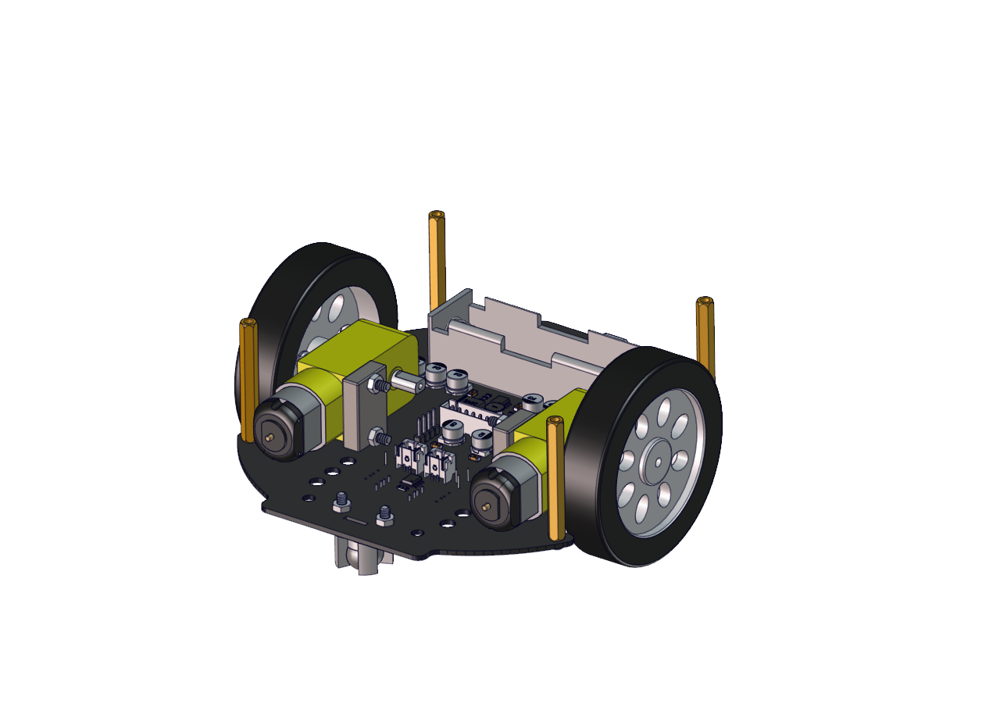
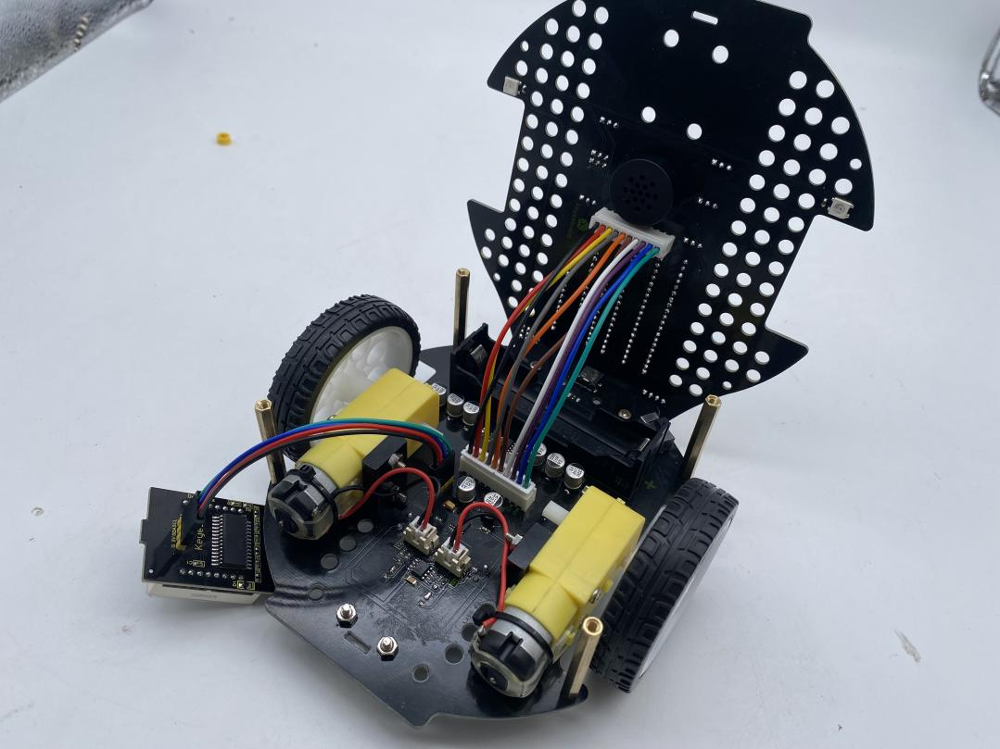
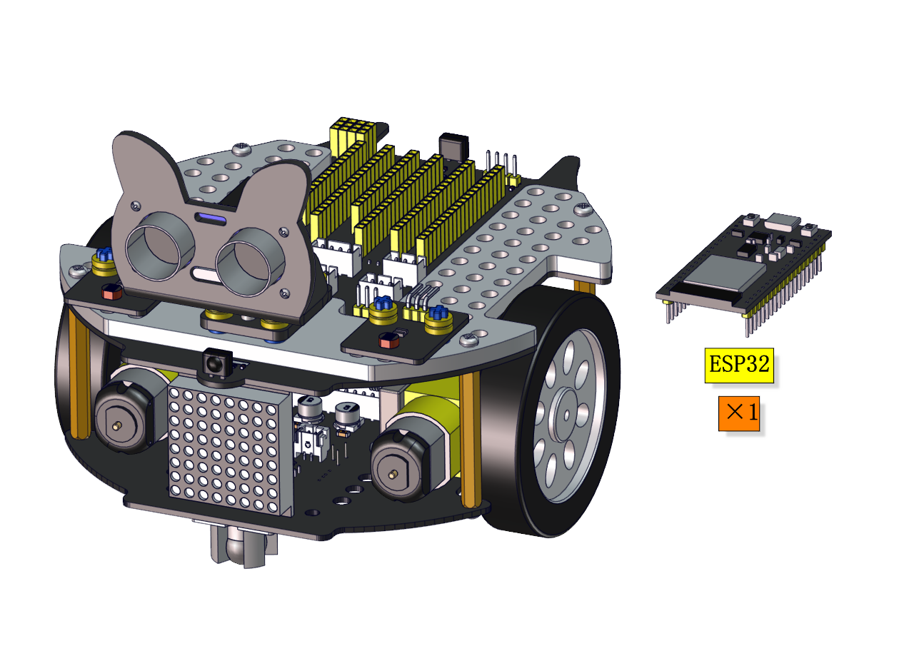

# Keyestudio Beetlebot 3 in 1 Robot for ESP32 


## 1. Description：

The Beetlebot smart robot, compatible with LEGO building blocks, is a STEM educational product which can automatically dodge obstacles, follow black lines and light to move. Besides, it has three cool forms such as the soccer robot, the siege robot, the handling robot. As for beginners, they can create whatever they want by LEGO building blocks.

Various improvements have been made on the Beetlebot car in comparison with other smart cars. It integrates a motor driver and a large number of sensors and is easy to assemble.

Going forward, not only can it impart Micropython programming knowledge and AI application to children and the youth, but also it can cultivate their creativity, hands-on ability, problem-solving capability, interpersonal communication as well as teamwork ability. With this kit, you have a chance to experience soccer games using your own robots.

## 2. Features：

- Compatible with LEGO building blocks: generate diverse forms withLEGO blocks and sensors
- Three forms: a soccer robot, a siege engine, a handling robot
- Various functions: Pictures display, atmosphere light control, line tracking, obstacle avoidance, light following , IR control and WIFI control.
- Easy to build: embedded design on car body; wire up the car body with a few steps
- High compatibility: reserve ports for the Raspberry Pico board and the Arduino Nano board
- Charging function: integrate a circuit for 18650 batteries, low-cost and effective
- WiFi Control: adopt WiFi control, can finish tailor-made software development
- App: compatible with Android and iOS systems, with aesthetic page and flexible control system

| Parameters                       |                                           |
| -------------------------------- | ----------------------------------------- |
| Working Voltage                  | 5v                                        |
| Input voltage                    | 2.5V~4.2V（Single-cell lithium battery ） |
| Maximum output current           | 3A                                        |
| Maximum power dissipation        | 15W（T=80℃）                              |
| Motor speed                      | 5V 200 rpm / min                          |
| Driving mode                     | Dual H-bridge driver                      |
| Induction angle                  | <15°                                      |
| Distance detection               | 2cm-400cm                                 |
| Infrared remote control distance | 7m                                        |
| Size                             | 176mm*137mm*130mm                         |
| Environmental attributes         | ROHS                                      |

## 3.Install the Beetlebot Car


 Step 1

Components Required


 Step 2

Components Required


 Step 3
Comp onents Required


 Step 4

Components Required




 Step 5

Components  Required


Connect the motor and the 8*8 dot matrix display to PCB boards

| Left motor | Right motor |
| ---------- | ----------- |
| L          | R           |


| 8*8 display | PCB board |
| ----------- | --------- |
| G           | G         |
| 5V          | 5V        |
| SDA         | SDA       |
| SCL         | SCL       |




 Step 6

Components Required


 Step 7

Components Required


 Step 8

Components Required


 Step  9

Components Required


Adjust the angle of the servo to 90 degree before installing the car

|    Servo    |     PCB     |
| :---------: | :---------: |
| Brown line  |      G      |
|  Red line   |     5V      |
| Orange line | S1（GPIO4） |

Method 1：Arduino

```c++
#include <Arduino.h>
// servo channels 
int channel_PWM = 3;  
// Servo frequency, then the period is 1/50, which is 20ms, PWM has a total of 16 channels, 0-7 high-speed channels are driven by 80Mhz clock, and the last 8 low-speed channels are driven by 1Mhz clock
int freq_PWM = 50;   
//PWM resolution, the value is between 0-20, here is 10, then the pwm value filled in the following ledcWrite is between 0-2 to the 10th power, that is, 0-1024.
int resolution_PWM = 10;   
//
const int PWM_Pin = 4;  //connect pwm to GPIO4
void setup() {
  ledcSetup(channel_PWM, freq_PWM, resolution_PWM); // Set servo channel, servo frequency, PWM resolution.
  ledcAttachPin(PWM_Pin, channel_PWM);  //connect LEDC channels to IO ports
}
void loop() {
  ledcWrite(channel_PWM, 77);  //The 20ms high level is about 2.5ms, which is 2.5/20*1024, and the angle of the steering gear is 90°.
}
```

Copy the above code to the main board of the Beetlebot car; or you can check this code as follows;


Method 2：Scratch-KidsBlock code

You also can adjust the initial angle of the servo via Scratch-KidsBlock code.


Or you can get it in the following folder


Method 3：MicroPython code

```python
from machine import Pin, PWM
import time

#Define GPIO4’s output frequency as 50Hz and its duty cycle as 77, and assign them to PWM
servoPin = Pin(4)
pwm = PWM(servoPin, freq=50)
```

How to get it


 Step 10

Components Required


 Step 11

Components Required




 Wire up

Wire up the ultrasonic sensor Wire up the servo

| Ultrasonic Sensor |     PCB      |
| :---------------: | :----------: |
|        Vcc        |      5V      |
|       Trig        | S2（GPIO5）  |
|       Echo        | S1（GPIO18） |
|        Gnd        |      G       |


|    Servo    |     PCB     |
| :---------: | :---------: |
| Brown line  |      G      |
|  Red line   |     5V      |
| Orange line | S1（GPIO4） |


Wire up the left photoresistor

| Left photoresistor |     PCB     |
| :----------------: | :---------: |
|         G          |      G      |
|         V          |      V      |
|         S          | S（GPIO34） |


Wire up the right photoresistor

| right photoresistor | PCB         |
| ------------------- | ----------- |
| G                   | G           |
| V                   | V           |
| S                   | S（GPIO35） |


## 4.Resources

Download code,libraries and more details, please refer to the following link:

[https://fs.keyestudio.com/KS5002](https://fs.keyestudio.com/KS5002)
